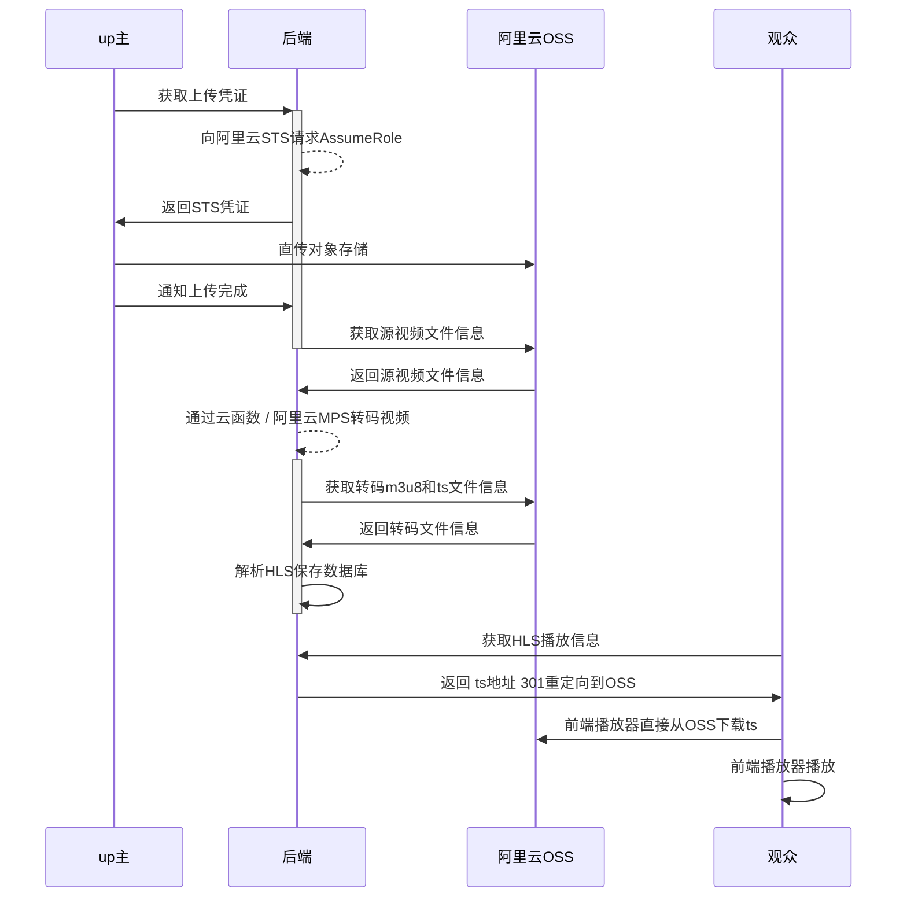

# 视频讲解

# 关键逻辑

## 上传




## 转码

### 谁转？

有三种方式

如果码率很低，直接用ffmpeg，也就是云函数，这样最快

其次可以用阿里云的视频转码接口

最快的方式是GPU的云函数

### 回调

云函数，和阿里云接口，都有回调，我都有统一回调处理

### 冗余加速


## 播放

### 自适应码率

接入了Apple的自适应码率，之前用户的痛点是，1080加载慢，720加载快但是不清楚

交给自适应自动切换，当然要写接口，这把之前获取播放地址逻辑都改了

### cdn？

预热，我试过，慢。cdn没有缓存不如直接访问对象存储了，那现在就是直接访问的

### 统计

heartbeat保存当前进度，下次打开的时候，再调接口获取上次离开的时的进度，设置到播放器

### 前端

目前还是用的最原始的HTML，不会vue，以后有机会可以改造一下，前端确实很重要，用户只能看到前端。

后端我还想接入RocketMQ呢

### 小程序

小程序可以用在微信上分享，现在接入了小程序，上传页面有小程序码可以分享

### 安卓

又单独做了App可以上传

# 接口文档

[](https://app.getpostman.com/run-collection/dced8657344813ee3fbc?action=collection%2Fimport)

[用户接口](docs/api/user/api-user.md)

[上传视频接口](docs/api/video/api-video.md)

[YouTube接口](docs/api/youtube/api-youtube.md)

[播放视频接口](docs/api/play/api-play.md)

[转码接口](docs/api/transcode/api-transcode.md)

[统计接口](docs/api/statistics/api-statistics.md)

[AndroidApp接口](docs/api/app/api-app.md)

# MongoDB 关键表结构

## video

### 重要字段

```json
{
    "_id":"63954cdfdee0d14ef70074bc",
    "userId":"638e1b7ccc41ab5499df37bf",
    "originalFileId":"63954cdfdee0d14ef70074bb",
    "originalFileKey":"videos/638e1b7ccc41ab5499df37bf/63954cdfdee0d14ef70074bc/original/63954cdfdee0d14ef70074bc.mp4",
    "watchCount":1,
    "duration":53908,
    "coverId":"63954cfbdee0d14ef70074c0",
    "coverUrl":"https://video-2022-prod.oss-cn-beijing.aliyuncs.com/videos/638e1b7ccc41ab5499df37bf/63954cdfdee0d14ef70074bc/cover/63954cfbdee0d14ef70074c0.jpg",
    "watchId":"1601779335300788224",
    "watchUrl":"https://videoplus.top/watch?v=1601779335300788224",
    "shortUrl":"https://a4.fit/6356",
    "title":"农夫山泉价格",
    "description":"",
    "width":1920,
    "height":1080,
    "videoCodec":"h264",
    "audioCodec":"aac",
    "bitrate":15508,
    "type":"USER_UPLOAD",
    "provider":"ALIYUN_OSS",
    "status":"READY",
    "createTime":"2022-12-11T03:22:07.824Z",
    "updateTime":"2022-12-11T03:23:07.020Z",
    "expireTime":"2023-01-10T03:22:07.824Z",
    "isPermanent":false,
    "isOriginalFileDeleted":false,
    "isTranscodeFilesDeleted":false,
    "transcodeIds":[
        "63954cfbdee0d14ef70074c3",
        "63954cfcdee0d14ef70074c4"
    ]
}
```

| 参数           | 说明               | 示例                     |
| -------------- | ------------------ | ------------------------ |
| userId         | 作者id             | 638e1b7ccc41ab5499df37bf |
| originalFileId | 原生文件id         | 63954cdfdee0d14ef70074bb |
| watchCount     | 观看次数统计       |                          |
| duration       | 视频时长，单位毫秒 |                          |
| coverId        | 封面文件id         |                          |
| transcodeIds   |                    |                          |

### 通过阿里云获取的视频信息 mediaInfo

```json
"mediaInfo": {
    "async": false,
    "input": {
      "bucket": "video-2022-prod",
      "location": "oss-cn-beijing",
      "object": "videos/638e1b7ccc41ab5499df37bf/63954cdfdee0d14ef70074bc/original/63954cdfdee0d14ef70074bc.mp4"
    },
    "jobId": "794c2269c2af4f1abe79d10c57a9fbd0",
    "creationTime": "2022-12-11T03:22:35Z",
    "state": "Success",
    "properties": {
      "duration": "53.908500",
      "fileSize": "104502461",
      "streams": {
        "audioStreamList": {
          "audioStream": [
            {
              "channelLayout": "stereo",
              "codecTagString": "mp4a",
              "index": "1",
              "bitrate": "96.001",
              "timebase": "1/48000",
              "codecTimeBase": "1/48000",
              "codecTag": "0x6134706d",
              "duration": "53.908500",
              "channels": "2",
              "sampleFmt": "fltp",
              "codecLongName": "AAC (Advanced Audio Coding)",
              "startTime": "0.000000",
              "codecName": "aac",
              "lang": "eng",
              "samplerate": "48000"
            }
          ]
        },
        "videoStreamList": {
          "videoStream": [
            {
              "avgFPS": "59.337578",
              "hasBFrames": "1",
              "colorRange": "pc",
              "bitrate": "15375.053",
              "codecTimeBase": "968897/114984000",
              "duration": "53.827611",
              "dar": "0:1",
              "networkCost": {},
              "startTime": "0.000000",
              "colorTransfer": "smpte170m",
              "lang": "eng",
              "height": "1080",
              "level": "40",
              "sar": "0:1",
              "profile": "High",
              "codecTagString": "avc1",
              "fps": "60.0",
              "index": "0",
              "timebase": "1/90000",
              "codecTag": "0x31637661",
              "pixFmt": "yuvj420p",
              "codecLongName": "H.264 / AVC / MPEG-4 AVC / MPEG-4 part 10",
              "width": "1920",
              "colorPrimaries": "bt470bg",
              "codecName": "h264"
            }
          ]
        },
        "subtitleStreamList": {
          "subtitleStream": []
        }
      },
      "format": {
        "duration": "53.908500",
        "numPrograms": "0",
        "size": "104502461",
        "formatName": "mov,mp4,m4a,3gp,3g2,mj2",
        "bitrate": "15508.123",
        "startTime": "0.000000",
        "formatLongName": "QuickTime / MOV",
        "numStreams": "2"
      },
      "fps": "60.0",
      "width": "1920",
      "bitrate": "15508.123",
      "fileFormat": "QuickTime / MOV",
      "height": "1080"
    }
  }
```

###  video Java Bean

```java
@Data
@Document
public class Video {
    @Id
    private String id;

    @Indexed
    private String userId;
    @Indexed
    private String originalFileId;
    private String originalFileKey;

    private Integer watchCount;
    private Long duration;      //视频时长，单位毫秒
    private String coverId;
    private String coverUrl;

    @Indexed
    private String watchId;
    private String watchUrl;
    private String shortUrl;
    private String title;
    private String description;

    private Integer width;
    private Integer height;
    private String videoCodec;
    private String audioCodec;
    private Integer bitrate;

    @Indexed
    private String type;
    @Indexed
    private String provider;    //它就是对象存储提供商，和file是一对一关系

    @Indexed
    private String youtubeVideoId;
    private String youtubeUrl;
    private JSONObject youtubeVideoInfo;
    private Date youtubePublishTime;

    @Indexed
    private String status;
    @Indexed
    private Date createTime;
    @Indexed
    private Date updateTime;

    @Indexed
    private Date expireTime;
    @Indexed
    private Boolean isPermanent;                //是否是永久视频
    private Boolean isOriginalFileDeleted;      //源视频是否已删除
    private Boolean isTranscodeFilesDeleted;    //ts转码文件是否已删除
    private Date deleteTime;                    //什么时候删的

    private JSONObject mediaInfo;

    private List<String> transcodeIds;

    public boolean isYoutube() {
        return StringUtils.equals(type, VideoType.YOUTUBE);
    }

    public boolean isReady() {
        return StringUtils.equals(status, VideoStatus.READY);
    }
}

```

# 其它设计

## 分包


## 登陆拦截器


## 密码


## 短连接

## 观看次数

# TODOs

https://shimo.im/docs/Ee32M5wMj1CejeA2/ 《2022.02.23 新点播功能联想 ideas 列表》，可复制链接后用石墨文档 App 打开

## 播放器

- [ ] 网页上传

- [ ] 搬运YouTube

- [ ] 一个好用的前端网页m3u8播放器

- [ ] 截帧封面，截首帧就行

- [ ] 时间跳转t=21

- [ ] 多分辨率选择

- [ ] 播放列表

- [ ] 视频权限，public，unlist，private

- [ ] 多种转码方式，客户端或者云ffmpeg转码，或者云api收费转码，最终汇聚到新建视频函数
- [ ] 以720甚至480开始播放，根据网络情况自动升1080


# 如何部署？

RSA

Redis

application.props

[Java 8 Stream Api Examples](docs/java8-stream-examples/java8-stream-examples.md)

# 变更日志

## 2022年11月27日21:18:08

RSA密码加密计划

## 2022年12月7日23:06:51

重新接入阿里云web播放器

## 2022年12月10日13:33:26

加入自适应码率

## 2022年12月10日23:03:12
RequestUtil to DTO改造方案

## 2022年12月10日23:34:23
接入UserHolder，取消request获取user对象

## 2023年1月15日10:10:19
引入GlobalExceptionHandler，自定义异常VideoException，service抛异常

## 2023年1月15日11:10:19
引入cacheService，解决循环依赖

## 2023年2月2日00:32:21
RequestUtil获取request对象改造方案

## 2023年5月16日07:53:24
改造钉钉通知类NotificationService，把异常发送到钉钉

## 2023年5月19日07:27:42
把video对象抽出MediaInfo子类

## 2023年5月19日08:20:58
抽出EnvironmentService，取消之前所有@Value注入

## 2023年5月25日07:46:21
改造登录拦截器，一个放token，一个拦截

## 2023年5月28日10:15:56
新增请求日志拦截器RequestLogInterceptor，保存请求记录，耗时
