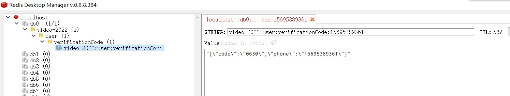

# 目录

[TOC]


# 视频讲解


# 关键逻辑

## 上传


## 转码

### 谁转？


### 回调


### 冗余加速


## 播放

### 自适应码率


### cdn？

预热，我试过，慢

### 统计

heartbeat

### 前端


### 小程序


### 安卓


# 接口文档

[](https://app.getpostman.com/run-collection/dced8657344813ee3fbc?action=collection%2Fimport)

## 1. 用户

### 请求验证码

请求短信验证码，然后后端会在Redis缓存，有过期时间

```text
GET /user/requestVerificationCode
```

|   参数  | 说明   | 示例值 |
|-----|-----|-----|
|  phone   | 手机号 | 15695389361 |



### 提交验证码

```
GET /user/submitVerificationCode
```

| 参数  | 说明   | 示例值      |
| ----- | ------ | ----------- |
| phone | 手机号 | 15695389361 |
| code  | 验证码 | 4736        |

验证码正确 返回示例：

```json
{
    "code": 0,
    "message": "success",
    "data": {
        "id": "63a1d358388fcc49fa49d393",
        "phone": "15695389361",
        "registerChannel": "WEB",
        "createTime": "2022-12-24T15:23:03.244+00:00",
        "token": "1605222255652876288"
    }
}
```

| 参数            | 说明                        | 示例值                        |
| --------------- | --------------------------- | ----------------------------- |
| id              | userId                      | 63a1d358388fcc49fa49d393      |
| phone           | 手机号                      | 15695389361                   |
| registerChannel | 注册渠道：网页 / 微信小程序 | WEB / WECHAT_MINI_PROGRAM     |
| createTime      | 创建时间                    | 2022-12-24T15:23:03.244+00:00 |
| token           | 登陆凭证                    | 1605222255652876288           |

验证码错误 返回示例：

```json
{
    "code": 1,
    "message": "fail",
    "data": null
}
```

### 根据 token 获取用户

```
GET /user/getUserByToken
```

| 参数  | 说明 | 示例值              |
| ----- | ---- | ------------------- |
| token | 令牌 | 1599798488034250752 |

示例返回

```json
{
    "code": 0,
    "message": "success",
    "data": {
        "id": "638e1811c29e3b400dcf9b80",
        "phone": "15695389361",
        "registerChannel": "WEB",
        "createTime": "2022-12-05T11:10:56.322+00:00",
        "token": "1599798488034250752"
    }
}
```

### 根据 userId 获取用户

```
GET /user/getUserById
```

| 参数   | 说明 | 示例值                   |
| ------ | ---- | ------------------------ |
| userId |      | 638e1811c29e3b400dcf9b80 |

返回

```json
{
    "code": 0,
    "message": "success",
    "data": {
        "id": "638e1811c29e3b400dcf9b80",
        "phone": "53845328866",
        "registerChannel": "WEB",
        "createTime": "2022-12-05T16:10:56.322+00:00",
        "token": null
    }
}
```

### 请求clientId

用户不需要登陆就可以看视频，client和session id用于追求未登录用户

前端播放器，在打开网页时，第一件事，先检查这两个id，如果没有，请求后端，后端会在数据库新建保存，

然后前端会把clientId保存在localStorage，把sessionId保存在sessionStorage，下次请求带上

```
GET /client/requestClientId
```

返回

```json
{
    "code": 0,
    "message": "success",
    "data": {
        "clientId": "63a1da9a7b31fd0978672504"
    }
}
```

### 请求sessionId

区分观看次数，就是靠sessionId

```
GET /session/requestSessionId
```

返回

```json
{
    "code": 0,
    "message": "success",
    "data": {
        "sessionId": "63a1db2b7b31fd0978672505"
    }
}
```

## 2. 视频

### 创建视频
```text
POST /video/create
```
请求示例
```json
{
    "originalFilename": "VID_20220319_131135.mp4",
    "type": "USER_UPLOAD"
}
```
| 参数             | 说明                                         | 示例                    |
| ---------------- | -------------------------------------------- | ----------------------- |
| originalFilename | 原始文件名，主要用于：上传对象存储的文件后缀 | VID_20220319_131135.mp4 |
| type             | 类型：用户上传 / YouTube                     | USER_UPLOAD / YOUTUBE   |

返回示例

```json
{
    "code": 0,
    "message": "success",
    "data": {
        "watchId": "1601779335300788224",
        "shortUrl": "https://a4.fit/6356",
        "videoId": "63a1806f882a4230c02d0a36",
        "watchUrl": "https://videoplus.top/watch?v=1601779335300788224",
        "fileId": "63a1806f882a4230c02d0a35"
    }
}
```

| 参数     | 说明                           | 示例                                              |
| -------- | ------------------------------ | ------------------------------------------------- |
| fileId   | 文件id，接下来用于上传对象存储 | 63a1806f882a4230c02d0a35                          |
| watchUrl | 观看地址                       | https://videoplus.top/watch?v=1601779335300788224 |
| shortUrl | 短连接                         | https://a4.fit/6356                               |
| videoId  | 视频id                         | 63a1806f882a4230c02d0a36                          |

### 获取上传凭证

通过阿里云对象存储STS接口，赋予临时accessKey

```text
GET /file/getUploadCredentials
```

请求

| 参数   | 说明   | 示例                     |
| ------ | ------ | ------------------------ |
| fileId | 文件id | 63a1806f882a4230c02d0a35 |

返回示例

```json
{
    "code": 0,
    "message": "success",
    "data": {
        "bucket": "video-2022-dev",
        "accessKeyId": "STS.NURKKUmgubZ1ugs1fZZqrTqLj",
        "endpoint": "oss-cn-beijing.aliyuncs.com",
        "secretKey": "3zdCPTmzEhVq7CMy1kpRjpzhESRPpMD5viNADtB3C3bq",
        "provider": "ALIYUN_OSS",
        "sessionToken": "CAISogJ1q6Ft5B2yfSjIr5bnAPHhgLhU1Zjad0HC1WYPVv5eu7TniDz2IH9LeHVhB+4WsPQ0lW1U6vwdlplpTJtIfkHfdsp36LJe9A7kPYfPtZO74+RcgsyuRWHOVU6rhMSKOLn3FoODI6f9MAicVt6sVAGiJ1uYRFWAHcCjq/wON6Y6PGSRaT5BG60lRG9Lo9MbMn38LOukNgWQ7EPbEEtvvHgX6wo9k9PdpPeR8R3Dllb35/YIroDqWPieYtJrIY10XqXevoU0VNKYjncAtEgWrvcu3PMYp2qXhLzHXQkNuSfhGvHP79hiIDV+YqUHAKNepJD+76Yn5bCPxtqpm0gdZrAID3iFG5rb2szAFaauLc18a7f3NnOIiIjVbIk/RvX84JKDXhqAAWWasFC7Sr+7spVTPdYH09iDguAiZAq7pFhB+Qm0EZsmsh76XfqobuTrr4odGVYbd/9mgT5ly21FdSCnTcajHAGoc2dCRoFq2kBWE/ae4gR7qg/n8qiSZuarkld0LLjod9CmpXBt/9yXmEfzPxN3UVN5YuzEVlvY7wh+hGZ33SX7",
        "expiration": "2022-12-28T13:16:37Z",
        "key": "videos/638e1811c29e3b400dcf9b80/63a18b79882a4230c02d0a38/original/63a18b79882a4230c02d0a38.mp4"
    }
}
```

| 参数         | 说明                                        | 示例                                               |
| ------------ | ------------------------------------------- | -------------------------------------------------- |
| bucket       | 存储桶                                      | 63a1806f882a4230c02d0a35                           |
| accessKeyId  |                                             | STS.NURKKUmgubZ1ugs1fZZqrTqLj                      |
| secretKey    |                                             | 3zdCPTmzEhVq7CMy1kpRjpzhESRPpMD5viNADtB3C3bq       |
| endpoint     | 对象存储公网地址                            | oss-cn-beijing.aliyuncs.com                        |
| provider     | 供应商，之前用过百度云，现在只有阿里云OSS了 | ALIYUN_OSS                                         |
| sessionToken | STS需要的                                   | CAISogJ1q6Ft5B2yfSjIr5bnAPHh......                 |
| expiration   | 过期时间                                    | 2022-12-28T13:16:37Z                               |
| key          | 上传对象存储路径：用户id+视频id             | videos/638cf9b80/63a02d0a38/original/63a1d0a38.mp4 |

### 通知文件上传完成

```text
GET /file/uploadFinish?fileId=624face951b82a5445c4f048
```


## 3. YouTube

#### 新建搬运YouTube视频

```text
POST /video/create
```

传入

```json
{
    "type": "YOUTUBE",
    "youtubeUrl": "https://youtu.be/OJzbRMXx5O4"
}
```

#### 获取YouTube文件拓展名

```
GET https://youtube.videoplus.top:5030/youtube/getFileExtension?youtubeVideoId=j4LtMumQGHc
```

传参

| 参数           | 说明            | 示例值      |
| -------------- | --------------- | ----------- |
| youtubeVideoId | YouTube的视频id | j4LtMumQGHc |

示例返回：

```json
{
    "extension": "webm"
}
```

#### 获取YouTube视频信息

后面最终是调用的 Google YouTube 的接口

```
GET https://youtube.videoplus.top:5030/youtube/getVideoInfo?youtubeVideoId=j4LtMumQGHc
```

传参

| 参数           | 说明            | 示例值      |
| -------------- | --------------- | ----------- |
| youtubeVideoId | YouTube的视频id | j4LtMumQGHc |

示例返回，直接透传YouTube返回内容

```json
{
    "snippet": {
        "publishedAt": {
            "dateOnly": false,
            "timeZoneShift": 0,
            "value": 1649507106000
        },
        "defaultAudioLanguage": "en",
        "localized": {
            "description": "At least 52 people were killed Friday in a Russian rocket attack on one of the easternmost train stations still operating in Ukraine. The shock of the deadly missile strike on the crowded railroad station has Ukraine's President Volodymyr Zelenskyy calling for a global response. Debora Patta reports.\n\n\"CBS Saturday Morning\" co-hosts Jeff Glor, Michelle Miller and Dana Jacobson deliver two hours of original reporting and breaking news, as well as profiles of leading figures in culture and the arts. Watch \"CBS Saturday Morning\" at 7 a.m. ET on CBS and 8 a.m. ET on the CBS News app.\n\nSubscribe to \"CBS Mornings\" on YouTube: https://www.youtube.com/CBSMornings \nWatch CBS News live: https://cbsn.ws/1PlLpZ7c​\nDownload the CBS News app: https://cbsn.ws/1Xb1WC8​\nFollow \"CBS Mornings\" on Instagram: https://bit.ly/3A13OqA\nLike \"CBS Mornings\" on Facebook: https://bit.ly/3tpOx00\nFollow \"CBS Mornings\" on Twitter: https://bit.ly/38QQp8B\nSubscribe to our newsletter: https://cbsn.ws/1RqHw7T​\nTry Paramount+ free: https://bit.ly/2OiW1kZ\n\nFor video licensing inquiries, contact: licensing@veritone.com",
            "title": "At least 52 people killed in Ukraine railroad station attack"
        },
        "description": "At least 52 people were killed Friday in a Russian rocket attack on one of the easternmost train stations still operating in Ukraine. The shock of the deadly missile strike on the crowded railroad station has Ukraine's President Volodymyr Zelenskyy calling for a global response. Debora Patta reports.\n\n\"CBS Saturday Morning\" co-hosts Jeff Glor, Michelle Miller and Dana Jacobson deliver two hours of original reporting and breaking news, as well as profiles of leading figures in culture and the arts. Watch \"CBS Saturday Morning\" at 7 a.m. ET on CBS and 8 a.m. ET on the CBS News app.\n\nSubscribe to \"CBS Mornings\" on YouTube: https://www.youtube.com/CBSMornings \nWatch CBS News live: https://cbsn.ws/1PlLpZ7c​\nDownload the CBS News app: https://cbsn.ws/1Xb1WC8​\nFollow \"CBS Mornings\" on Instagram: https://bit.ly/3A13OqA\nLike \"CBS Mornings\" on Facebook: https://bit.ly/3tpOx00\nFollow \"CBS Mornings\" on Twitter: https://bit.ly/38QQp8B\nSubscribe to our newsletter: https://cbsn.ws/1RqHw7T​\nTry Paramount+ free: https://bit.ly/2OiW1kZ\n\nFor video licensing inquiries, contact: licensing@veritone.com",
        "thumbnails": {
            "standard": {
                "width": 640,
                "url": "https://i.ytimg.com/vi/j4LtMumQGHc/sddefault.jpg",
                "height": 480
            },
            "default": {
                "width": 120,
                "url": "https://i.ytimg.com/vi/j4LtMumQGHc/default.jpg",
                "height": 90
            },
            "high": {
                "width": 480,
                "url": "https://i.ytimg.com/vi/j4LtMumQGHc/hqdefault.jpg",
                "height": 360
            },
            "maxres": {
                "width": 1280,
                "url": "https://i.ytimg.com/vi/j4LtMumQGHc/maxresdefault.jpg",
                "height": 720
            },
            "medium": {
                "width": 320,
                "url": "https://i.ytimg.com/vi/j4LtMumQGHc/mqdefault.jpg",
                "height": 180
            }
        },
        "title": "At least 52 people killed in Ukraine railroad station attack",
        "categoryId": "25",
        "channelId": "UC-SJ6nODDmufqBzPBwCvYvQ",
        "channelTitle": "CBS Mornings",
        "liveBroadcastContent": "none",
        "tags": [
            "CBS Saturday Morning",
            "CBS News",
            "video",
            "ukraine",
            "train",
            "railroad station",
            "deadly missile strike",
            "crowded railroad",
            "president volodymyr zelenskyy"
        ]
    },
    "kind": "youtube#video",
    "etag": "iM78paVC76ZjgNuvg6uPjBkRzR0",
    "id": "j4LtMumQGHc",
    "contentDetails": {
        "duration": "PT3M43S",
        "licensedContent": true,
        "caption": "false",
        "contentRating": {},
        "definition": "hd",
        "projection": "rectangular",
        "regionRestriction": {
            "blocked": [
                "AU",
                "CA",
                "JP"
            ]
        },
        "dimension": "2d"
    },
    "statistics": {
        "likeCount": 4604,
        "viewCount": 850738,
        "commentCount": 3197,
        "favoriteCount": 0
    }
}
```


## 4. 播放

#### 获取播放信息

```
GET /video/getWatchInfo?watchId=1509176752561631232
```


返回

```json
{
    "code":0,
    "message":"success",
    "data":{
        "id":"63954cdfdee0d14ef70074bc",
        "userId":"638e1b7ccc41ab5499df37bf",
        "watchCount":2,
        "duration":53908,
        "coverUrl":"https://video-2022-prod.oss-cn-beijing.aliyuncs.com/videos/638e1b7ccc41ab5499df37bf/63954cdfdee0d14ef70074bc/cover/63954cfbdee0d14ef70074c0.jpg",
        "watchId":"1601779335300788224",
        "watchUrl":"https://videoplus.top/watch?v=1601779335300788224",
        "shortUrl":"https://a4.fit/6356",
        "title":"农夫山泉价格",
        "description":"",
        "type":"USER_UPLOAD",
        "youtubeVideoId":null,
        "youtubeUrl":null,
        "youtubePublishTime":null,
        "status":"READY",
        "createTime":"2022-12-11T03:22:07.824+00:00",
        "createTimeString":"2022-12-11 11:22:07",
        "youtubePublishTimeString":null
    }
}
```

#### 获取m3u8自适应播放内容

```
GET /watchController/getMultivariantPlaylist.m3u8?videoId=63954cdfdee0d14ef70074bc&clientId=638e1d969cae0b13419384e9&sessionId=63a1ddc7752d1b03473363a5
```

返回

```
#EXTM3U

#EXT-X-STREAM-INF:BANDWIDTH=7032284,AVERAGE-BANDWIDTH=4064092
https://videoplus.top/watchController/getM3u8Content.m3u8?resolution=720p&videoId=63954cdfdee0d14ef70074bc&clientId=638e1d969cae0b13419384e9&sessionId=63a1ddc7752d1b03473363a5&transcodeId=63954cfbdee0d14ef70074c3

#EXT-X-STREAM-INF:BANDWIDTH=18344529,AVERAGE-BANDWIDTH=11883132
https://videoplus.top/watchController/getM3u8Content.m3u8?resolution=1080p&videoId=63954cdfdee0d14ef70074bc&clientId=638e1d969cae0b13419384e9&sessionId=63a1ddc7752d1b03473363a5&transcodeId=63954cfcdee0d14ef70074c4
```

#### 获取m3u8内容

```
GET /watchController/getM3u8Content.m3u8?resolution=720p&videoId=63954cdfdee0d14ef70074bc&clientId=638e1d969cae0b13419384e9&sessionId=63a1ddc7752d1b03473363a5&transcodeId=63954cfbdee0d14ef70074c3
```

返回

```
#EXTM3U
#EXT-X-VERSION:3
#EXT-X-ALLOW-CACHE:YES
#EXT-X-TARGETDURATION:2
#EXT-X-MEDIA-SEQUENCE:0
#EXTINF:1.983333,
https://videoplus.top/file/access?resolution=720p&tsIndex=0&videoId=63954cdfdee0d14ef70074bc&clientId=638e1d969cae0b13419384e9&sessionId=63a1ddc7752d1b03473363a5&fileId=63954d0edee0d14ef70074e3&timestamp=1671552458573&nonce=CH3XxwVS5vhZVIh-rE-um&sign=153ab2e06d7b47a9baaa8561416a5720
#EXTINF:1.983333,
https://videoplus.top/file/access?resolution=720p&tsIndex=1&videoId=63954cdfdee0d14ef70074bc&clientId=638e1d969cae0b13419384e9&sessionId=63a1ddc7752d1b03473363a5&fileId=63954d0edee0d14ef70074e4&timestamp=1671552458573&nonce=4ICGuuh5Cs_jtTwqR-v-w&sign=c225c76a7b5d4615bd2815ca4fc08b1f
#EXTINF:1.983333,
https://videoplus.top/file/access?resolution=720p&tsIndex=2&videoId=63954cdfdee0d14ef70074bc&clientId=638e1d969cae0b13419384e9&sessionId=63a1ddc7752d1b03473363a5&fileId=63954d0edee0d14ef70074e5&timestamp=1671552458573&nonce=0iBJ1HC-d7v_uQqyc8w6a&sign=2fba1143590744b89c7c723169227288
#EXTINF:1.983333,
https://videoplus.top/file/access?resolution=720p&tsIndex=3&videoId=63954cdfdee0d14ef70074bc&clientId=638e1d969cae0b13419384e9&sessionId=63a1ddc7752d1b03473363a5&fileId=63954d0edee0d14ef70074e6&timestamp=1671552458574&nonce=_21VWJ2v4ecalnOZZ6Syk&sign=062830eb0de44196b36f77b36d2fc759
#EXTINF:1.983333,
https://videoplus.top/file/access?resolution=720p&tsIndex=4&videoId=63954cdfdee0d14ef70074bc&clientId=638e1d969cae0b13419384e9&sessionId=63a1ddc7752d1b03473363a5&fileId=63954d0edee0d14ef70074e7&timestamp=1671552458574&nonce=QVGtfA1oko99WdLkOM7gj&sign=616d468400954b5a9de8da6e596b5c0f
#EXT-X-ENDLIST
```

#### 心跳

```
POST /heartbeat/add
```

payload

```json
{
    "videoId":"63954cdfdee0d14ef70074bc",
    "clientId":"638e1d969cae0b13419384e9",
    "sessionId":"63a1ddc7752d1b03473363a5",
    "videoStatus":"READY",
    "playerProvider":"ALIYUN_WEB",
    "clientTime":"2022-12-20T16:11:47.181Z",
    "type":"TIMER",
    "event":null,
    "playerTime":820.37,
    "playerStatus":"pause",
    "playerVolume":1
}
```

## 5. 阿里云 云函数 ffmpeg 转码

### ffprobe 获取视频信息
```text
POST https://ffprobe-video-transcode-gysmioluyt.cn-beijing.fcapp.run
```
传入
```json
{
    "bucket": "video-2022-prod",
    "region": "cn-beijing",
    "endpoint": "oss-cn-beijing-internal.aliyuncs.com",
    "inputKey": "test/demo-src.mp4",
    "inputKey1": "videos/62565a16c3afe0646f9c67b9/6256a80e1273947edf8854c7/original/6256a80e1273947edf8854c7.webm"
}
```
### 发起转码
```text
POST https://transcoe-master-video-transcode-pqrshwejna.cn-beijing.fcapp.run
```
```json
{
    "outputDir":"videos/62511690c3afe0646f9c670b/62626cff1fb6c600b2a7f14d/transcode/720p",
    "videoId":"62626cff1fb6c600b2a7f14d",
    "audioCodec":"aac",
    "resolution":"720p",
    "quality":"keep",
    "bucket":"video-2022-prod",
    "jobId":"829bb555d5b14123ad3cf129519701de",
    "endpoint":"oss-cn-beijing-internal.aliyuncs.com",
    "width":1280,
    "callbackUrl":"https://videoplus.top/transcode/aliyunCloudFunctionTranscodeCallback",
    "inputKey":"videos/62511690c3afe0646f9c670b/62626cff1fb6c600b2a7f14d/original/62626cff1fb6c600b2a7f14d.yv",
    "transcodeId":"62626d7e1fb6c600b2a7f14e",
    "height":720,
    "videoCodec":"h264"
}
```
## 6. 统计

### 统计某视频流量消耗

观众观看视频，所消耗流量

```
GET /statistics/getTrafficConsume?videoId=63a1a40bcc99952a50decc3f
```

返回示例

```json
{
    "code": 0,
    "message": "success",
    "data": {
        "trafficConsumeString": "693.02 MB",
        "videoId": "63a1a40bcc99952a50decc3f",
        "trafficConsumeInBytes": 726685236
    }
}
```

| 参数                  | 说明                          | 示例                     |
| --------------------- | ----------------------------- | ------------------------ |
| trafficConsumeString  | 供人类读的流量                | 693.02 MB                |
| trafficConsumeInBytes | 视频所消耗流量，单位字节bytes | 726685236                |
| videoId               | 视频id                        | 63a1a40bcc99952a50decc3f |

## 7. App

### 检查App版本

```
GET /app/checkUpdate
```

请求参数

| 参数     | 说明                | 示例    |
| -------- | ------------------- | ------- |
| platform | 平台：android / ios | android |

返回

```json
{
    "code": 0,
    "message": "success",
    "data": {
        "downloadUrl": "https://baidu.com",
        "versionInfo": "最新版本信息：alpha内测，2022年4月25日20:41:46",
        "compareVersion": false,
        "versionName": "1.0.0",
        "versionCode": 1,
        "isForceUpdate": false
    }
}
```

| 参数           | 说明                                                         | 示例                                                         |
| -------------- | ------------------------------------------------------------ | ------------------------------------------------------------ |
| downloadUrl    | apk包下载地址                                                | http://abcdefg.com/video-2022-prod/packages/andoird/1.0.0-release.apk |
| versionInfo    | 版本描述信息                                                 |                                                              |
| compareVersion | 客户端是否把当前版本与最新版本对比，看是否更新，仅用于测试安装覆盖 | false                                                        |
| versionName    | 版本                                                         | 1.0.0                                                        |
| versionCode    | 版本号                                                       | 1                                                            |
| isForceUpdate  | 是否强制更新                                                 | false                                                        |

# MongoDB 关键表结构

## video

### 重要字段

```json
{
    "_id":"63954cdfdee0d14ef70074bc",
    "userId":"638e1b7ccc41ab5499df37bf",
    "originalFileId":"63954cdfdee0d14ef70074bb",
    "originalFileKey":"videos/638e1b7ccc41ab5499df37bf/63954cdfdee0d14ef70074bc/original/63954cdfdee0d14ef70074bc.mp4",
    "watchCount":1,
    "duration":53908,
    "coverId":"63954cfbdee0d14ef70074c0",
    "coverUrl":"https://video-2022-prod.oss-cn-beijing.aliyuncs.com/videos/638e1b7ccc41ab5499df37bf/63954cdfdee0d14ef70074bc/cover/63954cfbdee0d14ef70074c0.jpg",
    "watchId":"1601779335300788224",
    "watchUrl":"https://videoplus.top/watch?v=1601779335300788224",
    "shortUrl":"https://a4.fit/6356",
    "title":"农夫山泉价格",
    "description":"",
    "width":1920,
    "height":1080,
    "videoCodec":"h264",
    "audioCodec":"aac",
    "bitrate":15508,
    "type":"USER_UPLOAD",
    "provider":"ALIYUN_OSS",
    "status":"READY",
    "createTime":"2022-12-11T03:22:07.824Z",
    "updateTime":"2022-12-11T03:23:07.020Z",
    "expireTime":"2023-01-10T03:22:07.824Z",
    "isPermanent":false,
    "isOriginalFileDeleted":false,
    "isTranscodeFilesDeleted":false,
    "transcodeIds":[
        "63954cfbdee0d14ef70074c3",
        "63954cfcdee0d14ef70074c4"
    ]
}
```

| 参数           | 说明               | 示例                     |
| -------------- | ------------------ | ------------------------ |
| userId         | 作者id             | 638e1b7ccc41ab5499df37bf |
| originalFileId | 原生文件id         | 63954cdfdee0d14ef70074bb |
| watchCount     | 观看次数统计       |                          |
| duration       | 视频时长，单位毫秒 |                          |
| coverId        | 封面文件id         |                          |
| transcodeIds   |                    |                          |

### 通过阿里云获取的视频信息 mediaInfo

```json
"mediaInfo": {
    "async": false,
    "input": {
      "bucket": "video-2022-prod",
      "location": "oss-cn-beijing",
      "object": "videos/638e1b7ccc41ab5499df37bf/63954cdfdee0d14ef70074bc/original/63954cdfdee0d14ef70074bc.mp4"
    },
    "jobId": "794c2269c2af4f1abe79d10c57a9fbd0",
    "creationTime": "2022-12-11T03:22:35Z",
    "state": "Success",
    "properties": {
      "duration": "53.908500",
      "fileSize": "104502461",
      "streams": {
        "audioStreamList": {
          "audioStream": [
            {
              "channelLayout": "stereo",
              "codecTagString": "mp4a",
              "index": "1",
              "bitrate": "96.001",
              "timebase": "1/48000",
              "codecTimeBase": "1/48000",
              "codecTag": "0x6134706d",
              "duration": "53.908500",
              "channels": "2",
              "sampleFmt": "fltp",
              "codecLongName": "AAC (Advanced Audio Coding)",
              "startTime": "0.000000",
              "codecName": "aac",
              "lang": "eng",
              "samplerate": "48000"
            }
          ]
        },
        "videoStreamList": {
          "videoStream": [
            {
              "avgFPS": "59.337578",
              "hasBFrames": "1",
              "colorRange": "pc",
              "bitrate": "15375.053",
              "codecTimeBase": "968897/114984000",
              "duration": "53.827611",
              "dar": "0:1",
              "networkCost": {},
              "startTime": "0.000000",
              "colorTransfer": "smpte170m",
              "lang": "eng",
              "height": "1080",
              "level": "40",
              "sar": "0:1",
              "profile": "High",
              "codecTagString": "avc1",
              "fps": "60.0",
              "index": "0",
              "timebase": "1/90000",
              "codecTag": "0x31637661",
              "pixFmt": "yuvj420p",
              "codecLongName": "H.264 / AVC / MPEG-4 AVC / MPEG-4 part 10",
              "width": "1920",
              "colorPrimaries": "bt470bg",
              "codecName": "h264"
            }
          ]
        },
        "subtitleStreamList": {
          "subtitleStream": []
        }
      },
      "format": {
        "duration": "53.908500",
        "numPrograms": "0",
        "size": "104502461",
        "formatName": "mov,mp4,m4a,3gp,3g2,mj2",
        "bitrate": "15508.123",
        "startTime": "0.000000",
        "formatLongName": "QuickTime / MOV",
        "numStreams": "2"
      },
      "fps": "60.0",
      "width": "1920",
      "bitrate": "15508.123",
      "fileFormat": "QuickTime / MOV",
      "height": "1080"
    }
  }
```

###  video Java Bean

```java
@Data
@Document
public class Video {
    @Id
    private String id;

    @Indexed
    private String userId;
    @Indexed
    private String originalFileId;
    private String originalFileKey;

    private Integer watchCount;
    private Long duration;      //视频时长，单位毫秒
    private String coverId;
    private String coverUrl;

    @Indexed
    private String watchId;
    private String watchUrl;
    private String shortUrl;
    private String title;
    private String description;

    private Integer width;
    private Integer height;
    private String videoCodec;
    private String audioCodec;
    private Integer bitrate;

    @Indexed
    private String type;
    @Indexed
    private String provider;    //它就是对象存储提供商，和file是一对一关系

    @Indexed
    private String youtubeVideoId;
    private String youtubeUrl;
    private JSONObject youtubeVideoInfo;
    private Date youtubePublishTime;

    @Indexed
    private String status;
    @Indexed
    private Date createTime;
    @Indexed
    private Date updateTime;

    @Indexed
    private Date expireTime;
    @Indexed
    private Boolean isPermanent;                //是否是永久视频
    private Boolean isOriginalFileDeleted;      //源视频是否已删除
    private Boolean isTranscodeFilesDeleted;    //ts转码文件是否已删除
    private Date deleteTime;                    //什么时候删的

    private JSONObject mediaInfo;

    private List<String> transcodeIds;

    public boolean isYoutube() {
        return StringUtils.equals(type, VideoType.YOUTUBE);
    }

    public boolean isReady() {
        return StringUtils.equals(status, VideoStatus.READY);
    }
}

```

# 其它设计

## 分包


## 登陆拦截器


## 密码


## 短连接

## 观看次数

# TODOs

https://shimo.im/docs/Ee32M5wMj1CejeA2/ 《2022.02.23 新点播功能联想 ideas 列表》，可复制链接后用石墨文档 App 打开

## 播放器

- [ ] 网页上传

- [ ] 搬运YouTube

- [ ] 一个好用的前端网页m3u8播放器

- [ ] 截帧封面，截首帧就行

- [ ] 时间跳转t=21

- [ ] 多分辨率选择

- [ ] 播放列表

- [ ] 视频权限，public，unlist，private

- [ ] 多种转码方式，客户端或者云ffmpeg转码，或者云api收费转码，最终汇聚到新建视频函数
- [ ] 以720甚至480开始播放，根据网络情况自动升1080


# 如何部署？

RSA

Redis

application.props

# Java8 Stream API Examples

## 1. 过滤 filter

**代码**

```java
Arrays.stream(m3u8Content.split("\n"))
        .filter(e -> !e.startsWith("#")).collect(Collectors.toList());
```


**解释**

当转码完成后，会生成m3u8文件。要解析出m3u8中的ts文件，干掉 # 开头的注释

.filter(e -> !e.startsWith("#")) 代表过滤，里面的条件是你最终留下来的


**m3u8文件，过滤前：**

```
#EXTM3U
#EXT-X-VERSION:3
#EXT-X-ALLOW-CACHE:YES
#EXT-X-TARGETDURATION:3
#EXT-X-MEDIA-SEQUENCE:0
#EXTINF:2.021111,
6379bbbab1d6e03eeab86c9e-00001.ts
#EXTINF:1.998667,
6379bbbab1d6e03eeab86c9e-00002.ts
#EXTINF:1.998667,
6379bbbab1d6e03eeab86c9e-00003.ts
#EXTINF:1.998667,
6379bbbab1d6e03eeab86c9e-00004.ts
#EXT-X-ENDLIST
```

**过滤后：**

```
6379bbbab1d6e03eeab86c9e-00001.ts
6379bbbab1d6e03eeab86c9e-00002.ts
6379bbbab1d6e03eeab86c9e-00003.ts
6379bbbab1d6e03eeab86c9e-00004.ts
```


**划重点：**

```java
.filter(e -> !e.startsWith("#")).collect(Collectors.toList());
```


## 2. 统计数量 count

**代码**

```java
//从数据库中查出，该视频对应的所有转码任务
List<Transcode> transcodeList = transcodeRepository.getByIds(video.getTranscodeIds());
//统计已完成数量
long completeCount = transcodeList.stream().filter(Transcode::isFinishStatus).count();
```


**场景：**

统计Transcode对象的status字段，有多少是“已完成”状态


**视频状态：**

**已创建**，用户正在上传源视频

源文件上传完成，发起转码之后，状态为：**转码中**

转码分为1080p，720p，多个分辨率，部分转码完成的状态就是：**正在转码，部分完成**

所有转码完成，状态为：**视频已就绪**

```java
public class VideoStatus {
    public static final String CREATED = "CREATED";
    public static final String TRANSCODING = "TRANSCODING";
    public static final String TRANSCODING_PARTLY_COMPLETED  = "TRANSCODING_PARTLY_COMPLETED";
    public static final String READY = "READY";
}
```


**两个Transcode对象的json：**

```json
[
    {
        "createTime":1671632120107,
        "finishStatus":true,
        "finishTime":1671632136000,
        "id":"63a314f8c7f12263436e0d21",
        "jobId":"fae8e61121c3422db12031a20badbbb3",
        "m3u8AccessUrl":"https://video-2022-dev.oss-cn-beijing.aliyuncs.com/videos/638741b6a71dc42ea537d9b1/63a314edc7f12263436e0d1d/transcode/720p/63a314f8c7f12263436e0d21.m3u8",
        "m3u8Key":"videos/638741b6a71dc42ea537d9b1/63a314edc7f12263436e0d1d/transcode/720p/63a314f8c7f12263436e0d21.m3u8",
        "provider":"ALIYUN_MPS_TRANSCODE",
        "resolution":"720p",        "sourceKey":"videos/638741b6a71dc42ea537d9b1/63a314edc7f12263436e0d1d/original/63a314edc7f12263436e0d1d.mp4",
        "status":"TranscodeSuccess",
        "successStatus":true,
        "userId":"638741b6a71dc42ea537d9b1",
        "videoId":"63a314edc7f12263436e0d1d"
    },
    
    {
        "createTime":1671632120248,
        "finishStatus":false,
        "id":"63a314f8c7f12263436e0d22",
        "jobId":"7d239815c45d4caba7f9751f58681427",
        "m3u8AccessUrl":"https://video-2022-dev.oss-cn-beijing.aliyuncs.com/videos/638741b6a71dc42ea537d9b1/63a314edc7f12263436e0d1d/transcode/1080p/63a314f8c7f12263436e0d22.m3u8",
  "m3u8Key":"videos/638741b6a71dc42ea537d9b1/63a314edc7f12263436e0d1d/transcode/1080p/63a314f8c7f12263436e0d22.m3u8",
        "provider":"ALIYUN_MPS_TRANSCODE",
        "resolution":"1080p",
        "sourceKey":"videos/638741b6a71dc42ea537d9b1/63a314edc7f12263436e0d1d/original/63a314edc7f12263436e0d1d.mp4",
        "status":"Submitted",
        "successStatus":false,
        "userId":"638741b6a71dc42ea537d9b1",
        "videoId":"63a314edc7f12263436e0d1d"
    }
]
```

**划重点：**

```java
.filter(Transcode::isFinishStatus).count();
```


## 3. list 转 map

**代码**

```java
List<OSSObjectSummary> objects = fileService.listAllObjects(transcodeFolder);
Map<String, OSSObjectSummary> ossFilenameMap = objects.stream().collect(
        Collectors.toMap(e -> FilenameUtils.getName(e.getKey()), Function.identity()));
```

**描述**

把对象存储的List的objects转成了map，用于之后的组装

key是OSS的key，value还是之前的对象

**List< OSSObjectSummary> objects**

```json
[
    {
        "bucketName":"video-2022-dev",
        "eTag":"67AB6B4EA67235B6B7DAB871AEDF9AB5",
        "key":"videos/638741b6a71dc42ea537d9b1/63a31d33c1de457ae738ae6f/transcode/720p/63a31d3ec1de457ae738ae73-00001.ts",
        "lastModified":1671634257000,
        "size":1106944,
        "storageClass":"Standard",
        "type":"Normal"
    },
    
    {
        "bucketName":"video-2022-dev",
        "eTag":"2BCCDFEBB0ED93FEAAB0530F79266795",
        "key":"videos/638741b6a71dc42ea537d9b1/63a31d33c1de457ae738ae6f/transcode/720p/63a31d3ec1de457ae738ae73-00002.ts",
        "lastModified":1671634257000,
        "size":1263360,
        "storageClass":"Standard",
        "type":"Normal"
    },
    
    {
        "bucketName":"video-2022-dev",
        "eTag":"5DAFC82E75980211CC002D811804A4B0",
        "key":"videos/638741b6a71dc42ea537d9b1/63a31d33c1de457ae738ae6f/transcode/720p/63a31d3ec1de457ae738ae73-00003.ts",
        "lastModified":1671634258000,
        "size":796180,
        "storageClass":"Standard",
        "type":"Normal"
    }
]
```


**Map< String, OSSObjectSummary> ossFilenameMap**

```json
{
    "63a31d3ec1de457ae738ae73-00003.ts":{
        "bucketName":"video-2022-dev",
        "eTag":"5DAFC82E75980211CC002D811804A4B0",
        "key":"videos/638741b6a71dc42ea537d9b1/63a31d33c1de457ae738ae6f/transcode/720p/63a31d3ec1de457ae738ae73-00003.ts",
        "lastModified":1671634258000,
        "size":796180,
        "storageClass":"Standard",
        "type":"Normal"
    },
    
    "63a31d3ec1de457ae738ae73-00001.ts":{
        "bucketName":"video-2022-dev",
        "eTag":"67AB6B4EA67235B6B7DAB871AEDF9AB5",
        "key":"videos/638741b6a71dc42ea537d9b1/63a31d33c1de457ae738ae6f/transcode/720p/63a31d3ec1de457ae738ae73-00001.ts",
        "lastModified":1671634257000,
        "size":1106944,
        "storageClass":"Standard",
        "type":"Normal"
    },
    
    "63a31d3ec1de457ae738ae73-00002.ts":{
        "bucketName":"video-2022-dev",
        "eTag":"2BCCDFEBB0ED93FEAAB0530F79266795",
        "key":"videos/638741b6a71dc42ea537d9b1/63a31d33c1de457ae738ae6f/transcode/720p/63a31d3ec1de457ae738ae73-00002.ts",
        "lastModified":1671634257000,
        "size":1263360,
        "storageClass":"Standard",
        "type":"Normal"
    }
}
```

**划重点**：

```java
.collect(Collectors.toMap(e -> FilenameUtils.getName(e.getKey()), Function.identity()));
```


## 4. 从list中摘出某字段列表

**代码**

```java
//反向更新transcode的ts文件id列表
transcode.setTsFileIds(tsFiles.stream().map(File::getId).collect(Collectors.toList()));
```


**描述**

转码Transcode对象，保存了所有ts文件的id，作为冗余字段，下次拿这些文件id直接去拿文件，比在File表条件查询更快

所以我们需要从一堆File对象的list里找出id的list

**List< File> tsFiles**

```java
[
    {
        "bitrate":4203680,
        "createTime":1671634759267,
        "etag":"C2FB06BBE12249536ACB328CFCA7C54C",
        "extension":"ts",
        "filename":"63a31f382d25175e68da8bd3-00001.ts",
        "id":"63a31f472d25175e68da8bd6",
        "isDeleted":false,
        "key":"videos/638741b6a71dc42ea537d9b1/63a31f2d2d25175e68da8bcf/transcode/720p/63a31f382d25175e68da8bd3-00001.ts",
        "provider":"ALIYUN_OSS",
        "resolution":"720p",
        "size":1050920,
        "status":"READY",
        "storageClass":"Standard",
        "transcodeId":"63a31f382d25175e68da8bd3",
        "tsIndex":0,
        "type":"TRANSCODE_TS",
        "uploadTime":1671634756000,
        "userId":"638741b6a71dc42ea537d9b1",
        "videoId":"63a31f2d2d25175e68da8bcf",
        "videoType":"USER_UPLOAD"
    },
    
    {
        "bitrate":4810544,
        "createTime":1671634759267,
        "etag":"791AF144143C2DDEE204B379A52A90AF",
        "extension":"ts",
        "filename":"63a31f382d25175e68da8bd3-00002.ts",
        "id":"63a31f472d25175e68da8bd7",
        "isDeleted":false,
        "key":"videos/638741b6a71dc42ea537d9b1/63a31f2d2d25175e68da8bcf/transcode/720p/63a31f382d25175e68da8bd3-00002.ts",
        "provider":"ALIYUN_OSS",
        "resolution":"720p",
        "size":1202636,
        "status":"READY",
        "storageClass":"Standard",
        "transcodeId":"63a31f382d25175e68da8bd3",
        "tsIndex":1,
        "type":"TRANSCODE_TS",
        "uploadTime":1671634756000,
        "userId":"638741b6a71dc42ea537d9b1",
        "videoId":"63a31f2d2d25175e68da8bcf",
        "videoType":"USER_UPLOAD"
    }
]
```

**List< String> tsFileIds**

```json
[
    "63a31f472d25175e68da8bd6",
    "63a31f472d25175e68da8bd7",
    "63a31f472d25175e68da8bd8",
    "63a31f472d25175e68da8bd9",
    "63a31f472d25175e68da8bda",
    "63a31f472d25175e68da8bdb",
    "63a31f472d25175e68da8bdc",
    "63a31f472d25175e68da8bdd",
    "63a31f472d25175e68da8bde"
]
```

**Transcode 对象：冗余反向保存 tsFileIds**

```json
{
    "averageBitrate":4210824,
    "createTime":1671635170346,
    "finishStatus":true,
    "finishTime":1671635186000,
    "id":"63a320e2a225e21a6ee0b57d",
    "jobId":"7eb67f77a4064dc6bb1cc3e633d00ba1",
    "m3u8AccessUrl":"https://video-2022-dev.oss-cn-beijing.aliyuncs.com/videos/638741b6a71dc42ea537d9b1/63a320d8a225e21a6ee0b579/transcode/720p/63a320e2a225e21a6ee0b57d.m3u8",
    "m3u8Content":"#EXTM3U\n#EXT-X-VERSION:3\n#EXT-X-ALLOW-CACHE:YES\n#EXT-X-TARGETDURATION:2\n#EXT-X-MEDIA-SEQUENCE:0\n#EXTINF:2.000000,\n63a320e2a225e21a6ee0b57d-00001.ts\n#EXTINF:2.000000,\n63a320e2a225e21a6ee0b57d-00002.ts\n#EXTINF:2.000000,\n63a320e2a225e21a6ee0b57d-00003.ts\n#EXTINF:2.000000,\n63a320e2a225e21a6ee0b57d-00004.ts\n#EXTINF:2.000000,\n63a320e2a225e21a6ee0b57d-00005.ts\n#EXTINF:2.000000,\n63a320e2a225e21a6ee0b57d-00006.ts\n#EXTINF:2.000000,\n63a320e2a225e21a6ee0b57d-00007.ts\n#EXTINF:2.000000,\n63a320e2a225e21a6ee0b57d-00008.ts\n#EXTINF:2.000000,\n63a320e2a225e21a6ee0b57d-00009.ts\n#EXTINF:2.000000,\n63a320e2a225e21a6ee0b57d-00010.ts\n#EXTINF:2.000000,\n63a320e2a225e21a6ee0b57d-00011.ts\n#EXTINF:2.000000,\n63a320e2a225e21a6ee0b57d-00012.ts\n#EXTINF:2.000000,\n63a320e2a225e21a6ee0b57d-00013.ts\n#EXTINF:2.000000,\n63a320e2a225e21a6ee0b57d-00014.ts\n#EXTINF:2.000000,\n63a320e2a225e21a6ee0b57d-00015.ts\n#EXTINF:2.000000,\n63a320e2a225e21a6ee0b57d-00016.ts\n#EXTINF:2.000000,\n63a320e2a225e21a6ee0b57d-00017.ts\n#EXTINF:2.000000,\n63a320e2a225e21a6ee0b57d-00018.ts\n#EXTINF:2.000000,\n63a320e2a225e21a6ee0b57d-00019.ts\n#EXTINF:2.000000,\n63a320e2a225e21a6ee0b57d-00020.ts\n#EXTINF:2.000000,\n63a320e2a225e21a6ee0b57d-00021.ts\n#EXTINF:2.000000,\n63a320e2a225e21a6ee0b57d-00022.ts\n#EXTINF:2.000000,\n63a320e2a225e21a6ee0b57d-00023.ts\n#EXTINF:2.000000,\n63a320e2a225e21a6ee0b57d-00024.ts\n#EXTINF:2.000000,\n63a320e2a225e21a6ee0b57d-00025.ts\n#EXTINF:2.000000,\n63a320e2a225e21a6ee0b57d-00026.ts\n#EXTINF:2.000000,\n63a320e2a225e21a6ee0b57d-00027.ts\n#EXTINF:2.000000,\n63a320e2a225e21a6ee0b57d-00028.ts\n#EXTINF:0.133333,\n63a320e2a225e21a6ee0b57d-00029.ts\n#EXT-X-ENDLIST\n",
    "m3u8Key":"videos/638741b6a71dc42ea537d9b1/63a320d8a225e21a6ee0b579/transcode/720p/63a320e2a225e21a6ee0b57d.m3u8",
    "maxBitrate":6171664,
    "provider":"ALIYUN_MPS_TRANSCODE",
    "resolution":"720p",
  "sourceKey":"videos/638741b6a71dc42ea537d9b1/63a320d8a225e21a6ee0b579/original/63a320d8a225e21a6ee0b579.mp4",
    "status":"TranscodeSuccess",
    "successStatus":true,
    "tsFileIds":[
        "63a320f3a225e21a6ee0b580",
        "63a320f3a225e21a6ee0b581",
        "63a320f3a225e21a6ee0b582",
        "63a320f3a225e21a6ee0b583",
        "63a320f3a225e21a6ee0b584",
        "63a320f3a225e21a6ee0b585",
        "63a320f3a225e21a6ee0b586",
        "63a320f3a225e21a6ee0b587",
        "63a320f3a225e21a6ee0b588",
        "63a320f3a225e21a6ee0b589",
        "63a320f3a225e21a6ee0b58a",
        "63a320f3a225e21a6ee0b58b",
        "63a320f3a225e21a6ee0b58c",
        "63a320f3a225e21a6ee0b58d",
        "63a320f3a225e21a6ee0b58e",
        "63a320f3a225e21a6ee0b58f",
        "63a320f3a225e21a6ee0b590",
        "63a320f3a225e21a6ee0b591",
        "63a320f3a225e21a6ee0b592",
        "63a320f3a225e21a6ee0b593",
        "63a320f3a225e21a6ee0b594",
        "63a320f3a225e21a6ee0b595",
        "63a320f3a225e21a6ee0b596",
        "63a320f3a225e21a6ee0b597",
        "63a320f3a225e21a6ee0b598",
        "63a320f3a225e21a6ee0b599",
        "63a320f3a225e21a6ee0b59a",
        "63a320f3a225e21a6ee0b59b",
        "63a320f3a225e21a6ee0b59c"
    ],
    "userId":"638741b6a71dc42ea537d9b1",
    "videoId":"63a320d8a225e21a6ee0b579"
}
```

**划重点：**

```java
.map(File::getId).collect(Collectors.toList());
```


## 5. 求和 sum

**代码**

```java
//计算transcode平均码率
long tsTotalSize = tsFiles.stream().mapToLong(File::getSize).sum();
BigDecimal duration = new BigDecimal(video.getDuration() / 1000);
transcode.setAverageBitrate(calculateBitrate(tsTotalSize, duration));
```

**介绍**

在自适应码率的HLS里，需要给定带宽所需要的最大码率和平均码率

最大码率计算方法：遍历所有ts文件大小，求最大值

计算平均码率：所有ts文件大小求和，再除以 视频总时长


**参考：Apple的HLS自适应码率文档**

https://developer.apple.com/documentation/http_live_streaming/example_playlists_for_http_live_streaming/creating_a_multivariant_playlist


**Apple 的多码率自适应官方例子：**

```json
#EXTM3U
#EXT-X-STREAM-INF:BANDWIDTH=150000,RESOLUTION=416x234,CODECS="avc1.42e00a,mp4a.40.2"
http://example.com/low/index.m3u8
#EXT-X-STREAM-INF:BANDWIDTH=240000,RESOLUTION=416x234,CODECS="avc1.42e00a,mp4a.40.2"
http://example.com/lo_mid/index.m3u8
#EXT-X-STREAM-INF:BANDWIDTH=440000,RESOLUTION=416x234,CODECS="avc1.42e00a,mp4a.40.2"
http://example.com/hi_mid/index.m3u8
#EXT-X-STREAM-INF:BANDWIDTH=640000,RESOLUTION=640x360,CODECS="avc1.42e00a,mp4a.40.2"
http://example.com/high/index.m3u8
#EXT-X-STREAM-INF:BANDWIDTH=64000,CODECS="mp4a.40.5"
http://example.com/audio/index.m3u8
```


**Apple 文档参数解释：**

AVERAGE-BANDWIDTH
(Optional, but recommended) An integer that represents the average bit rate for the variant stream.

BANDWIDTH
(Required) An integer that is the upper bound of the overall bit rate for each media file, in bits per second. The upper bound value is calculated to include any container overhead that appears or will appear in the playlist.


**划重点：**

```java
.mapToLong(File::getSize).sum();
```


## 6. 最大值 max

场景跟上一个一样，自适应码率

```java
//计算transcode最高码率
Integer maxBitrate = tsFiles.stream()
    .max(Comparator.comparing(File::getBitrate)).get().getBitrate();
transcode.setMaxBitrate(maxBitrate);
```

划重点，比较器：

```java
.max(Comparator.comparing(File::getBitrate)).get().getBitrate();
```


# 变更日志

## 2022年11月27日21:18:08

RSA密码加密计划

## 2022年12月7日23:06:51

重新接入阿里云web播放器

## 2022年12月10日13:33:26

加入自适应码率

## 2022年12月10日23:03:12
RequestUtil to DTO改造方案

## 2022年12月10日23:34:23
接入UserHolder，取消request获取user对象