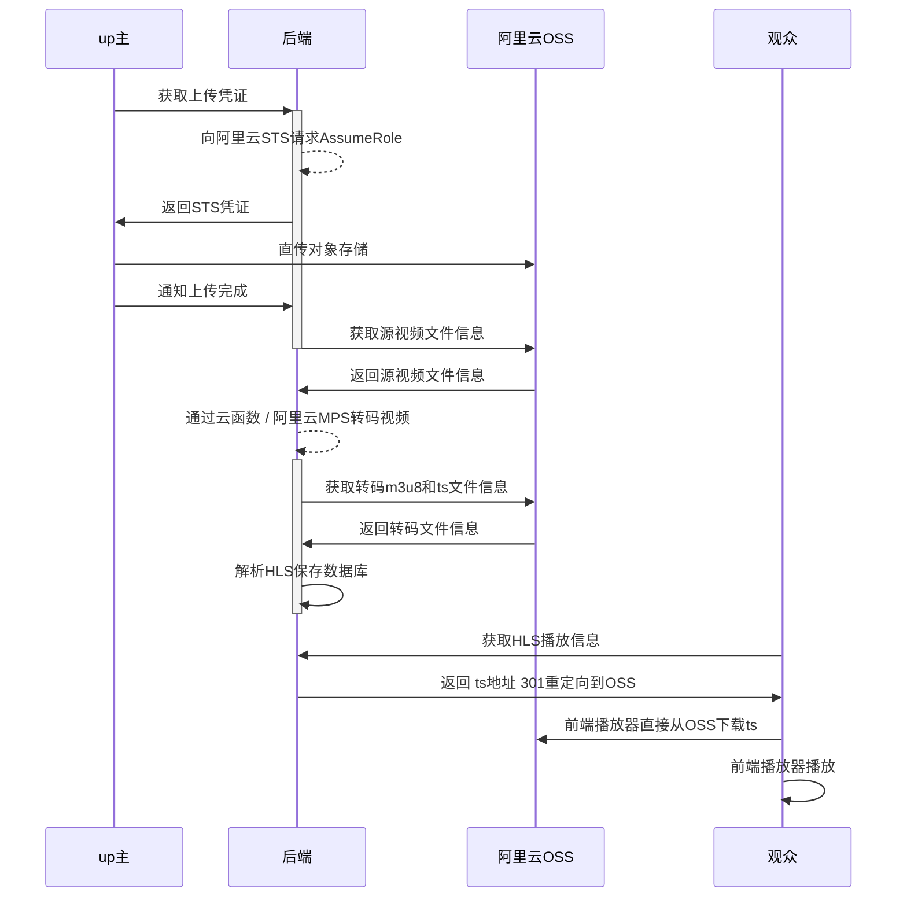

# 关键逻辑

## 上传




**转码**

**谁转？**

有三种方式

如果码率很低，直接用ffmpeg，也就是云函数，这样最快

其次可以用阿里云的视频转码接口

最快的方式是GPU的云函数

**回调**

云函数，和阿里云接口，都有回调，我都有统一回调处理

**冗余加速**


**播放**

**自适应码率**

接入了Apple的自适应码率，之前用户的痛点是，1080加载慢，720加载快但是不清楚

交给自适应自动切换，当然要写接口，这把之前获取播放地址逻辑都改了

**cdn？**

预热，我试过，慢。cdn没有缓存不如直接访问对象存储了，那现在就是直接访问的

**统计**

heartbeat保存当前进度，下次打开的时候，再调接口获取上次离开的时的进度，设置到播放器

**前端**

目前还是用的最原始的HTML，不会vue，以后有机会可以改造一下，前端确实很重要，用户只能看到前端。

后端我还想接入RocketMQ呢

**小程序**

小程序可以用在微信上分享，现在接入了小程序，上传页面有小程序码可以分享

**安卓**

又单独做了App可以上传

# 接口文档

[](https://app.getpostman.com/run-collection/dced8657344813ee3fbc?action=collection%2Fimport)

[用户接口](docs/api/user/api-user.md)

[上传视频接口](docs/api/video/api-video.md)

[YouTube接口](docs/api/youtube/api-youtube.md)

[播放视频接口](docs/api/play/api-play.md)

[转码接口](docs/api/transcode/api-transcode.md)

[统计接口](docs/api/statistics/api-statistics.md)

[AndroidApp接口](docs/api/app/api-app.md)

# MongoDB 关键表结构

[video 视频对象](docs/mongodb/video.md)

# 其它设计

## 分包

## 登陆拦截器

## 密码

## 短连接

## 观看次数

# 代办
[代办](docs/todo/todo-list.md)

## 播放器

## 加签
[签名设计](docs/design/sign/sign.md)

# 如何部署？

RSA

Redis

application.props

# Java 8 Stream Api Examples
[Java 8 Stream Api Examples](docs/java8-stream-examples/java8-stream-examples.md)

# 变更日志
[变更日志](docs/changes/changes.md)

# 运维
## 从file迁移到tsFile，条件是type=TRANSCODE_TS
```js
const query = { type: 'TRANSCODE_TS' };
const batchSize = 500;

let count = db.file.countDocuments(query);

print(`Total documents to migrate: ${count}`);

let offset = 0;
let progress = 0;
while (offset < count) {
  const docs = db.file.find(query).skip(offset).limit(batchSize).toArray();
  if (docs.length === 0) {
    print('No documents found to migrate.');
    break;
  }
  print(`Migrating ${docs.length} documents...`);

  for (const doc of docs) {
    db.tsFile.updateOne({ _id: doc._id }, { $set: doc }, { upsert: true });
    printjson(doc);
    progress++;
    const percentage = Math.floor(progress / count * 100);
    print(`Progress: ${progress}/${count} (${percentage}%)`);
  }

  offset += docs.length;

  db.file.deleteMany({ _id: { $in: docs.map(doc => doc._id) } });
}

print('Migration complete. Old documents deleted.');

```
## 改字段名
```js
db.tsFile.updateMany({}, { $rename: { 'type': 'fileType' } });

```

# YouTube
[YouTube下载](docs/design/youtube/youtube.md)