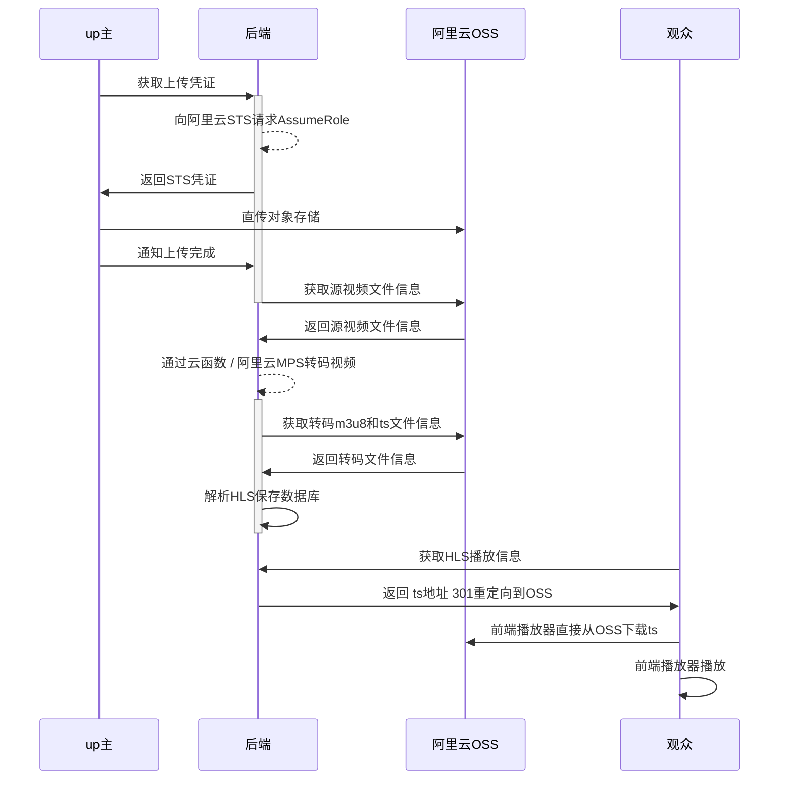

# 视频讲解

# 关键逻辑

## 上传




## 转码

### 谁转？

有三种方式

如果码率很低，直接用ffmpeg，也就是云函数，这样最快

其次可以用阿里云的视频转码接口

最快的方式是GPU的云函数

### 回调

云函数，和阿里云接口，都有回调，我都有统一回调处理

### 冗余加速


## 播放

### 自适应码率

接入了Apple的自适应码率，之前用户的痛点是，1080加载慢，720加载快但是不清楚

交给自适应自动切换，当然要写接口，这把之前获取播放地址逻辑都改了

### cdn？

预热，我试过，慢。cdn没有缓存不如直接访问对象存储了，那现在就是直接访问的

### 统计

heartbeat保存当前进度，下次打开的时候，再调接口获取上次离开的时的进度，设置到播放器

### 前端

目前还是用的最原始的HTML，不会vue，以后有机会可以改造一下，前端确实很重要，用户只能看到前端。

后端我还想接入RocketMQ呢

### 小程序

小程序可以用在微信上分享，现在接入了小程序，上传页面有小程序码可以分享

### 安卓

又单独做了App可以上传

# 接口文档

[](https://app.getpostman.com/run-collection/dced8657344813ee3fbc?action=collection%2Fimport)

[用户接口](docs/api/user/api-user.md)

[上传视频接口](docs/api/video/api-video.md)

[YouTube接口](docs/api/youtube/api-youtube.md)

[播放视频接口](docs/api/play/api-play.md)

[转码接口](docs/api/transcode/api-transcode.md)

[统计接口](docs/api/statistics/api-statistics.md)

[AndroidApp接口](docs/api/app/api-app.md)

# MongoDB 关键表结构

## video

### 重要字段

```json
{
    "_id":"63954cdfdee0d14ef70074bc",
    "userId":"638e1b7ccc41ab5499df37bf",
    "originalFileId":"63954cdfdee0d14ef70074bb",
    "originalFileKey":"videos/638e1b7ccc41ab5499df37bf/63954cdfdee0d14ef70074bc/original/63954cdfdee0d14ef70074bc.mp4",
    "watchCount":1,
    "duration":53908,
    "coverId":"63954cfbdee0d14ef70074c0",
    "coverUrl":"https://video-2022-prod.oss-cn-beijing.aliyuncs.com/videos/638e1b7ccc41ab5499df37bf/63954cdfdee0d14ef70074bc/cover/63954cfbdee0d14ef70074c0.jpg",
    "watchId":"1601779335300788224",
    "watchUrl":"https://videoplus.top/watch?v=1601779335300788224",
    "shortUrl":"https://a4.fit/6356",
    "title":"农夫山泉价格",
    "description":"",
    "width":1920,
    "height":1080,
    "videoCodec":"h264",
    "audioCodec":"aac",
    "bitrate":15508,
    "type":"USER_UPLOAD",
    "provider":"ALIYUN_OSS",
    "status":"READY",
    "createTime":"2022-12-11T03:22:07.824Z",
    "updateTime":"2022-12-11T03:23:07.020Z",
    "expireTime":"2023-01-10T03:22:07.824Z",
    "isPermanent":false,
    "isOriginalFileDeleted":false,
    "isTranscodeFilesDeleted":false,
    "transcodeIds":[
        "63954cfbdee0d14ef70074c3",
        "63954cfcdee0d14ef70074c4"
    ]
}
```

| 参数           | 说明               | 示例                     |
| -------------- | ------------------ | ------------------------ |
| userId         | 作者id             | 638e1b7ccc41ab5499df37bf |
| originalFileId | 原生文件id         | 63954cdfdee0d14ef70074bb |
| watchCount     | 观看次数统计       |                          |
| duration       | 视频时长，单位毫秒 |                          |
| coverId        | 封面文件id         |                          |
| transcodeIds   |                    |                          |

### 通过阿里云获取的视频信息 mediaInfo

```json
"mediaInfo": {
    "async": false,
    "input": {
      "bucket": "video-2022-prod",
      "location": "oss-cn-beijing",
      "object": "videos/638e1b7ccc41ab5499df37bf/63954cdfdee0d14ef70074bc/original/63954cdfdee0d14ef70074bc.mp4"
    },
    "jobId": "794c2269c2af4f1abe79d10c57a9fbd0",
    "creationTime": "2022-12-11T03:22:35Z",
    "state": "Success",
    "properties": {
      "duration": "53.908500",
      "fileSize": "104502461",
      "streams": {
        "audioStreamList": {
          "audioStream": [
            {
              "channelLayout": "stereo",
              "codecTagString": "mp4a",
              "index": "1",
              "bitrate": "96.001",
              "timebase": "1/48000",
              "codecTimeBase": "1/48000",
              "codecTag": "0x6134706d",
              "duration": "53.908500",
              "channels": "2",
              "sampleFmt": "fltp",
              "codecLongName": "AAC (Advanced Audio Coding)",
              "startTime": "0.000000",
              "codecName": "aac",
              "lang": "eng",
              "samplerate": "48000"
            }
          ]
        },
        "videoStreamList": {
          "videoStream": [
            {
              "avgFPS": "59.337578",
              "hasBFrames": "1",
              "colorRange": "pc",
              "bitrate": "15375.053",
              "codecTimeBase": "968897/114984000",
              "duration": "53.827611",
              "dar": "0:1",
              "networkCost": {},
              "startTime": "0.000000",
              "colorTransfer": "smpte170m",
              "lang": "eng",
              "height": "1080",
              "level": "40",
              "sar": "0:1",
              "profile": "High",
              "codecTagString": "avc1",
              "fps": "60.0",
              "index": "0",
              "timebase": "1/90000",
              "codecTag": "0x31637661",
              "pixFmt": "yuvj420p",
              "codecLongName": "H.264 / AVC / MPEG-4 AVC / MPEG-4 part 10",
              "width": "1920",
              "colorPrimaries": "bt470bg",
              "codecName": "h264"
            }
          ]
        },
        "subtitleStreamList": {
          "subtitleStream": []
        }
      },
      "format": {
        "duration": "53.908500",
        "numPrograms": "0",
        "size": "104502461",
        "formatName": "mov,mp4,m4a,3gp,3g2,mj2",
        "bitrate": "15508.123",
        "startTime": "0.000000",
        "formatLongName": "QuickTime / MOV",
        "numStreams": "2"
      },
      "fps": "60.0",
      "width": "1920",
      "bitrate": "15508.123",
      "fileFormat": "QuickTime / MOV",
      "height": "1080"
    }
  }
```

###  video Java Bean

```java
@Data
@Document
public class Video {
    @Id
    private String id;

    @Indexed
    private String userId;
    @Indexed
    private String originalFileId;
    private String originalFileKey;

    private Integer watchCount;
    private Long duration;      //视频时长，单位毫秒
    private String coverId;
    private String coverUrl;

    @Indexed
    private String watchId;
    private String watchUrl;
    private String shortUrl;
    private String title;
    private String description;

    private Integer width;
    private Integer height;
    private String videoCodec;
    private String audioCodec;
    private Integer bitrate;

    @Indexed
    private String type;
    @Indexed
    private String provider;    //它就是对象存储提供商，和file是一对一关系

    @Indexed
    private String youtubeVideoId;
    private String youtubeUrl;
    private JSONObject youtubeVideoInfo;
    private Date youtubePublishTime;

    @Indexed
    private String status;
    @Indexed
    private Date createTime;
    @Indexed
    private Date updateTime;

    @Indexed
    private Date expireTime;
    @Indexed
    private Boolean isPermanent;                //是否是永久视频
    private Boolean isOriginalFileDeleted;      //源视频是否已删除
    private Boolean isTranscodeFilesDeleted;    //ts转码文件是否已删除
    private Date deleteTime;                    //什么时候删的

    private JSONObject mediaInfo;

    private List<String> transcodeIds;

    public boolean isYoutube() {
        return StringUtils.equals(type, VideoType.YOUTUBE);
    }

    public boolean isReady() {
        return StringUtils.equals(status, VideoStatus.READY);
    }
}

```

# 其它设计

## 分包


## 登陆拦截器


## 密码


## 短连接

## 观看次数

# TODOs

https://shimo.im/docs/Ee32M5wMj1CejeA2/ 《2022.02.23 新点播功能联想 ideas 列表》，可复制链接后用石墨文档 App 打开

## 播放器

- [ ] 网页上传

- [ ] 搬运YouTube

- [ ] 一个好用的前端网页m3u8播放器

- [ ] 截帧封面，截首帧就行

- [ ] 时间跳转t=21

- [ ] 多分辨率选择

- [ ] 播放列表

- [ ] 视频权限，public，unlist，private

- [ ] 多种转码方式，客户端或者云ffmpeg转码，或者云api收费转码，最终汇聚到新建视频函数
- [ ] 以720甚至480开始播放，根据网络情况自动升1080


# 如何部署？

RSA

Redis

application.props

# Java8 Stream API Examples

## 视频讲解
https://www.bilibili.com/video/BV1M44y1f7AD/

## 1. 过滤 filter

**代码**

```java
Arrays.stream(m3u8Content.split("\n"))
        .filter(e -> !e.startsWith("#")).collect(Collectors.toList());
```


**解释**

当转码完成后，会生成m3u8文件。要解析出m3u8中的ts文件，干掉 # 开头的注释

.filter(e -> !e.startsWith("#")) 代表过滤，里面的条件是你最终留下来的


**m3u8文件，过滤前：**

```
#EXTM3U
#EXT-X-VERSION:3
#EXT-X-ALLOW-CACHE:YES
#EXT-X-TARGETDURATION:3
#EXT-X-MEDIA-SEQUENCE:0
#EXTINF:2.021111,
6379bbbab1d6e03eeab86c9e-00001.ts
#EXTINF:1.998667,
6379bbbab1d6e03eeab86c9e-00002.ts
#EXTINF:1.998667,
6379bbbab1d6e03eeab86c9e-00003.ts
#EXTINF:1.998667,
6379bbbab1d6e03eeab86c9e-00004.ts
#EXT-X-ENDLIST
```

**过滤后：**

```
6379bbbab1d6e03eeab86c9e-00001.ts
6379bbbab1d6e03eeab86c9e-00002.ts
6379bbbab1d6e03eeab86c9e-00003.ts
6379bbbab1d6e03eeab86c9e-00004.ts
```


**划重点：**

```java
.filter(e -> !e.startsWith("#")).collect(Collectors.toList());
```


## 2. 统计数量 count

**代码**

```java
//从数据库中查出，该视频对应的所有转码任务
List<Transcode> transcodeList = transcodeRepository.getByIds(video.getTranscodeIds());
//统计已完成数量
long completeCount = transcodeList.stream().filter(Transcode::isFinishStatus).count();
```


**场景：**

统计Transcode对象的status字段，有多少是“已完成”状态


**视频状态：**

**已创建**，用户正在上传源视频

源文件上传完成，发起转码之后，状态为：**转码中**

转码分为1080p，720p，多个分辨率，部分转码完成的状态就是：**正在转码，部分完成**

所有转码完成，状态为：**视频已就绪**

```java
public class VideoStatus {
    public static final String CREATED = "CREATED";
    public static final String TRANSCODING = "TRANSCODING";
    public static final String TRANSCODING_PARTLY_COMPLETED  = "TRANSCODING_PARTLY_COMPLETED";
    public static final String READY = "READY";
}
```


**两个Transcode对象的json：**

```json
[
    {
        "createTime":1671632120107,
        "finishStatus":true,
        "finishTime":1671632136000,
        "id":"63a314f8c7f12263436e0d21",
        "jobId":"fae8e61121c3422db12031a20badbbb3",
        "m3u8AccessUrl":"https://video-2022-dev.oss-cn-beijing.aliyuncs.com/videos/638741b6a71dc42ea537d9b1/63a314edc7f12263436e0d1d/transcode/720p/63a314f8c7f12263436e0d21.m3u8",
        "m3u8Key":"videos/638741b6a71dc42ea537d9b1/63a314edc7f12263436e0d1d/transcode/720p/63a314f8c7f12263436e0d21.m3u8",
        "provider":"ALIYUN_MPS_TRANSCODE",
        "resolution":"720p",        "sourceKey":"videos/638741b6a71dc42ea537d9b1/63a314edc7f12263436e0d1d/original/63a314edc7f12263436e0d1d.mp4",
        "status":"TranscodeSuccess",
        "successStatus":true,
        "userId":"638741b6a71dc42ea537d9b1",
        "videoId":"63a314edc7f12263436e0d1d"
    },
    
    {
        "createTime":1671632120248,
        "finishStatus":false,
        "id":"63a314f8c7f12263436e0d22",
        "jobId":"7d239815c45d4caba7f9751f58681427",
        "m3u8AccessUrl":"https://video-2022-dev.oss-cn-beijing.aliyuncs.com/videos/638741b6a71dc42ea537d9b1/63a314edc7f12263436e0d1d/transcode/1080p/63a314f8c7f12263436e0d22.m3u8",
  "m3u8Key":"videos/638741b6a71dc42ea537d9b1/63a314edc7f12263436e0d1d/transcode/1080p/63a314f8c7f12263436e0d22.m3u8",
        "provider":"ALIYUN_MPS_TRANSCODE",
        "resolution":"1080p",
        "sourceKey":"videos/638741b6a71dc42ea537d9b1/63a314edc7f12263436e0d1d/original/63a314edc7f12263436e0d1d.mp4",
        "status":"Submitted",
        "successStatus":false,
        "userId":"638741b6a71dc42ea537d9b1",
        "videoId":"63a314edc7f12263436e0d1d"
    }
]
```

**划重点：**

```java
.filter(Transcode::isFinishStatus).count();
```


## 3. list 转 map

**代码**

```java
List<OSSObjectSummary> objects = fileService.listAllObjects(transcodeFolder);
Map<String, OSSObjectSummary> ossFilenameMap = objects.stream().collect(
        Collectors.toMap(e -> FilenameUtils.getName(e.getKey()), Function.identity()));
```

**描述**

把对象存储的List的objects转成了map，用于之后的组装

key是OSS的key，value还是之前的对象

**List< OSSObjectSummary> objects**

```json
[
    {
        "bucketName":"video-2022-dev",
        "eTag":"67AB6B4EA67235B6B7DAB871AEDF9AB5",
        "key":"videos/638741b6a71dc42ea537d9b1/63a31d33c1de457ae738ae6f/transcode/720p/63a31d3ec1de457ae738ae73-00001.ts",
        "lastModified":1671634257000,
        "size":1106944,
        "storageClass":"Standard",
        "type":"Normal"
    },
    
    {
        "bucketName":"video-2022-dev",
        "eTag":"2BCCDFEBB0ED93FEAAB0530F79266795",
        "key":"videos/638741b6a71dc42ea537d9b1/63a31d33c1de457ae738ae6f/transcode/720p/63a31d3ec1de457ae738ae73-00002.ts",
        "lastModified":1671634257000,
        "size":1263360,
        "storageClass":"Standard",
        "type":"Normal"
    },
    
    {
        "bucketName":"video-2022-dev",
        "eTag":"5DAFC82E75980211CC002D811804A4B0",
        "key":"videos/638741b6a71dc42ea537d9b1/63a31d33c1de457ae738ae6f/transcode/720p/63a31d3ec1de457ae738ae73-00003.ts",
        "lastModified":1671634258000,
        "size":796180,
        "storageClass":"Standard",
        "type":"Normal"
    }
]
```


**Map< String, OSSObjectSummary> ossFilenameMap**

```json
{
    "63a31d3ec1de457ae738ae73-00003.ts":{
        "bucketName":"video-2022-dev",
        "eTag":"5DAFC82E75980211CC002D811804A4B0",
        "key":"videos/638741b6a71dc42ea537d9b1/63a31d33c1de457ae738ae6f/transcode/720p/63a31d3ec1de457ae738ae73-00003.ts",
        "lastModified":1671634258000,
        "size":796180,
        "storageClass":"Standard",
        "type":"Normal"
    },
    
    "63a31d3ec1de457ae738ae73-00001.ts":{
        "bucketName":"video-2022-dev",
        "eTag":"67AB6B4EA67235B6B7DAB871AEDF9AB5",
        "key":"videos/638741b6a71dc42ea537d9b1/63a31d33c1de457ae738ae6f/transcode/720p/63a31d3ec1de457ae738ae73-00001.ts",
        "lastModified":1671634257000,
        "size":1106944,
        "storageClass":"Standard",
        "type":"Normal"
    },
    
    "63a31d3ec1de457ae738ae73-00002.ts":{
        "bucketName":"video-2022-dev",
        "eTag":"2BCCDFEBB0ED93FEAAB0530F79266795",
        "key":"videos/638741b6a71dc42ea537d9b1/63a31d33c1de457ae738ae6f/transcode/720p/63a31d3ec1de457ae738ae73-00002.ts",
        "lastModified":1671634257000,
        "size":1263360,
        "storageClass":"Standard",
        "type":"Normal"
    }
}
```

**划重点**：

```java
.collect(Collectors.toMap(e -> FilenameUtils.getName(e.getKey()), Function.identity()));
```


## 4. 从list中摘出某字段列表

**代码**

```java
//反向更新transcode的ts文件id列表
transcode.setTsFileIds(tsFiles.stream().map(File::getId).collect(Collectors.toList()));
```


**描述**

转码Transcode对象，保存了所有ts文件的id，作为冗余字段，下次拿这些文件id直接去拿文件，比在File表条件查询更快

所以我们需要从一堆File对象的list里找出id的list

**List< File> tsFiles**

```java
[
    {
        "bitrate":4203680,
        "createTime":1671634759267,
        "etag":"C2FB06BBE12249536ACB328CFCA7C54C",
        "extension":"ts",
        "filename":"63a31f382d25175e68da8bd3-00001.ts",
        "id":"63a31f472d25175e68da8bd6",
        "isDeleted":false,
        "key":"videos/638741b6a71dc42ea537d9b1/63a31f2d2d25175e68da8bcf/transcode/720p/63a31f382d25175e68da8bd3-00001.ts",
        "provider":"ALIYUN_OSS",
        "resolution":"720p",
        "size":1050920,
        "status":"READY",
        "storageClass":"Standard",
        "transcodeId":"63a31f382d25175e68da8bd3",
        "tsIndex":0,
        "type":"TRANSCODE_TS",
        "uploadTime":1671634756000,
        "userId":"638741b6a71dc42ea537d9b1",
        "videoId":"63a31f2d2d25175e68da8bcf",
        "videoType":"USER_UPLOAD"
    },
    
    {
        "bitrate":4810544,
        "createTime":1671634759267,
        "etag":"791AF144143C2DDEE204B379A52A90AF",
        "extension":"ts",
        "filename":"63a31f382d25175e68da8bd3-00002.ts",
        "id":"63a31f472d25175e68da8bd7",
        "isDeleted":false,
        "key":"videos/638741b6a71dc42ea537d9b1/63a31f2d2d25175e68da8bcf/transcode/720p/63a31f382d25175e68da8bd3-00002.ts",
        "provider":"ALIYUN_OSS",
        "resolution":"720p",
        "size":1202636,
        "status":"READY",
        "storageClass":"Standard",
        "transcodeId":"63a31f382d25175e68da8bd3",
        "tsIndex":1,
        "type":"TRANSCODE_TS",
        "uploadTime":1671634756000,
        "userId":"638741b6a71dc42ea537d9b1",
        "videoId":"63a31f2d2d25175e68da8bcf",
        "videoType":"USER_UPLOAD"
    }
]
```

**List< String> tsFileIds**

```json
[
    "63a31f472d25175e68da8bd6",
    "63a31f472d25175e68da8bd7",
    "63a31f472d25175e68da8bd8",
    "63a31f472d25175e68da8bd9",
    "63a31f472d25175e68da8bda",
    "63a31f472d25175e68da8bdb",
    "63a31f472d25175e68da8bdc",
    "63a31f472d25175e68da8bdd",
    "63a31f472d25175e68da8bde"
]
```

**Transcode 对象：冗余反向保存 tsFileIds**

```json
{
    "averageBitrate":4210824,
    "createTime":1671635170346,
    "finishStatus":true,
    "finishTime":1671635186000,
    "id":"63a320e2a225e21a6ee0b57d",
    "jobId":"7eb67f77a4064dc6bb1cc3e633d00ba1",
    "m3u8AccessUrl":"https://video-2022-dev.oss-cn-beijing.aliyuncs.com/videos/638741b6a71dc42ea537d9b1/63a320d8a225e21a6ee0b579/transcode/720p/63a320e2a225e21a6ee0b57d.m3u8",
    "m3u8Content":"#EXTM3U\n#EXT-X-VERSION:3\n#EXT-X-ALLOW-CACHE:YES\n#EXT-X-TARGETDURATION:2\n#EXT-X-MEDIA-SEQUENCE:0\n#EXTINF:2.000000,\n63a320e2a225e21a6ee0b57d-00001.ts\n#EXTINF:2.000000,\n63a320e2a225e21a6ee0b57d-00002.ts\n#EXTINF:2.000000,\n63a320e2a225e21a6ee0b57d-00003.ts\n#EXTINF:2.000000,\n63a320e2a225e21a6ee0b57d-00004.ts\n#EXTINF:2.000000,\n63a320e2a225e21a6ee0b57d-00005.ts\n#EXTINF:2.000000,\n63a320e2a225e21a6ee0b57d-00006.ts\n#EXTINF:2.000000,\n63a320e2a225e21a6ee0b57d-00007.ts\n#EXTINF:2.000000,\n63a320e2a225e21a6ee0b57d-00008.ts\n#EXTINF:2.000000,\n63a320e2a225e21a6ee0b57d-00009.ts\n#EXTINF:2.000000,\n63a320e2a225e21a6ee0b57d-00010.ts\n#EXTINF:2.000000,\n63a320e2a225e21a6ee0b57d-00011.ts\n#EXTINF:2.000000,\n63a320e2a225e21a6ee0b57d-00012.ts\n#EXTINF:2.000000,\n63a320e2a225e21a6ee0b57d-00013.ts\n#EXTINF:2.000000,\n63a320e2a225e21a6ee0b57d-00014.ts\n#EXTINF:2.000000,\n63a320e2a225e21a6ee0b57d-00015.ts\n#EXTINF:2.000000,\n63a320e2a225e21a6ee0b57d-00016.ts\n#EXTINF:2.000000,\n63a320e2a225e21a6ee0b57d-00017.ts\n#EXTINF:2.000000,\n63a320e2a225e21a6ee0b57d-00018.ts\n#EXTINF:2.000000,\n63a320e2a225e21a6ee0b57d-00019.ts\n#EXTINF:2.000000,\n63a320e2a225e21a6ee0b57d-00020.ts\n#EXTINF:2.000000,\n63a320e2a225e21a6ee0b57d-00021.ts\n#EXTINF:2.000000,\n63a320e2a225e21a6ee0b57d-00022.ts\n#EXTINF:2.000000,\n63a320e2a225e21a6ee0b57d-00023.ts\n#EXTINF:2.000000,\n63a320e2a225e21a6ee0b57d-00024.ts\n#EXTINF:2.000000,\n63a320e2a225e21a6ee0b57d-00025.ts\n#EXTINF:2.000000,\n63a320e2a225e21a6ee0b57d-00026.ts\n#EXTINF:2.000000,\n63a320e2a225e21a6ee0b57d-00027.ts\n#EXTINF:2.000000,\n63a320e2a225e21a6ee0b57d-00028.ts\n#EXTINF:0.133333,\n63a320e2a225e21a6ee0b57d-00029.ts\n#EXT-X-ENDLIST\n",
    "m3u8Key":"videos/638741b6a71dc42ea537d9b1/63a320d8a225e21a6ee0b579/transcode/720p/63a320e2a225e21a6ee0b57d.m3u8",
    "maxBitrate":6171664,
    "provider":"ALIYUN_MPS_TRANSCODE",
    "resolution":"720p",
  "sourceKey":"videos/638741b6a71dc42ea537d9b1/63a320d8a225e21a6ee0b579/original/63a320d8a225e21a6ee0b579.mp4",
    "status":"TranscodeSuccess",
    "successStatus":true,
    "tsFileIds":[
        "63a320f3a225e21a6ee0b580",
        "63a320f3a225e21a6ee0b581",
        "63a320f3a225e21a6ee0b582",
        "63a320f3a225e21a6ee0b583",
        "63a320f3a225e21a6ee0b584",
        "63a320f3a225e21a6ee0b585",
        "63a320f3a225e21a6ee0b586",
        "63a320f3a225e21a6ee0b587",
        "63a320f3a225e21a6ee0b588",
        "63a320f3a225e21a6ee0b589",
        "63a320f3a225e21a6ee0b58a",
        "63a320f3a225e21a6ee0b58b",
        "63a320f3a225e21a6ee0b58c",
        "63a320f3a225e21a6ee0b58d",
        "63a320f3a225e21a6ee0b58e",
        "63a320f3a225e21a6ee0b58f",
        "63a320f3a225e21a6ee0b590",
        "63a320f3a225e21a6ee0b591",
        "63a320f3a225e21a6ee0b592",
        "63a320f3a225e21a6ee0b593",
        "63a320f3a225e21a6ee0b594",
        "63a320f3a225e21a6ee0b595",
        "63a320f3a225e21a6ee0b596",
        "63a320f3a225e21a6ee0b597",
        "63a320f3a225e21a6ee0b598",
        "63a320f3a225e21a6ee0b599",
        "63a320f3a225e21a6ee0b59a",
        "63a320f3a225e21a6ee0b59b",
        "63a320f3a225e21a6ee0b59c"
    ],
    "userId":"638741b6a71dc42ea537d9b1",
    "videoId":"63a320d8a225e21a6ee0b579"
}
```

**划重点：**

```java
.map(File::getId).collect(Collectors.toList());
```


## 5. 求和 sum

**代码**

```java
//计算transcode平均码率
long tsTotalSize = tsFiles.stream().mapToLong(File::getSize).sum();
BigDecimal duration = new BigDecimal(video.getDuration() / 1000);
transcode.setAverageBitrate(calculateBitrate(tsTotalSize, duration));
```

**介绍**

在自适应码率的HLS里，需要给定带宽所需要的最大码率和平均码率

最大码率计算方法：遍历所有ts文件大小，求最大值

计算平均码率：所有ts文件大小求和，再除以 视频总时长


**参考：Apple的HLS自适应码率文档**

https://developer.apple.com/documentation/http_live_streaming/example_playlists_for_http_live_streaming/creating_a_multivariant_playlist


**Apple 的多码率自适应官方例子：**

```text
#EXTM3U
#EXT-X-STREAM-INF:BANDWIDTH=150000,RESOLUTION=416x234,CODECS="avc1.42e00a,mp4a.40.2"
http://example.com/low/index.m3u8
#EXT-X-STREAM-INF:BANDWIDTH=240000,RESOLUTION=416x234,CODECS="avc1.42e00a,mp4a.40.2"
http://example.com/lo_mid/index.m3u8
#EXT-X-STREAM-INF:BANDWIDTH=440000,RESOLUTION=416x234,CODECS="avc1.42e00a,mp4a.40.2"
http://example.com/hi_mid/index.m3u8
#EXT-X-STREAM-INF:BANDWIDTH=640000,RESOLUTION=640x360,CODECS="avc1.42e00a,mp4a.40.2"
http://example.com/high/index.m3u8
#EXT-X-STREAM-INF:BANDWIDTH=64000,CODECS="mp4a.40.5"
http://example.com/audio/index.m3u8
```


**Apple 文档参数解释：**

AVERAGE-BANDWIDTH
(Optional, but recommended) An integer that represents the average bit rate for the variant stream.

BANDWIDTH
(Required) An integer that is the upper bound of the overall bit rate for each media file, in bits per second. The upper bound value is calculated to include any container overhead that appears or will appear in the playlist.


**划重点：**

```java
.mapToLong(File::getSize).sum();
```


## 6. 最大值 max

场景跟上一个一样，自适应码率

```java
//计算transcode最高码率
Integer maxBitrate = tsFiles.stream()
    .max(Comparator.comparing(File::getBitrate)).get().getBitrate();
transcode.setMaxBitrate(maxBitrate);
```

划重点，比较器：

```java
.max(Comparator.comparing(File::getBitrate)).get().getBitrate();
```


# 变更日志

## 2022年11月27日21:18:08

RSA密码加密计划

## 2022年12月7日23:06:51

重新接入阿里云web播放器

## 2022年12月10日13:33:26

加入自适应码率

## 2022年12月10日23:03:12
RequestUtil to DTO改造方案

## 2022年12月10日23:34:23
接入UserHolder，取消request获取user对象

## 2023年1月15日10:10:19
引入GlobalExceptionHandler，自定义异常VideoException，service抛异常

## 2023年1月15日11:10:19
引入cacheService，解决循环依赖

## 2023年2月2日00:32:21
RequestUtil获取request对象改造方案

## 2023年5月16日07:53:24
改造钉钉通知类NotificationService，把异常发送到钉钉

## 2023年5月19日07:27:42
把video对象抽出MediaInfo子类

## 2023年5月19日08:20:58
抽出EnvironmentService，取消之前所有@Value注入

## 2023年5月25日07:46:21
改造登录拦截器，一个放token，一个拦截

## 2023年5月28日10:15:56
新增请求日志拦截器RequestLogInterceptor，保存请求记录，耗时
