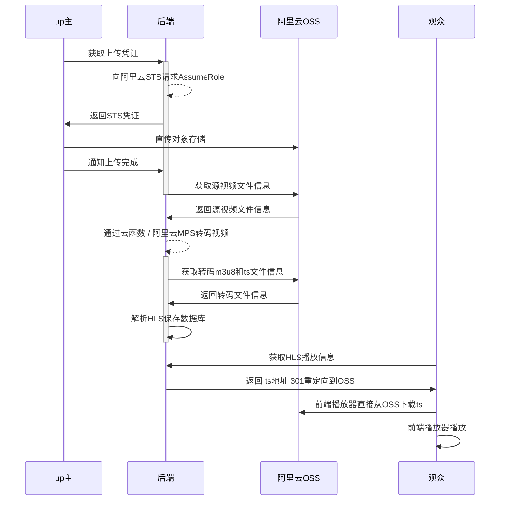

## 上传



**转码**

**谁转？**

有三种方式

如果码率很低，直接用ffmpeg，也就是云函数，这样最快

其次可以用阿里云的视频转码接口

最快的方式是GPU的云函数

**回调**

云函数，和阿里云接口，都有回调，我都有统一回调处理

**冗余加速**


**播放**

**自适应码率**

接入了Apple的自适应码率，之前用户的痛点是，1080加载慢，720加载快但是不清楚

交给自适应自动切换，当然要写接口，这把之前获取播放地址逻辑都改了

**cdn？**

预热，我试过，慢。cdn没有缓存不如直接访问对象存储了，那现在就是直接访问的

**统计**

heartbeat保存当前进度，下次打开的时候，再调接口获取上次离开的时的进度，设置到播放器

**前端**

目前还是用的最原始的HTML，不会vue，以后有机会可以改造一下，前端确实很重要，用户只能看到前端。

后端我还想接入RocketMQ呢

**小程序**

小程序可以用在微信上分享，现在接入了小程序，上传页面有小程序码可以分享

**安卓**

又单独做了App可以上传


## 分包

## 登陆拦截器

## 密码

## 短连接

## 观看次数

## 播放器

## 加签
## 签名设计
加签种类：
1. 用户请求后端
2. 后端应用内部调用
3. 开放第三方接口

### 1. 用户请求后端

### 2. 后端应用内部调用，比如云函数回调
#### 业务场景
后端应用内部调用，比如云函数回调
#### 签名方法
urlEncode(base64(HmacSHA256(

url中的参数，去掉sign字段，按字母排序 + "\n"

body + "\n"
)))
#### 代码调用
```java
public static String hmac(String key, String data) {
    HMac hMac = SecureUtil.hmacSha256(key);
    return hMac.digestBase64(data, true);
}
```

### 3. 开放第三方接口


# Youtube
# 构建下载YouTube的自定义Docker镜像

## 定义 Dockerfile

```dockerfile
FROM centos:7

RUN yum install -y java-11-openjdk python3 python3-pip ffmpeg clang gcc
RUN python3 --version
RUN pip3 install -i https://mirrors.aliyun.com/pypi/simple/ yt-dlp
```

## 构建自定义镜像

```shell
docker build -t video-2022-youtube-base-image:1.0 .
```

## 删除所有镜像

```shell
docker stop $(docker ps -aq)
docker rm $(docker ps -aq)
docker rmi --force $(docker images -q)
```

## 推送到阿里云Docker镜像仓库

登录香港仓库

```shell
sudo docker login --username=finalbird@foxmail.com registry.cn-hongkong.aliyuncs.com
```

打标签 tag

```shell
docker tag video-2022-youtube-base-image:1.0 registry.cn-hongkong.aliyuncs.com/b4/video-2022-youtube-base-image:1.0
```

推送

```shell
docker push registry.cn-hongkong.aliyuncs.com/b4/video-2022-youtube-base-image:1.0
```