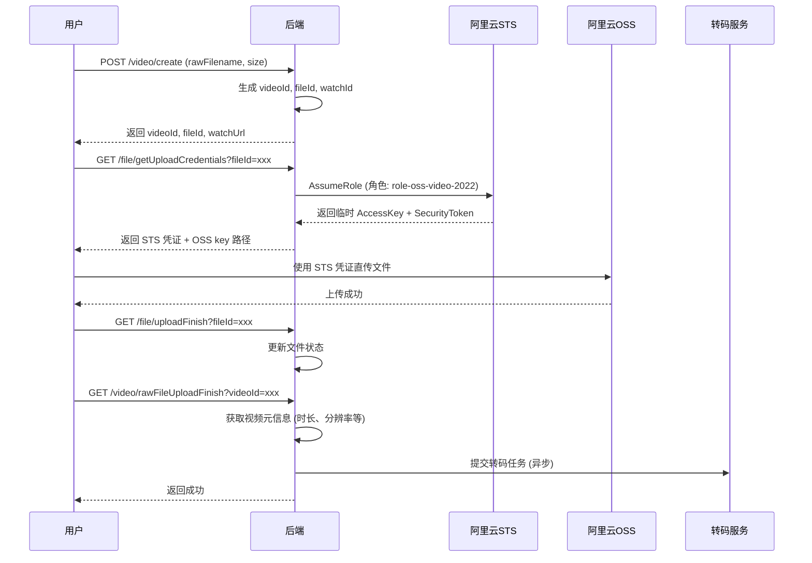
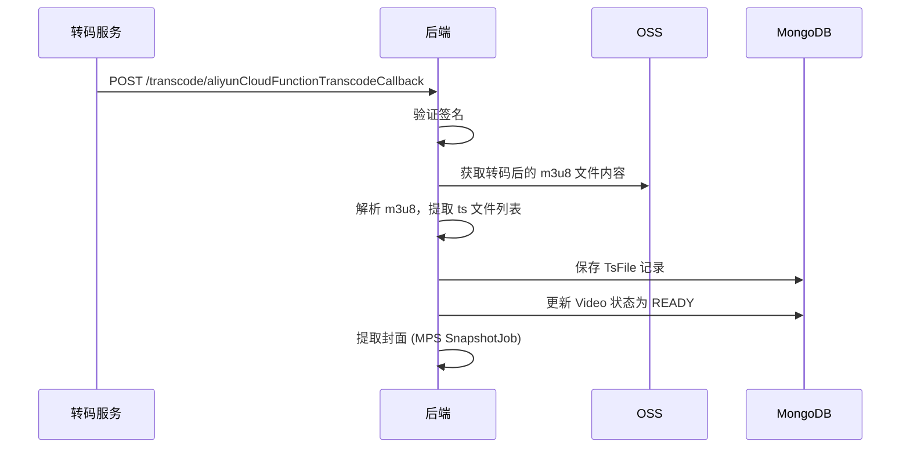
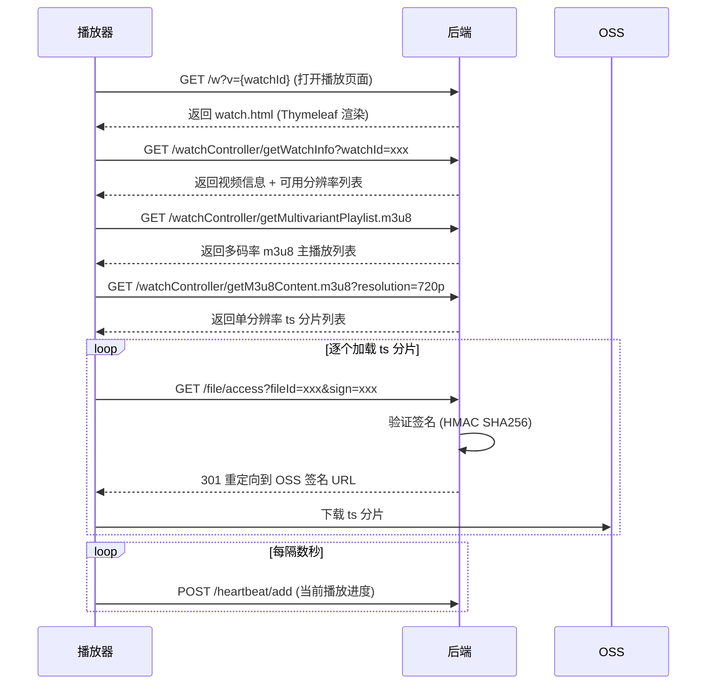

# 关键设计

> 文档地图：[README](../README.md) > 本文档

本文档描述 video-2022 的核心架构和关键业务流程，供开发者和 AI 理解系统设计。

---

## 业务文档

> 每个业务域独立成文档，包含 Mermaid 流程图、代码调用链、数据模型和边界情况。

| 文档 | 说明 |
|------|------|
| [视频上传与去重](业务/1-视频上传与去重.md) | 上传流程、STS 凭证、MD5 去重、文件链接 |
| [视频转码](业务/2-视频转码.md) | 工厂模式、MPS/云函数/GPU、状态机、回调 |
| [视频播放](业务/3-视频播放.md) | HLS 自适应码率、签名访问、心跳、进度恢复 |
| [视频存储](业务/4-视频存储.md) | OSS 双 Bucket、路径规则、Presigned URL、日志/库存 |
| [YouTube 下载](业务/5-YouTube下载.md) | 云函数部署、yt-dlp、文件传输、封面迁移 |
| [用户与设备](业务/6-用户与设备.md) | 手机认证、Token、拦截器、设备识别 |
| [封面提取](业务/7-封面提取.md) | 帧提取、YouTube 缩略图、签名 URL |
| [计费系统](业务/8-计费系统.md) | 流量费用、钱包、账单、自动计费任务 |
| [播放列表](业务/9-播放列表.md) | CRUD、排序、分享 |
| [系统服务](业务/10-系统服务.md) | ID 生成、钉钉通知、异常处理、IP 定位、定时任务 |

---

## 系统架构总览

```
┌─────────────┐     ┌──────────────────────────────────────────────────┐
│  前端页面     │     │              Spring Boot 后端 (port 5022)         │
│  upload.html │────▶│                                                  │
│  watch.html  │◀────│  Controller → Service → Repository (MongoDB)     │
│  login.html  │     │                                                  │
└─────────────┘     └───────┬──────────┬──────────┬──────────┬─────────┘
                            │          │          │          │
                    ┌───────▼──┐ ┌─────▼────┐ ┌──▼───┐ ┌───▼────┐
                    │ 阿里云OSS │ │ 阿里云MPS │ │Redis │ │MongoDB │
                    │ (视频存储) │ │ (视频转码) │ │(缓存) │ │(数据库) │
                    └──────────┘ └──────────┘ └──────┘ └────────┘
```

### 核心模块依赖关系

```
user (用户认证)
  ↓ token
video (视频管理) ← file (文件管理) ← oss (OSS封装)
  ↓ videoId
transcode (转码) → cover (封面提取)
  ↓ transcodeId
watch (播放) → heartbeat (心跳) → progress (进度)
  ↓
playlist (播放列表)
```

---

## 一、视频上传流程

### 时序图


```mermaid
sequenceDiagram
    participant 用户
    participant 后端
    participant STS as 阿里云STS
    participant OSS as 阿里云OSS
    participant 转码 as 转码服务

    用户->>后端: POST /video/create (rawFilename, size)
    后端->>后端: 生成 videoId, fileId, watchId
    后端-->>用户: 返回 videoId, fileId, watchUrl

    用户->>后端: GET /file/getUploadCredentials?fileId=xxx
    后端->>STS: AssumeRole (角色: role-oss-video-2022)
    STS-->>后端: 返回临时 AccessKey + SecurityToken
    后端-->>用户: 返回 STS 凭证 + OSS key 路径

    用户->>OSS: 使用 STS 凭证直传文件
    OSS-->>用户: 上传成功

    用户->>后端: GET /file/uploadFinish?fileId=xxx
    后端->>后端: 更新文件状态

    用户->>后端: GET /video/rawFileUploadFinish?videoId=xxx
    后端->>后端: 获取视频元信息 (时长、分辨率等)
    后端->>转码: 提交转码任务 (异步)
    后端-->>用户: 返回成功
```

### 关键代码路径

```
VideoController.create()
  → VideoService.create()
    → IdService.getVideoId()      // Redis 原子计数器生成 ID
    → FileService.createFile()    // 创建文件记录
    → MongoDB 保存 Video 文档

FileController.getUploadCredentials()
  → FileService.getUploadCredentials()
    → OssVideoService.generateUploadCredentials()  // STS AssumeRole
    → 返回 {accessKeyId, secretKey, sessionToken, key, bucket}

VideoController.rawFileUploadFinish()
  → RawFileService.rawFileUploadFinish()
    → 获取 OSS 文件元信息
    → TranscodeService.transcode()  // 触发转码
```

### OSS 存储路径规则

```
videos/{userId}/{yyyyMM}/{videoId}/raw/{fileId}/{fileId}.mp4          ← 原始文件
videos/{userId}/{yyyyMM}/{videoId}/transcode/{transcodeId}/           ← 转码文件
videos/{userId}/{yyyyMM}/{videoId}/cover/{coverId}/{fileId}.jpg       ← 封面图片
```

---

## 二、转码流程

### 工厂模式选择转码实现

位置：`transcode/` 包

```
TranscodeService.transcode(video)
  → TranscodeFactory.getTranscodeService()
    → 优先级：
      1. AliyunCfGPUTranscodeImpl   (GPU 云函数，最快)
      2. AliyunMpsTranscodeImpl     (阿里云 MPS 服务)
      3. AliyunCfTranscodeImpl      (普通云函数)
```

### 转码参数

| 分辨率 | MPS 模板 ID | 输出格式 |
|--------|------------|----------|
| 480p | `6db7941bf7ec43c4a4ecc7f67d87ace6` | HLS (.m3u8 + .ts) |
| 720p | `f96c8ccf81c44f079d285e13c1a1a104` | HLS (.m3u8 + .ts) |
| 1080p | `438e72fb70d04b89bf2b37b2769cf1ec` | HLS (.m3u8 + .ts) |

### 转码回调流程


```mermaid
sequenceDiagram
    participant 转码服务
    participant 后端
    participant OSS
    participant MongoDB

    转码服务->>后端: POST /transcode/aliyunCloudFunctionTranscodeCallback
    后端->>后端: 验证签名
    后端->>OSS: 获取转码后的 m3u8 文件内容
    后端->>后端: 解析 m3u8，提取 ts 文件列表
    后端->>MongoDB: 保存 TsFile 记录
    后端->>MongoDB: 更新 Video 状态为 READY
    后端->>后端: 提取封面 (MPS SnapshotJob)
```

### 视频状态流转

```
CREATED → UPLOADING → PREPARE_TRANSCODING → TRANSCODING → READY
                                                          ↓ (失败)
                                                    TRANSCODE_FAILED
```

---

## 三、视频播放流程

### HLS 自适应码率播放


```mermaid
sequenceDiagram
    participant 播放器
    participant 后端
    participant OSS

    播放器->>后端: GET /w?v={watchId} (打开播放页面)
    后端-->>播放器: 返回 watch.html (Thymeleaf 渲染)

    播放器->>后端: GET /watchController/getWatchInfo?watchId=xxx
    后端-->>播放器: 返回视频信息 + 可用分辨率列表

    播放器->>后端: GET /watchController/getMultivariantPlaylist.m3u8
    后端-->>播放器: 返回多码率 m3u8 主播放列表

    播放器->>后端: GET /watchController/getM3u8Content.m3u8?resolution=720p
    后端-->>播放器: 返回单分辨率 ts 分片列表

    loop 逐个加载 ts 分片
        播放器->>后端: GET /file/access?fileId=xxx&sign=xxx
        后端->>后端: 验证签名 (HMAC SHA256)
        后端-->>播放器: 301 重定向到 OSS 签名 URL
        播放器->>OSS: 下载 ts 分片
    end

    loop 每隔数秒
        播放器->>后端: POST /heartbeat/add (当前播放进度)
    end
```

### 文件访问签名设计

ts 文件访问需要签名，防止盗链：

```
签名参数：resolution, fileId, timestamp, nonce
签名算法：urlEncode(base64(HmacSHA256(params_sorted_by_key + "\n")))
签名密钥：应用内部密钥
有效期：签名中的 timestamp 控制
```

代码位置：`file/access/` 包

---

## 四、用户认证

### 登录流程

```
手机号 + 验证码 → 生成 token (Redis缓存30分钟) → 后续请求通过 Header 携带 token
```

### Token 传递方式

- HTTP Header: `token: {value}`
- Query Parameter: `?token={value}`（兼容 OSS 上传场景）

### 拦截器

位置：`springboot/interceptor/`

每个请求经过拦截器检查 token → 从 Redis 获取用户信息 → 注入到请求上下文

---

## 五、ID 生成策略

位置：`system/service/IdService.java`

使用 Redis 原子计数器生成全局唯一 ID：

| ID 类型 | 前缀 | 格式 | 示例 |
|---------|------|------|------|
| userId | `u_` | `u_{时间单元}{序号}{随机}` | `u_2507677900001740` |
| videoId | `v_` | `v_{时间单元}{序号}{随机}` | `v_2507678200001472` |
| fileId | `f_` | `f_{时间单元}{序号}{随机}` | `f_2507678200002991` |
| transcodeId | `t_` | `t_{时间单元}{序号}{随机}` | `t_2507682700003456` |
| coverId | `c_` | `c_{时间单元}{序号}{随机}` | `c_2507682700002250` |
| watchId | 无 | 短字母数字 | `2ISMYP` |

---

## 六、Redis 用途

| 用途 | Key 模式 | TTL | 说明 |
|------|---------|-----|------|
| 用户 Token 缓存 | `user:token:{token}` | 30 分钟 | 登录态 |
| 验证码 | `user:verificationCode:{phone}` | 10 分钟 | 手机验证码 |
| Long ID 计数器 | `increaseLongId:{timeUnit}` | 按时间单元 | 原子递增生成唯一 ID |
| Short ID 计数器 | `increaseShortId:{date}` | 2 天 | 短 ID 生成 |
| IP 地理位置缓存 | `ip:{ip}` | 6 小时 | 缓存阿里云 API 结果 |

---

## 七、OSS 双 Bucket 设计

| Bucket | 名称 | 用途 |
|--------|------|------|
| 视频 bucket | `video-2022-dev` / `video-2022-prod` | 原始视频、转码文件、封面 |
| 数据 bucket | `oss-data-bucket` | OSS 访问日志、库存报告（阿里云自动写入） |

数据 bucket 的内容由 `OssLogService` 和 `OssInventoryService` 解析后存入 MongoDB，用于流量统计和数据分析。

---

## 八、YouTube 下载

YouTube 模块独立部署到阿里云函数计算（香港区域），使用 yt-dlp 下载视频后上传到 OSS。

### Docker 镜像构建

```dockerfile
FROM centos:7
RUN yum install -y java-11-openjdk python3 python3-pip ffmpeg clang gcc
RUN pip3 install -i https://mirrors.aliyun.com/pypi/simple/ yt-dlp
```

```shell
# 构建
docker build -t video-2022-youtube-base-image:1.0 .

# 推送到阿里云镜像仓库 (香港)
docker tag video-2022-youtube-base-image:1.0 \
  registry.cn-hongkong.aliyuncs.com/b4/video-2022-youtube-base-image:1.0
docker push registry.cn-hongkong.aliyuncs.com/b4/video-2022-youtube-base-image:1.0
```