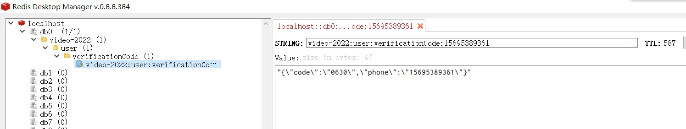

## 1. 用户

### 请求验证码

请求短信验证码，然后后端会在Redis缓存，有过期时间

```text
GET /user/requestVerificationCode
```

| 参数  | 说明   | 示例值      |
| ----- | ------ | ----------- |
| phone | 手机号 | 15695389361 |



### 提交验证码

```
GET /user/submitVerificationCode
```

| 参数  | 说明   | 示例值      |
| ----- | ------ | ----------- |
| phone | 手机号 | 15695389361 |
| code  | 验证码 | 4736        |

验证码正确 返回示例：

```json
{
    "code": 0,
    "message": "success",
    "data": {
        "id": "63a1d358388fcc49fa49d393",
        "phone": "15695389361",
        "registerChannel": "WEB",
        "createTime": "2022-12-24T15:23:03.244+00:00",
        "token": "1605222255652876288"
    }
}
```

| 参数            | 说明                        | 示例值                        |
| --------------- | --------------------------- | ----------------------------- |
| id              | userId                      | 63a1d358388fcc49fa49d393      |
| phone           | 手机号                      | 15695389361                   |
| registerChannel | 注册渠道：网页 / 微信小程序 | WEB / WECHAT_MINI_PROGRAM     |
| createTime      | 创建时间                    | 2022-12-24T15:23:03.244+00:00 |
| token           | 登陆凭证                    | 1605222255652876288           |

验证码错误 返回示例：

```json
{
    "code": 1,
    "message": "fail",
    "data": null
}
```

### 根据 token 获取用户

```
GET /user/getUserByToken
```

| 参数  | 说明 | 示例值              |
| ----- | ---- | ------------------- |
| token | 令牌 | 1599798488034250752 |

示例返回

```json
{
    "code": 0,
    "message": "success",
    "data": {
        "id": "638e1811c29e3b400dcf9b80",
        "phone": "15695389361",
        "registerChannel": "WEB",
        "createTime": "2022-12-05T11:10:56.322+00:00",
        "token": "1599798488034250752"
    }
}
```

### 根据 userId 获取用户

```
GET /user/getUserById
```

| 参数   | 说明 | 示例值                   |
| ------ | ---- | ------------------------ |
| userId |      | 638e1811c29e3b400dcf9b80 |

返回

```json
{
    "code": 0,
    "message": "success",
    "data": {
        "id": "638e1811c29e3b400dcf9b80",
        "phone": "53845328866",
        "registerChannel": "WEB",
        "createTime": "2022-12-05T16:10:56.322+00:00",
        "token": null
    }
}
```

### 请求clientId

用户不需要登陆就可以看视频，client和session id用于追求未登录用户

前端播放器，在打开网页时，第一件事，先检查这两个id，如果没有，请求后端，后端会在数据库新建保存，

然后前端会把clientId保存在localStorage，把sessionId保存在sessionStorage，下次请求带上

```
GET /client/requestClientId
```

返回

```json
{
    "code": 0,
    "message": "success",
    "data": {
        "clientId": "63a1da9a7b31fd0978672504"
    }
}
```

### 请求sessionId

区分观看次数，就是靠sessionId

```
GET /session/requestSessionId
```

返回

```json
{
    "code": 0,
    "message": "success",
    "data": {
        "sessionId": "63a1db2b7b31fd0978672505"
    }
}
```

## 