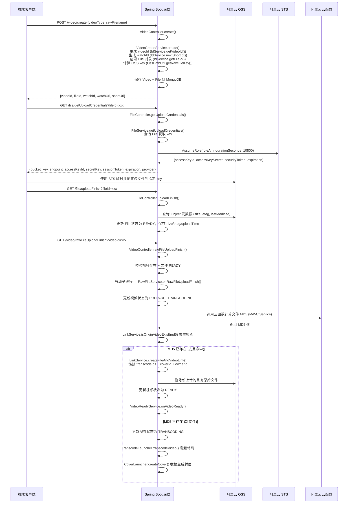
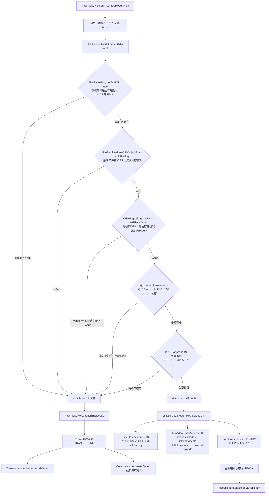

# 视频上传与去重

> 文档地图：[README](../../README.md) > [关键设计](../1-关键设计.md) > 本文档

本文档详细描述用户上传视频的完整流程，包括 STS 临时凭证生成、客户端直传 OSS、原始文件上传完成回调、MD5 去重以及去重后的链接机制。所有细节均来自源码。

---

## 1. 上传流程时序图



---

## 2. STS 凭证生成

### 凭证获取流程

`BaseOssService.generateUploadCredentials(String key)` 负责生成 STS 临时凭证：

| 配置项 | 值 | 来源 |
|--------|------|------|
| STS Endpoint | `sts.cn-beijing.aliyuncs.com` | 硬编码 |
| Region | `cn-beijing` | 硬编码 |
| RoleArn | `acs:ram::1618784280874658:role/role-oss-video-2022` | 硬编码 |
| RoleSessionName | `roleSessionName-{UUID}` | `IdUtil.simpleUUID()` 动态生成 |
| DurationSeconds | `10800`（3 小时） | `60 * 60 * 3L` |

### 返回字段

```json
{
  "bucket": "配置中的 bucket 名",
  "key": "videos/{uploaderId}/{yyyyMM}/{videoId}/raw/{fileId}/{fileId}.{ext}",
  "endpoint": "配置中的 endpoint",
  "accessKeyId": "STS 临时 AccessKeyId",
  "secretKey": "STS 临时 AccessKeySecret",
  "sessionToken": "STS SecurityToken",
  "expiration": "凭证过期时间",
  "provider": "ALIYUN_OSS"
}
```

> `provider` 字段由 `FileService.getUploadCredentials()` 从 File 实体中读取后追加。

### OSS Key 路径规则

路径由 `OssPathUtil` 生成，格式如下：

| 方法 | 路径模板 | 示例 |
|------|----------|------|
| `getVideoPrefix(video)` | `videos/{uploaderId}/{yyyyMM}/{videoId}` | `videos/user123/202306/vid456` |
| `getRawFileKey(video, rawFile)` | `{prefix}/raw/{fileId}/{fileId}.{ext}` | `videos/user123/202306/vid456/raw/file789/file789.mp4` |
| `getTranscodePrefix(video)` | `{prefix}/transcode` | `videos/user123/202306/vid456/transcode` |
| `getM3u8Key(video, transcode)` | `{prefix}/transcode/{transcodeId}/{transcodeId}.m3u8` | 同上 |
| `getCoverKey(video, cover, file)` | `{prefix}/cover/{coverId}/{fileId}.{ext}` | 同上 |

> 日期格式使用 `DatePattern.SIMPLE_MONTH_PATTERN`（即 `yyyyMM`），取自 Video 的 `createTime`。

---

## 3. MD5 去重流程

### 去重判断时序



### isOriginVideoExist() 校验清单

`LinkService.isOriginVideoExist(String md5)` 执行以下 **5 层校验**，任一失败即返回 `false`：

| 序号 | 校验内容 | 代码 |
|------|----------|------|
| 1 | 数据库中是否存在相同 MD5 的 File 记录 | `fileRepository.getByMd5(md5)` |
| 2 | 该 File 的 OSS 对象是否仍然存在 | `fileService.doesOSSObjectExist(oldFile.getKey())` |
| 3 | 关联的 Video 是否存在且状态为 `READY` | `video != null && video.getStatus().equals(VideoStatus.READY)` |
| 4 | 所有关联 Transcode 是否已完成 | `TranscodeStatus.isFinishStatus(transcode.getStatus())` |
| 5 | 每个 Transcode 的 m3u8 文件在 OSS 上是否存在 | `fileService.doesOSSObjectExist(transcode.getM3u8Key())` |

### createFileAndVideoLink() 链接操作

当去重命中后，`LinkService.createFileAndVideoLink(newVideo, newFile, oldFile)` 执行：

**linkFile (文件链接)：**
- `newFile.hasLink = true`
- `newFile.linkFileId = oldFile.id`
- `newFile.linkFileKey = oldFile.key`

**linkVideo (视频链接)：**
- `newVideo.link.hasLink = true`
- `newVideo.link.linkVideoId = oldFile.videoId`
- `newVideo.transcodeIds = oldVideo.transcodeIds`（复用已有转码结果）
- `newVideo.coverId = oldVideo.coverId`（复用已有封面）
- `newVideo.ownerId = oldVideo.ownerId`（ownerId 指向首次上传者）

**后续操作（在 RawFileService 中执行）：**
- `fileService.deleteFile(newFile)` — 删除新上传的重复原始文件（OSS 删除 + 标记 `deleted=true`）
- 更新视频状态为 `READY`
- 调用 `videoReadyService.onVideoReady()` 触发就绪回调

### VideoReadyService.onVideoReady() 就绪回调

- 发送钉钉通知（仅生产环境）
- 如果 `video.link.hasLink == false`（非链接视频），将原始文件存储类型改为低频存储 (`StorageClass.IA`)
- 如果是链接视频（去重命中），则跳过存储降级（因为原始文件已被删除）

---

## 4. 数据模型

### Video 实体（上传相关字段）

| 字段 | 类型 | 索引 | 说明 |
|------|------|------|------|
| `id` | String | @Id | 视频唯一标识，`IdService.getVideoId()` 生成 |
| `uploaderId` | String | @Indexed | 上传者用户 ID |
| `ownerId` | String | @Indexed | 原始文件所有者（首次上传该 MD5 的用户） |
| `videoType` | String | @Indexed | 视频类型：`USER_UPLOAD` / `YOUTUBE` |
| `provider` | String | @Indexed | 对象存储提供商，默认 `ALIYUN_OSS` |
| `status` | String | @Indexed | 视频状态，见下方状态机 |
| `rawFileId` | String | @Indexed | 关联的原始文件 ID |
| `coverId` | String | @Indexed | 封面 ID |
| `transcodeIds` | List\<String\> | — | 转码任务 ID 列表 |
| `link` | Link | — | 去重链接信息（`hasLink`, `linkVideoId`） |
| `watch` | Watch | — | 播放信息（`watchId`, `watchUrl`, `shortUrl`, `watchCount`） |
| `mediaInfo` | MediaInfo | — | 媒体信息（时长等） |
| `createTime` | Date | @Indexed | 创建时间 |
| `updateTime` | Date | @Indexed | 更新时间 |

**视频状态流转：**

```
CREATED → UPLOADING → PREPARE_TRANSCODING → TRANSCODING
         → TRANSCODING_PARTLY_COMPLETE → PROCESSING_AFTER_TRANSCODE_COMPLETE → READY
```

去重命中时跳过转码直接进入 `READY`：`CREATED → PREPARE_TRANSCODING → READY`

### File 实体（存储相关字段）

继承自 `BasicFile`，使用 MongoDB `@Document` 存储。

| 字段 | 类型 | 索引 | 来源 | 说明 |
|------|------|------|------|------|
| `id` | String | @Id | `IdService.getFileId()` | 文件唯一标识 |
| `uploaderId` | String | @Indexed | 创建时设置 | 上传者用户 ID |
| `videoId` | String | @Indexed | 创建后关联 | 所属视频 ID |
| `rawFilename` | String | — | 前端传入 | 用户上传的原始文件名 |
| `videoType` | String | — | CreateVideoDTO | 视频类型 |
| `fileType` | String | — | 固定 `RAW_VIDEO` | 文件类型 |
| `fileStatus` | String | — | 初始 `CREATED` | 文件状态：`CREATED` → `READY` |
| `key` | String | @Indexed | `OssPathUtil.getRawFileKey()` | OSS 存储路径 |
| `extension` | String | — | 从文件名提取 | 文件扩展名 |
| `size` | Long | @Indexed | OSS 元数据 | 文件大小（字节） |
| `etag` | String | @Indexed | OSS 元数据 | ETag |
| `md5` | String | @Indexed | 云函数计算 | 文件 MD5 值（去重依据） |
| `provider` | String | — | 默认 `ALIYUN_OSS` | 对象存储提供商 |
| `storageClass` | String | — | OSS 元数据 | 存储类型 |
| `acl` | String | — | — | 访问控制 |
| `hasLink` | Boolean | — | 初始 `false` | 是否为去重链接文件 |
| `linkFileId` | String | — | 去重时设置 | 链接到的原始文件 ID |
| `linkFileKey` | String | — | 去重时设置 | 链接到的原始文件 OSS key |
| `deleted` | Boolean | — | 初始 `false` | 是否已删除 |
| `uploadTime` | Date | @Indexed | OSS 元数据 | 上传时间 |
| `createTime` | Date | @Indexed | 构造函数 | 记录创建时间 |
| `updateTime` | Date | @Indexed | 构造函数 | 记录更新时间 |

---

## 5. 代码调用链

### 创建视频

```
VideoController.create(CreateVideoDTO)
  → VideoService.create(CreateVideoDTO)
    → VideoCreateService.create(CreateVideoDTO)
      → VideoCreateService.createVideo(CreateVideoDTO)
        → IdService.getVideoId()                  // 生成 videoId
        → IdService.nextShortId()                  // 生成 watchId
        → FileService.createVideoFile(CreateVideoDTO)
          → IdService.getFileId()                  // 生成 fileId
          → MongoTemplate.save(file)
        → MongoTemplate.save(video)
      → OssPathUtil.getRawFileKey(video, rawFile)  // 计算 OSS key
      → MongoTemplate.save(rawFile)                // 更新 file 的 key 和 videoId
```

### 获取上传凭证

```
FileController.getUploadCredentials(fileId)
  → FileService.getUploadCredentials(fileId)
    → FileRepository.getById(fileId)               // 查询 File 获取 key
    → OssVideoService.generateUploadCredentials(key)
      → BaseOssService.generateUploadCredentials(key)
        → DefaultAcsClient.getAcsResponse(AssumeRoleRequest)  // STS AssumeRole
```

### 文件上传完成

```
FileController.uploadFinish(fileId)
  → FileService.uploadFinish(fileId)
    → FileRepository.getById(fileId)
    → OssVideoService.getObject(key)               // 查询 OSS 元数据
    → 设置 File.size / etag / uploadTime / fileStatus=READY
    → MongoTemplate.save(file)
```

### 原始文件上传完成（核心流程）

```
VideoController.rawFileUploadFinish(videoId)
  → VideoService.rawFileUploadFinish(videoId)
    → CheckService.checkVideoIsNotReady(video)
    → CheckService.checkFileExist(fileId)
    → CheckService.checkFileIsReady(file)
    → new Thread → RawFileService.onRawFileUploadFinish(videoId)
      → VideoRepository.updateStatus(PREPARE_TRANSCODING)
      → FileService.getMd5(newFile)
        → Md5CfService.getOssObjectMd5(FileMd5DTO)  // 调用阿里云云函数
      → FileRepository.updateMd5(fileId, md5)
      → LinkService.isOriginVideoExist(md5)          // 5 层去重校验
      ├─ [命中] LinkService.createFileAndVideoLink(newVideo, newFile, oldFile)
      │    → LinkService.linkFile(newFile, oldFile)
      │    → LinkService.linkVideo(newVideo, oldFile)
      │    FileService.deleteFile(newFile)            // 删除重复文件
      │    VideoRepository.updateStatus(READY)
      │    VideoReadyService.onVideoReady(videoId)
      │      → NotificationService.sendVideoReadyMessage()  // 钉钉通知
      └─ [未命中] RawFileService.launchTranscode(newVideo)
           → VideoRepository.updateStatus(TRANSCODING)
           → TranscodeLauncher.transcodeVideo(user, newVideo)
           → CoverLauncher.createCover(user, newVideo)
```

---

## 6. 边界情况

### 上传超时 / 文件未到达 OSS

- `FileController.uploadFinish()` 调用 `OssVideoService.getObject(key)` 查询元数据。如果文件不存在，阿里云 SDK 会抛出 `OSSException`，未做显式捕获，将返回 500 错误。
- `VideoService.rawFileUploadFinish()` 中 `checkService.checkFileIsReady(file)` 会校验 File 状态是否为 `READY`，如果客户端跳过了 `uploadFinish` 直接调用，校验将失败。

### MD5 计算失败

- `Md5CfService.getOssObjectMd5()` 通过 HTTP 调用阿里云云函数。如果云函数返回异常或网络超时，`HttpUtil.post()` 可能抛出运行时异常。
- 由于 `RawFileService.onRawFileUploadFinish()` 在子线程中执行（`new Thread(() -> ...)`），异常不会传播到前端，视频将停留在 `PREPARE_TRANSCODING` 状态。

### 去重目标视频已删除或不可用

- `isOriginVideoExist()` 的第 2 层校验会检查 OSS 文件是否存在（`doesOSSObjectExist`），如果原始文件被人为删除，返回 `false`，走正常转码流程。
- 第 3 层校验要求关联 Video 状态为 `READY`。如果原视频被删除（`video == null`）或状态异常，同样返回 `false`。
- 第 4-5 层校验确保所有转码文件仍然可用，任何 m3u8 文件缺失都会导致去重失败，退回到正常转码流程。
- **容错设计**：即使去重判断曾经成功的文件后来被删除，新上传的视频仍能正常走转码流程，不会被阻塞。

### 并发上传相同文件

- `FileRepository.getByMd5(md5)` 查询的是第一个匹配的 File 记录。如果两个用户同时上传相同文件，且都在 `isOriginVideoExist()` 之前完成 MD5 计算，第一个写入 MD5 的将作为"原始文件"，第二个将命中去重。
- 如果两个上传在极短时间窗口内同时到达 `isOriginVideoExist()`，而此时第一个视频尚未完成转码（状态非 `READY`），则两个都会走转码流程，不会出现错误，但会产生重复转码。

### 原始文件删除失败

- `FileService.deleteFile()` 调用 `ossVideoService.deleteObject(key)` 删除 OSS 文件，然后标记 `deleted=true`。如果 OSS 删除失败，异常会在子线程中抛出，视频状态已更新为 `READY`，但 OSS 上会残留无用文件。

---

## 源码位置

| 类 | 路径 |
|----|------|
| VideoCreateService | `video/src/main/java/com/github/makewheels/video2022/video/service/VideoCreateService.java` |
| RawFileService | `video/src/main/java/com/github/makewheels/video2022/video/service/RawFileService.java` |
| LinkService | `video/src/main/java/com/github/makewheels/video2022/video/service/LinkService.java` |
| FileService | `video/src/main/java/com/github/makewheels/video2022/file/FileService.java` |
| Md5CfService | `video/src/main/java/com/github/makewheels/video2022/file/md5/Md5CfService.java` |
| CheckService | `video/src/main/java/com/github/makewheels/video2022/etc/check/CheckService.java` |
| VideoReadyService | `video/src/main/java/com/github/makewheels/video2022/video/service/VideoReadyService.java` |
| OssPathUtil | `video/src/main/java/com/github/makewheels/video2022/utils/OssPathUtil.java` |
