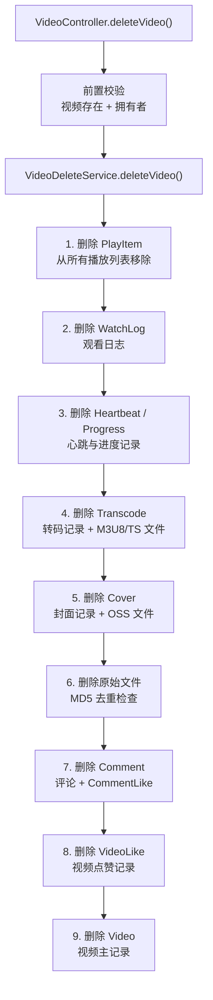

# 视频删除与级联

> 文档地图：[README](../../README.md) > [业务文档](../../README.md#业务文档) > 本文档

本文档描述视频删除的完整级联流程，包括权限校验、关联数据清理、OSS 对象删除及 MD5 去重保护机制。

---

## 1. API 入口

| 方法 | 路径 | 认证 | 说明 |
|------|------|------|------|
| GET | `/video/delete` | 需要登录 | 删除指定视频及所有关联数据 |

**请求参数**：`videoId`（必填）

**前置校验**：
1. `checkVideoExist(videoId)` — 视频必须存在
2. `checkVideoBelongsToUser(videoId, userId)` — 当前用户必须是视频拥有者

---

## 2. 级联删除流程



---

## 3. 各步骤详解

### 3.1 播放列表清理

从所有包含该视频的播放列表中移除 PlayItem 记录，并更新播放列表的 `videoList` 数组。

### 3.2 观看记录清理

批量删除该视频的所有 WatchLog 文档。

### 3.3 心跳与进度清理

删除该视频关联的所有 Heartbeat（播放器心跳）和 Progress（观看进度）记录。

### 3.4 转码文件删除

- 查询视频的所有 Transcode 记录
- 删除每个转码对应的 M3U8 文件和所有 TS 分片文件（OSS 对象）
- 删除 File 数据库记录
- 删除 Transcode 数据库记录

### 3.5 封面删除

- 删除封面对应的 OSS 对象
- 删除 File 数据库记录

### 3.6 原始文件删除（MD5 去重保护）

这是级联删除中最关键的步骤。由于系统支持文件 MD5 去重（多个视频可能引用同一个物理文件），删除 OSS 对象前必须检查是否还有其他文件引用相同的 MD5：

```
如果 (相同 MD5 的文件数 > 1):
    仅删除 File 数据库记录，保留 OSS 对象
否则:
    删除 OSS 对象 + File 数据库记录
```

这确保了去重链接的其他视频不会因为一个视频的删除而丢失源文件。

### 3.7 评论级联删除

- 查询视频的所有 Comment 记录
- 批量删除所有 CommentLike 记录（按 commentId 列表）
- 批量删除所有 Comment 记录

### 3.8 视频点赞删除

删除该视频的所有 VideoLike 记录。

### 3.9 视频主记录删除

最后删除 Video 文档本身。

---

## 4. 异常处理

- OSS 删除操作包裹在 try-catch 中，失败时记录警告日志但不中断整个删除流程
- 确保即使个别 OSS 对象删除失败，数据库记录仍被正确清理
