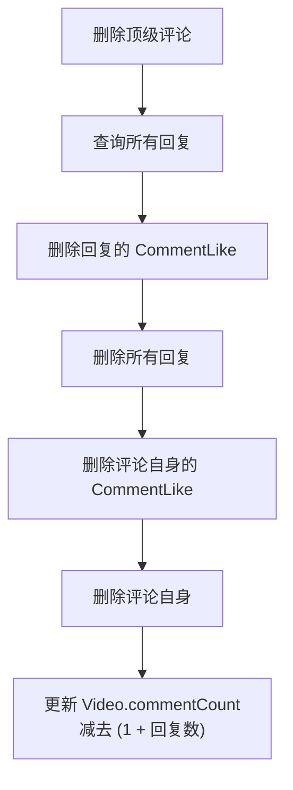

# 评论与回复系统

> 文档地图：[README](../../README.md) > [业务文档](../../README.md#业务文档) > 本文档

本文档描述视频评论系统的核心设计，包括两级评论结构、排序与分页、评论点赞以及级联删除逻辑。

---

## 1. API 接口

| 方法 | 路径 | 认证 | 说明 |
|------|------|------|------|
| POST | `/comment/add` | 需要登录 | 发表评论或回复 |
| GET | `/comment/getByVideoId` | 无需登录 | 获取视频的顶级评论列表 |
| GET | `/comment/getReplies` | 无需登录 | 获取某条评论的回复列表 |
| GET | `/comment/like` | 需要登录 | 切换评论点赞状态 |
| GET | `/comment/delete` | 需要登录 | 删除评论（需权限校验） |
| GET | `/comment/getCount` | 无需登录 | 获取视频评论总数 |

---

## 2. 两级评论结构

系统采用**两级评论模型**：顶级评论和回复。所有回复统一挂在顶级评论下，不支持嵌套回复树。

```
顶级评论 A (parentId = null)
├── 回复 A1 (parentId = A, replyToUserId = A的作者)
├── 回复 A2 (parentId = A, replyToUserId = A1的作者)  ← 回复A1，但parentId仍指向A
└── 回复 A3 (parentId = A, replyToUserId = A的作者)

顶级评论 B (parentId = null)
└── 回复 B1 (parentId = B)
```

**关键设计**：当用户回复一条「回复」时，系统自动将 `parentId` 指向根评论（即顶级评论的 ID），而非被回复的那条回复。`replyToUserId` 和 `replyToUserPhone` 字段记录实际被回复的用户信息。

### Comment 数据模型

| 字段 | 类型 | 说明 |
|------|------|------|
| `id` | String | 评论 ID |
| `videoId` | String | 所属视频（已索引） |
| `userId` | String | 评论者（已索引） |
| `parentId` | String | 父评论 ID，顶级评论为 null（已索引） |
| `replyToUserId` | String | 被回复用户 ID（仅回复时有值） |
| `content` | String | 评论内容（1-2000 字符） |
| `likeCount` | Integer | 点赞数 |
| `replyCount` | Integer | 回复数（仅顶级评论有意义） |

---

## 3. 排序与分页

### 3.1 顶级评论排序

支持两种排序方式：

| 排序 | 规则 | 使用场景 |
|------|------|---------|
| 热门排序（hot） | 按 `likeCount` 降序 | 默认排序，展示最受欢迎的评论 |
| 时间排序（time） | 按 `createTime` 降序 | 查看最新评论 |

### 3.2 回复排序

回复固定按 `createTime` **升序**排列（时间线顺序），便于阅读对话上下文。

### 3.3 分页

- 顶级评论：默认每页 20 条，最多 50 条（skip/limit 分页）
- 回复列表：同样使用 skip/limit 分页

---

## 4. 评论点赞

- 每个用户对每条评论只能点赞一次（`commentId + userId` 唯一约束）
- 再次点赞为取消操作（toggle 模式）
- 点赞/取消时通过原子操作 `$inc` 更新评论的 `likeCount`

### CommentLike 数据模型

| 字段 | 类型 | 说明 |
|------|------|------|
| `commentId` | String | 评论 ID（已索引） |
| `userId` | String | 点赞用户（已索引） |
| `createTime` | Date | 点赞时间 |

---

## 5. 评论删除与级联

### 5.1 权限校验

只有**评论作者**或**视频上传者**可以删除评论。

### 5.2 删除顶级评论

删除顶级评论时触发级联：



### 5.3 删除回复

删除回复时：

1. 删除该回复的 CommentLike 记录
2. 删除回复自身
3. 父评论的 `replyCount` 减 1
4. Video 的 `commentCount` 减 1

---

## 6. 评论计数维护

Video 文档维护 `commentCount` 字段（非规范化计数）：
- 发表评论时 +1
- 删除评论时 −1（删除顶级评论时减去 1 + 回复数）
- 通过 MongoDB `$inc` 原子操作更新，保证并发安全
