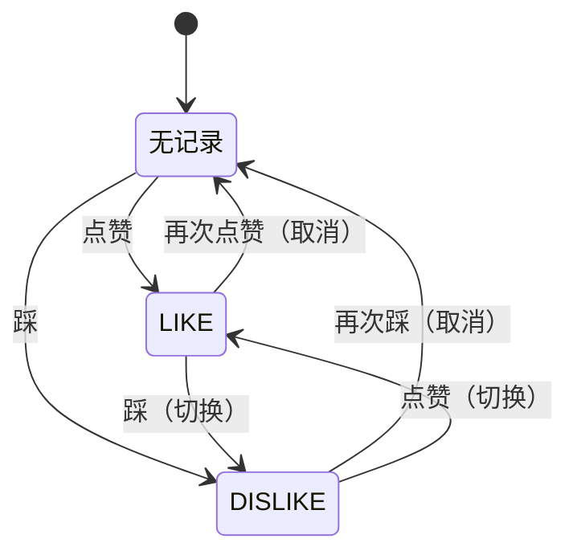

# 视频互动

> 文档地图：[README](../../README.md) > [业务文档](../../README.md#业务文档) > 本文档

本文档描述视频点赞/踩功能的设计与实现，包括 toggle 切换机制、计数维护和状态查询。

---

## 1. API 接口

| 方法 | 路径 | 认证 | 说明 |
|------|------|------|------|
| GET | `/videoLike/like` | 需要登录 | 点赞视频（toggle） |
| GET | `/videoLike/dislike` | 需要登录 | 踩视频（toggle） |
| GET | `/videoLike/getStatus` | 需要登录 | 获取当前用户对视频的互动状态 |

**前置校验**：所有接口均校验视频存在（`checkVideoExist`）。

---

## 2. 点赞/踩 Toggle 机制

每个用户对每个视频只能有一条 VideoLike 记录（`videoId + userId` 唯一约束）。点赞和踩是互斥的 toggle 操作：

### 状态转换

### 操作逻辑

| 当前状态 | 用户操作 | 结果 | 数据库操作 | 计数变化 |
|---------|---------|------|-----------|---------|
| 无记录 | 点赞 | LIKE | 创建记录 | likeCount +1 |
| 无记录 | 踩 | DISLIKE | 创建记录 | dislikeCount +1 |
| LIKE | 点赞 | 无记录 | 删除记录 | likeCount −1 |
| LIKE | 踩 | DISLIKE | 更新 type | likeCount −1, dislikeCount +1 |
| DISLIKE | 踩 | 无记录 | 删除记录 | dislikeCount −1 |
| DISLIKE | 点赞 | LIKE | 更新 type | dislikeCount −1, likeCount +1 |

---

## 3. VideoLike 数据模型

| 字段 | 类型 | 说明 |
|------|------|------|
| `id` | String | 记录 ID |
| `videoId` | String | 视频 ID（已索引） |
| `userId` | String | 用户 ID（已索引） |
| `type` | String | `LIKE` 或 `DISLIKE` |
| `createTime` | Date | 创建时间 |
| `updateTime` | Date | 最近更新时间（切换时更新） |

---

## 4. 计数维护

Video 文档维护两个非规范化计数字段：

| 字段 | 说明 |
|------|------|
| `likeCount` | 点赞数 |
| `dislikeCount` | 踩数 |

通过 MongoDB `$inc` 原子操作更新，保证并发安全。切换操作（如 LIKE → DISLIKE）在单次请求中同时递减旧计数、递增新计数。

---

## 5. 状态查询

`getStatus` 接口返回：

| 字段 | 说明 |
|------|------|
| `likeCount` | 视频当前点赞总数 |
| `dislikeCount` | 视频当前踩总数 |
| `action` | 当前用户的操作：`LIKE`、`DISLIKE` 或 `null`（未互动） |
