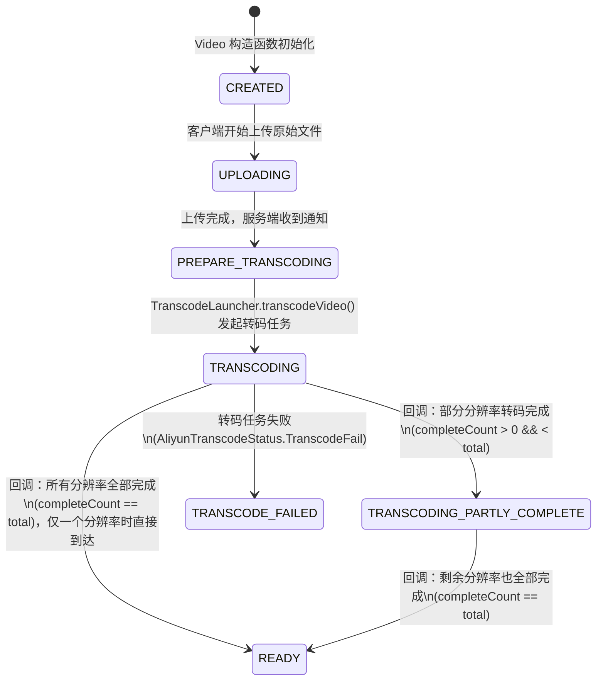
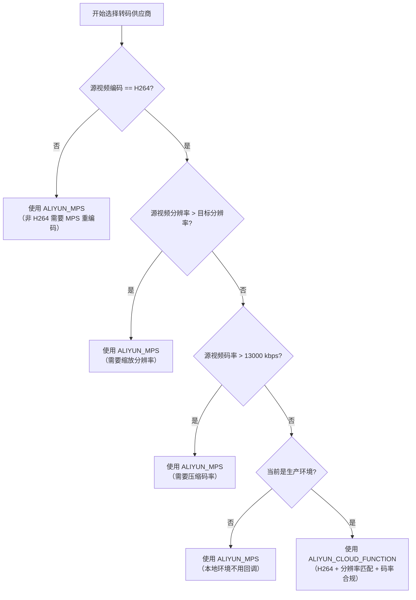
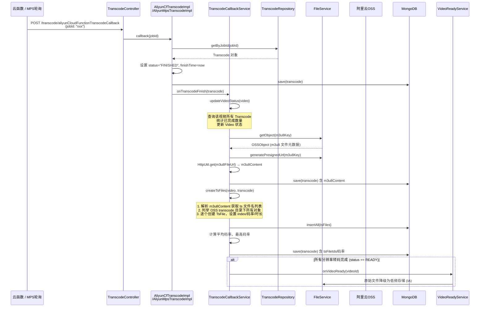

# 视频转码

> 文档地图：[README](../../README.md) > [关键设计](../1-关键设计.md) > 本文档

本文档面向 AI 助手（Copilot / Claude），描述视频转码全流程的业务逻辑与技术实现。所有内容均基于源码。

---

## 1. 视频状态机

视频生命周期由 `VideoStatus` 类定义（`video.constants.VideoStatus`），所有状态值为字符串常量。



**状态转换核心代码**：`TranscodeCallbackService.updateVideoStatus()`

```java
// 统计已完成的 transcode 数量
long completeCount = transcodeList.stream().filter(Transcode::isFinishStatus).count();
if (completeCount > 0 && completeCount < transcodeList.size())
    → TRANSCODING_PARTLY_COMPLETE
else if (completeCount == transcodeList.size())
    → READY
else
    → TRANSCODING
```

**就绪后动作**：当状态变为 `READY`，调用 `VideoReadyService.onVideoReady()`：
- 若非 link 视频，将 OSS 原始文件降级为低频存储（`StorageClass.IA`）

---

## 2. 转码工厂模式

### 2.1 整体架构

使用**策略模式 + Spring IoC 自动注入**。`TranscodeFactory` 通过 `@Resource` 自动收集所有 `TranscodeService` 实现类到 `Map<String, TranscodeService>`，key 为类名首字母小写。

```
TranscodeService (接口)
├── AliyunMpsTranscodeImpl       → provider = "ALIYUN_MPS_TRANSCODE"
├── AliyunCfTranscodeImpl        → provider = "ALIYUN_CLOUD_FUNCTION_TRANSCODE"
└── AliyunCfGPUTranscodeImpl     → provider = "ALIYUN_CLOUD_FUNCTION_TRANSCODE_GPU" (空壳，未实现)
```

### 2.2 供应商选择决策树

决策逻辑位于 `TranscodeLauncher.getTranscodeProvider()`：



**分辨率比较阈值**（`isResolutionOverThanTarget` 方法，用像素总数判断）：

| 目标分辨率 | 像素阈值（width × height） |
|-----------|--------------------------|
| 480p      | 854 × 480 = 409,920       |
| 720p      | 1280 × 720 = 921,600      |
| 1080p     | 1920 × 1080 = 2,073,600   |

### 2.3 转码分辨率选择

`TranscodeLauncher.transcodeVideo()` 根据源视频分辨率决定输出哪些分辨率：

| 源视频像素总数条件           | 输出分辨率 |
|---------------------------|-----------|
| width × height > 854×480  | 720p      |
| width × height > 1280×720 | 1080p     |

> 注意：若源视频足够大，会同时发起 720p 和 1080p 两个转码任务。不会输出 480p（代码中未发起 480p 转码）。

---

## 3. MPS 转码详情

### 3.1 MPS 模板 ID

定义于 `AliyunMpsService.submitTranscodeJobByResolution()`：

| 分辨率 | 阿里云 MPS 模板 ID                      |
|-------|----------------------------------------|
| 480p  | `6db7941bf7ec43c4a4ecc7f67d87ace6`      |
| 720p  | `f96c8ccf81c44f079d285e13c1a1a104`      |
| 1080p | `438e72fb70d04b89bf2b37b2769cf1ec`      |

**管道 ID**（pipelineId）：`6c126c07a9b34a85b7093e7bfa9c3ad9`

### 3.2 输入/输出路径

- **Input**：JSON 格式 `{ Bucket, Location: "oss-cn-beijing", Object: URLEncode(key) }`
- **Output**：MPS 有特殊行为——输出路径会自动追加 `.m3u8` 后缀，并将 ts 命名为 `{name}-00001.ts`。因此代码在提交前去掉 `.m3u8` 后缀：
  ```java
  if (to.endsWith(".m3u8")) {
      to = to.replace(".m3u8", "");
  }
  ```

### 3.3 MPS Job 状态

定义于 `AliyunTranscodeStatus`：

| 状态              | 含义       | 是否终态 |
|-------------------|----------|---------|
| `Submitted`       | 已提交     | 否       |
| `Transcoding`     | 转码中     | 否       |
| `TranscodeSuccess`| 转码成功   | ✅ 是     |
| `TranscodeFail`   | 转码失败   | ✅ 是     |
| `TranscodeCancelled`| 已取消   | ✅ 是     |

### 3.4 MPS 轮询机制

MPS 不使用 HTTP 回调，而是**轮询**（`AliyunMpsTranscodeImpl.iterateQueryAliyunTranscodeJob()`）：

- 新线程启动轮询：`new Thread(() -> iterateQueryAliyunTranscodeJob(video, transcode)).start()`
- 每 **2 秒** 查询一次 job 状态（`ThreadUtil.sleep(2000)`）
- 超时上限：视频时长 × 15 倍
- 每 3 轮输出一次调试日志
- 检测到终态后调用 `callback(jobId)` → `handleCallback()` → `transcodeCallbackService.onTranscodeFinish()`

---

## 4. 云函数转码详情

### 4.1 CPU 云函数（AliyunCfTranscodeImpl）

**调用方式**：通过 HTTP POST 异步调用阿里云函数计算（FC）

```
POST https://transcoe-master-video-transcode-pqrshwejna.cn-beijing.fcapp.run
Header: X-Fc-Invocation-Type: Async
```

**请求参数**（`CloudFunctionTranscodeService.transcode()`）：

| 参数         | 来源                                    |
|-------------|----------------------------------------|
| bucket      | 配置项 `aliyun.oss.video.bucket`        |
| endpoint    | 配置项 `aliyun.oss.video.internal-endpoint` |
| inputKey    | 原始文件 OSS key                        |
| outputDir   | m3u8Key 的父目录                        |
| videoId     | 视频 ID                                |
| transcodeId | 转码任务 ID                             |
| jobId       | 雪花算法生成（`IdUtil.getSnowflakeNextIdStr()`） |
| resolution  | 目标分辨率（720p / 1080p）                |
| width/height| 源视频宽高                               |
| videoCodec  | 固定 `H264`                            |
| audioCodec  | 固定 `AAC`                             |
| quality     | 固定 `"keep"`                           |
| callbackUrl | `/transcode/aliyunCloudFunctionTranscodeCallback` |

**回调处理**（`AliyunCfTranscodeImpl.callback()`）：
1. 云函数转码完成后 POST 到 `callbackUrl`，body 包含 `jobId`
2. 根据 `jobId` 查到 `Transcode` 对象
3. 设置状态为 `"FINISHED"`，设置 `finishTime`
4. 调用 `transcodeCallbackService.onTranscodeFinish(transcode)`

### 4.2 GPU 云函数（AliyunCfGPUTranscodeImpl）

Provider 值为 `"ALIYUN_CLOUD_FUNCTION_TRANSCODE_GPU"`，但当前为**空壳类**，未实现 `TranscodeService` 接口，无实际逻辑。

---

## 5. 转码回调流程



---

## 6. HLS 输出格式

### 6.1 OSS 路径结构

```
videos/{uploaderId}/{yyyyMM}/{videoId}/transcode/{transcodeId}/
├── {transcodeId}.m3u8          ← 播放列表
├── {transcodeId}-00000.ts      ← MPS 输出的 ts 命名格式
├── {transcodeId}-00001.ts
└── ...
```

路径生成逻辑（`OssPathUtil`）：
```
getVideoPrefix   = "videos/" + uploaderId + "/" + createDate(yyyyMM) + "/" + videoId
getTranscodePrefix = getVideoPrefix + "/transcode"
getM3u8Key       = getTranscodePrefix + "/" + transcodeId + "/" + transcodeId + ".m3u8"
```

### 6.2 m3u8 内容解析

`M3u8Util` 提供两个解析方法：

| 方法                | 功能                                                    |
|--------------------|--------------------------------------------------------|
| `getFilenames()`   | 过滤掉 `#` 开头的行，返回所有 ts 文件名列表                  |
| `getTsTimeLengthMap()` | 解析 `#EXTINF:{duration},` 行，返回 `Map<文件名, 时长>` |

### 6.3 ts 分片在 MongoDB 中的索引

每个 ts 文件对应一条 `TsFile` 记录，通过 `tsIndex`（从 0 开始）表示在 m3u8 中的顺序位置。所有 `TsFile.id` 汇总为 `Transcode.tsFileIds` 列表。

---

## 7. 数据模型

### 7.1 Transcode 实体

MongoDB collection：`transcode`（`@Document`），定义于 `transcode.bean.Transcode`

| 字段            | 类型           | 索引    | 说明                                    |
|----------------|---------------|--------|----------------------------------------|
| `id`           | String        | @Id    | 转码任务 ID（`IdService.getTranscodeId()`） |
| `userId`       | String        | @Indexed | 用户 ID                                |
| `videoId`      | String        | @Indexed | 所属视频 ID                              |
| `jobId`        | String        | @Indexed | MPS Job ID 或云函数雪花 ID                |
| `provider`     | String        | —      | 转码供应商，见 `TranscodeProvider` 常量      |
| `createTime`   | Date          | @Indexed | 创建时间（构造函数中自动设置 `new Date()`）    |
| `finishTime`   | Date          | @Indexed | 完成时间                                 |
| `status`       | String        | @Indexed | 转码状态                                 |
| `resolution`   | String        | @Indexed | 目标分辨率（480p / 720p / 1080p）           |
| `width`        | Integer       | —      | 宽度                                    |
| `height`       | Integer       | —      | 高度                                    |
| `averageBitrate` | Integer     | —      | 平均码率（bps，回调时计算）                   |
| `maxBitrate`   | Integer       | —      | 最高码率（bps，取所有 ts 片段中最大值）         |
| `sourceKey`    | String        | —      | 原始文件 OSS key                         |
| `m3u8Key`      | String        | —      | 输出 m3u8 的 OSS key                     |
| `result`       | JSONObject    | —      | MPS 任务返回的完整响应（仅 MPS）              |
| `m3u8Content`  | String        | —      | m3u8 文件文本内容                          |
| `tsFileIds`    | List\<String\> | —     | 关联的所有 TsFile ID 列表                  |

**初始状态**：构造函数中 `status = VideoStatus.CREATED = "CREATED"`

### 7.2 TsFile 实体

MongoDB collection：`tsFile`（`@Document`），定义于 `file.bean.TsFile`，继承 `BasicFile`

| 字段            | 类型        | 索引     | 说明                                     |
|----------------|-----------|---------|------------------------------------------|
| `id`           | String    | @Id     | TsFile ID（`IdService.getTsFileId()`）     |
| `uploaderId`   | String    | @Indexed | 上传者 ID                                 |
| `videoId`      | String    | @Indexed | 所属视频 ID                                |
| `transcodeId`  | String    | @Indexed | 所属转码任务 ID                             |
| `resolution`   | String    | —       | 分辨率（从 Transcode 继承）                  |
| `tsIndex`      | Integer   | —       | 在 m3u8 中的顺序位置（从 0 开始）              |
| `bitrate`      | Integer   | —       | 该 ts 片段的码率（bps）                      |
| `fileStatus`   | String    | —       | 文件状态（`FileStatus.READY`）               |
| `videoType`    | String    | —       | 视频类型（用户上传 / YouTube 搬运）            |
| `timeLength`   | BigDecimal| —       | 该 ts 片段时长（秒，从 m3u8 #EXTINF 解析）     |

**继承自 BasicFile 的字段**：`filename`, `fileType`（= `TRANSCODE_TS`）, `key`, `extension`, `size`, `etag`, `storageClass`, `uploadTime` 等。

### 7.3 Video ↔ Transcode 关系

```
Video.transcodeIds  ──1:N──>  Transcode.id
Transcode.tsFileIds ──1:N──>  TsFile.id
```

- `Video.transcodeIds`：在 `TranscodeLauncher.transcodeSingleResolution()` 中追加
- `Transcode.tsFileIds`：在 `TranscodeCallbackService.saveS3Files()` 中写入

---

## 8. 边界情况

### 8.1 转码失败处理

- **MPS 失败**：`AliyunTranscodeStatus.TranscodeFail` 和 `TranscodeCancelled` 均为终态（`isFinishStatus() == true`）。轮询检测到终态后触发 `callback()`，`handleCallback()` 将 job 状态写入 `transcode.status` 并调用 `onTranscodeFinish()`。
- **MPS 超时**：若轮询耗时超过 `15 × 视频时长（毫秒）`，轮询跳出并打印 `log.error`，不会触发回调，Transcode 和 Video 状态**不会更新**。
- **云函数失败**：`CloudFunctionTranscodeStatus.isFinishedStatus()` 始终返回 `true`。如果云函数执行失败不回调，Transcode 状态将停留在 `TRANSCODING`，无超时检测机制。

### 8.2 部分完成

当视频有多个分辨率（如同时 720p + 1080p），某一个先完成时：
- `updateVideoStatus()` 将 Video 状态设为 `TRANSCODING_PARTLY_COMPLETE`
- 已完成分辨率的 m3u8 和 ts 文件照常保存
- 待全部完成后状态变为 `READY`，触发 `onVideoReady()`

### 8.3 重试逻辑

当前代码中**无自动重试机制**：
- MPS 转码失败不重试
- 云函数回调失败不重试
- 若需重试，需外部人工干预

### 8.4 其他边界情况

- **无音频流**：`loadMediaInfoIntoVideo()` 中通过 `CollectionUtils.isNotEmpty(audioStream)` 检测。无音频流（如无人机视频）时不设置 `audioCodec`。
- **Transcode.isSuccessStatus()**：MPS 需判断 `TranscodeSuccess`；云函数固定返回 `true`（因为只有成功才会回调）。
- **码率计算精度**：`calculateBitrate()` 使用 `BigDecimal` 除法并 `HALF_UP` 四舍五入，单位为 **bps**（bits per second）。

---

## 源码位置

| 类 | 路径 |
|----|------|
| TranscodeService | `video/src/main/java/com/github/makewheels/video2022/transcode/factory/TranscodeService.java` |
| TranscodeLauncher | `video/src/main/java/com/github/makewheels/video2022/transcode/TranscodeLauncher.java` |
| TranscodeCallbackService | `video/src/main/java/com/github/makewheels/video2022/transcode/TranscodeCallbackService.java` |
| AliyunMpsService | `video/src/main/java/com/github/makewheels/video2022/transcode/aliyun/AliyunMpsService.java` |
| AliyunMpsTranscodeImpl | `video/src/main/java/com/github/makewheels/video2022/transcode/factory/AliyunMpsTranscodeImpl.java` |
| AliyunCfTranscodeImpl | `video/src/main/java/com/github/makewheels/video2022/transcode/factory/AliyunCfTranscodeImpl.java` |
| CloudFunctionTranscodeService | `video/src/main/java/com/github/makewheels/video2022/transcode/cloudfunction/CloudFunctionTranscodeService.java` |
| TranscodeFactory | `video/src/main/java/com/github/makewheels/video2022/transcode/factory/TranscodeFactory.java` |
