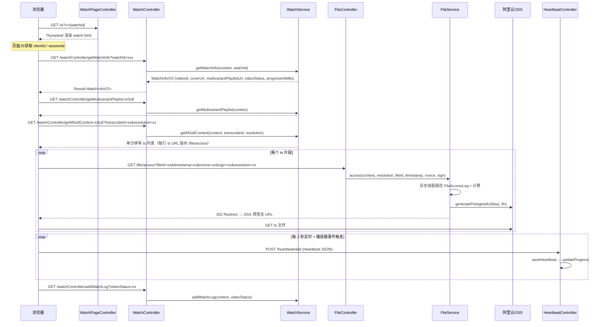

# 视频播放

> 文档地图：[README](../../README.md) > [关键设计](../1-关键设计.md) > 本文档

本文档面向 AI 助手（Copilot / Claude），描述视频播放全流程的业务逻辑与技术实现。所有内容均基于源码。

---

## 1. 播放流程时序图



### 流程说明

| 步骤 | 端点 | 作用 |
|------|------|------|
| 1 | `GET /w?v={watchId}` | `WatchPageController` 返回 Thymeleaf 模板 `watch.html`，路由 `/watch` 和 `/w` 等价 |
| 2 | `GET /watchController/getWatchInfo` | 通过 `watchId` 查 `Video`，返回 videoId、签名封面 URL、multivariantPlaylistUrl、videoStatus、播放进度（毫秒） |
| 3 | `GET /watchController/getMultivariantPlaylist.m3u8` | 生成 HLS 自适应码率主播放列表 |
| 4 | `GET /watchController/getM3u8Content.m3u8` | 根据 transcodeId + resolution 生成单分辨率 ts 列表，每行 ts 文件名替换为 `/file/access` URL |
| 5 | `GET /file/access` | 验证签名参数，异步记录访问日志并计费，302 重定向到 OSS 预签名 URL（有效期 3 小时） |
| 6 | `POST /heartbeat/add` | 客户端定时（2 秒）或事件触发发送心跳，服务端保存并更新播放进度 |
| 7 | `GET /watchController/addWatchLog` | 页面加载后增加观看记录（按 videoId + sessionId + videoStatus 去重） |

---

## 2. HLS 自适应码率

### 2.1 Multivariant Playlist（主播放列表）

由 `WatchService.getMultivariantPlaylist()` 生成，格式符合 [Apple HLS 规范](https://developer.apple.com/documentation/http_live_streaming/example_playlists_for_http_live_streaming/creating_a_multivariant_playlist)：

```
#EXTM3U

#EXT-X-STREAM-INF:BANDWIDTH={maxBitrate},AVERAGE-BANDWIDTH={averageBitrate}
{internalBaseUrl}/watchController/getM3u8Content.m3u8?resolution=xxx&videoId=xxx&clientId=xxx&sessionId=xxx&transcodeId=xxx

#EXT-X-STREAM-INF:BANDWIDTH={maxBitrate},AVERAGE-BANDWIDTH={averageBitrate}
...
```

**生成逻辑（源码 `WatchService:218-239`）：**

1. 通过 `videoId` 查 `Video`，取 `transcodeIds` 列表
2. 批量查 `Transcode` 集合
3. 遍历每个 `Transcode`，拼接 `#EXT-X-STREAM-INF` 行：
   - `BANDWIDTH` = `transcode.getMaxBitrate()`
   - `AVERAGE-BANDWIDTH` = `transcode.getAverageBitrate()`
4. 下一行为该分辨率对应的 `getM3u8Content.m3u8` URL

### 2.2 单分辨率 ts 列表

由 `WatchService.getM3u8Content()` 生成：

1. 根据 `transcodeId` 查 `Transcode`，取 `m3u8Content`（原始 m3u8 文本）和 `tsFileIds`
2. 批量查 `TsFile`，按 `filename` 建 Map
3. 逐行解析 m3u8Content，跳过 `#` 开头的元数据行
4. 非注释行（即 ts 文件名）替换为 `/file/access` URL，附加参数：
   - `resolution`, `tsIndex`, `fileType`, `videoId`, `clientId`, `sessionId`, `fileId`
   - `timestamp`（当前毫秒时间戳）, `nonce`（`IdUtil.nanoId()`）, `sign`（`IdUtil.simpleUUID()`）

### 2.3 分辨率切换

播放器（阿里云 Prism Player）设置 `isVBR: true`，由播放器根据网络带宽自动选择码率。`Transcode` 实体中的 `resolution`、`width`、`height`、`maxBitrate`、`averageBitrate` 字段为播放器提供切换依据。

---

## 3. 文件访问签名设计

### 3.1 签名参数生成

在 `WatchService.getM3u8Content()` 中（源码第 185-196 行），为每个 ts 文件 URL 附加签名参数：

| 参数 | 来源 | 说明 |
|------|------|------|
| `timestamp` | `System.currentTimeMillis()` | 请求时间戳（毫秒） |
| `nonce` | `IdUtil.nanoId()` | 随机数，用于防重放 |
| `sign` | `IdUtil.simpleUUID()` | 签名值 |
| `fileId` | `TsFile.getId()` | 文件唯一标识 |
| `resolution` | `Transcode.getResolution()` | 分辨率标识 |

### 3.2 文件访问流程

`FileController.access()` 接收签名参数后调用 `FileService.access()`：

```
GET /file/access?resolution=xx&fileId=xx&timestamp=xx&nonce=xx&sign=xx
```

**处理逻辑（`FileService.access()` 第 118-140 行）：**

1. 从 `Context` 提取 `videoId`、`clientId`、`sessionId`
2. **异步处理**：启动新线程调用 `FileAccessLogService.handleAccessLog()`
   - 保存 `FileAccessLog` 记录（文件信息 + 访问者信息 + IP）
   - 调用 `OssAccessFeeService.create()` 保存 OSS 访问计费记录
3. **同步返回**：
   - 通过 `fileId` 查 `TsFile` 的 OSS key
   - 调用 `generatePresignedUrl(key, Duration.ofHours(3))` 生成阿里云 OSS 预签名 URL
   - 设置 HTTP 302 重定向到该预签名 URL

### 3.3 预签名 URL

- 有效期：**3 小时**（`Duration.ofHours(3)`）
- 底层调用 `OssVideoService.generatePresignedUrl()` 生成阿里云 OSS 签名下载链接
- 所有 ts 文件在 OSS 上为 private ACL，只能通过预签名 URL 访问

---

## 4. 心跳系统

### 4.1 接口

```
POST /heartbeat/add
Content-Type: application/json
Headers: { token: localStorage.token }

RequestBody: Heartbeat 对象（JSON）
```

### 4.2 客户端发送时机

在 `watch.html` 中（源码第 447-464 行），心跳有两种触发方式：

| 触发方式 | type 字段值 | 说明 |
|----------|-------------|------|
| 定时器 | `"TIMER"` | 每 **2 秒**（`setInterval`）自动发送 |
| 播放器事件 | `"EVENT"` | 播放器事件触发，event 为事件名 |

**监听的播放器事件（共 18 个）**：`ready`, `play`, `pause`, `canplay`, `playing`, `ended`, `liveStreamStop`, `onM3u8Retry`, `hideBar`, `showBar`, `waiting`, `snapshoted`, `requestFullScreen`, `cancelFullScreen`, `error`, `startSeek`, `completeSeek`, `resolutionChange`, `seiFrame`, `rtsFallback`

### 4.3 心跳数据（客户端发送的 JSON 字段）

| 字段 | 值来源 | 说明 |
|------|--------|------|
| `videoId` | JS 全局变量 | 当前视频 ID |
| `clientId` | `localStorage.clientId` | 客户端标识（持久化） |
| `sessionId` | `sessionStorage.sessionId` | 会话标识（标签页级别） |
| `videoStatus` | JS 全局变量 | 视频状态（如 `READY`） |
| `playerProvider` | 硬编码 `"ALIYUN_WEB"` | 播放器类型 |
| `clientTime` | `new Date()` | 客户端当前时间 |
| `type` | `"TIMER"` 或 `"EVENT"` | 心跳触发类型 |
| `event` | 播放器事件名 | 定时器触发时为 `null` |
| `playerTime` | `player.getCurrentTime() * 1000` | 播放进度（毫秒） |
| `playerStatus` | `player.getStatus()` | 播放器状态（如 `playing`） |
| `playerVolume` | `player.getVolume()` | 播放器音量 |

### 4.4 服务端处理

`HeartbeatService.add()`（源码第 41-45 行）：

1. **保存心跳**：`saveHeartbeat()` — 设置 `viewerId`（从 `UserHolder` 获取登录用户 ID，未登录为 null）、`createTime`，然后 `mongoTemplate.save()`
2. **更新进度**：调用 `ProgressService.updateProgress(heartbeat)`

### 4.5 Heartbeat 实体

MongoDB 集合：`heartbeat`

复合索引：`{ videoId: 1, viewerId: 1, clientId: 1, createTime: 1 }`

| 字段 | 类型 | 说明 |
|------|------|------|
| `id` | String | MongoDB 主键 |
| `videoId` | String | 视频 ID |
| `clientId` | String | 客户端 ID |
| `sessionId` | String | 会话 ID |
| `viewerId` | String | 观看者用户 ID（未登录为 null） |
| `videoStatus` | String | 视频状态 |
| `playerProvider` | String | 播放器提供商 |
| `clientTime` | Date | 客户端时间 |
| `createTime` | Date | 服务端接收时间 |
| `type` | String | `"TIMER"` 或 `"EVENT"` |
| `event` | String | 播放器事件名 |
| `playerTime` | Long | 播放进度（毫秒） |
| `playerStatus` | String | 播放器状态 |
| `playerVolume` | BigDecimal | 音量 |

---

## 5. 播放进度

### 5.1 进度更新

`ProgressService.updateProgress(Heartbeat)` 在每次心跳时被调用：

1. **前置条件**：仅当 `heartbeat.playerStatus` 等于 `"playing"` 时才更新进度
2. 查询已有进度：`ProgressRepository.getProgress(videoId, viewerId, clientId)`
3. 若不存在则新建 `Progress` 对象，设置 videoId / viewerId / clientId
4. 若已存在则更新 `updateTime`
5. 设置 `sessionId` 和 `progressInMillis`（来自 `heartbeat.playerTime`）
6. `mongoTemplate.save()` — upsert 语义

### 5.2 进度查询

**查询维度**：`videoId` + `viewerId` + `clientId`

`ProgressRepository.getProgress()` 查询逻辑（源码第 16-27 行）：
- **断言**：`viewerId` 和 `clientId` 不能同时为空
- 优先按 `viewerId` 查询（已登录用户，跨设备共享进度）
- 若 `viewerId` 为 null，则按 `clientId` 查询（未登录用户，设备级进度）

### 5.3 续播流程

1. `WatchService.getWatchInfo()` 返回 `WatchInfoVO.progressInMillis`
2. 前端 `getInitSeekTimeInSeconds()` 决定起始播放位置：
   - 优先使用 URL 参数 `seekTimeInMills`（用于分享指定时间点）
   - 其次使用接口返回的 `progressInMillis`
   - 都没有则从 0 开始
3. 调用 `player.seek(time)` 跳转到指定位置

### 5.4 进度查询接口

```
GET /progress/getProgress?videoId=xxx&clientId=xxx
```

`ProgressController.getProgress()` 直接返回 `Progress` 对象。

---

## 6. 观看记录

### 6.1 接口

```
GET /watchController/addWatchLog?videoId=xxx&clientId=xxx&sessionId=xxx&videoStatus=xxx
```

### 6.2 去重逻辑

`WatchRepository.isWatchLogExist()` 按 `videoId` + `sessionId` + `videoStatus` 三个字段判断是否已存在记录，若已存在则跳过。

### 6.3 处理流程（`WatchService.addWatchLog()`）

1. **去重检查**：若该 session 已记录过相同 videoStatus 的观看日志，直接返回
2. **观看计数**：仅当 `videoStatus == "READY"` 时：
   - `VideoRepository.addWatchCount()` — MongoDB `$inc` 操作自增 `watch.watchCount`
   - 内存中同步更新 `Video.watch.watchCount` 并 save
3. **保存 WatchLog**：
   - IP：`RequestUtil.getIp()`
   - IP 归属地：`IpService.getIpWithRedis(ip)` — 带 Redis 缓存的 IP 地理信息查询，结果存为 JSONObject
   - UserAgent：`RequestUtil.getUserAgent()`
   - videoStatus、videoId、clientId、sessionId、createTime
4. **日志输出**：记录 videoId、title、IP、省/市/区
5. **钉钉推送**：生产环境下调用 `NotificationService.sendWatchLogMessage()` 发送通知

### 6.4 WatchLog 实体

MongoDB 集合：`watchLog`

| 字段 | 类型 | 说明 |
|------|------|------|
| `id` | String | MongoDB 主键 |
| `ip` | String | 客户端 IP |
| `videoId` | String | 视频 ID |
| `clientId` | String | 客户端 ID |
| `sessionId` | String | 会话 ID |
| `userAgent` | String | 浏览器 User-Agent |
| `videoStatus` | String | 视频状态（CREATED / READY 等） |
| `createTime` | Date | 记录创建时间 |
| `ipInfo` | JSONObject | IP 归属地信息（province、city、district 等） |

---

## 7. 数据模型

### 7.1 WatchLog 集合

```
Collection: watchLog
┌──────────────┬────────────┬──────────────────────────────┐
│ 字段          │ 类型       │ 说明                          │
├──────────────┼────────────┼──────────────────────────────┤
│ _id          │ String     │ MongoDB 自动生成               │
│ ip           │ String     │ 客户端 IP                      │
│ videoId      │ String     │ 视频 ID                        │
│ clientId     │ String     │ 客户端标识                      │
│ sessionId    │ String     │ 会话标识                        │
│ userAgent    │ String     │ User-Agent                     │
│ videoStatus  │ String     │ 视频状态                        │
│ createTime   │ Date       │ 创建时间                        │
│ ipInfo       │ JSONObject │ IP 地理信息                     │
└──────────────┴────────────┴──────────────────────────────┘
去重查询条件: { videoId, sessionId, videoStatus }
```

### 7.2 Heartbeat 集合

```
Collection: heartbeat
┌────────────────┬────────────┬───────────────────────────────────────┐
│ 字段            │ 类型       │ 说明                                   │
├────────────────┼────────────┼───────────────────────────────────────┤
│ _id            │ String     │ MongoDB 自动生成                        │
│ videoId        │ String     │ 视频 ID                                 │
│ clientId       │ String     │ 客户端 ID                               │
│ sessionId      │ String     │ 会话 ID                                 │
│ viewerId       │ String     │ 观看者 ID（可为 null）                    │
│ videoStatus    │ String     │ 视频状态                                 │
│ playerProvider │ String     │ 播放器提供商（如 ALIYUN_WEB）              │
│ clientTime     │ Date       │ 客户端时间                               │
│ createTime     │ Date       │ 服务端创建时间                            │
│ type           │ String     │ 触发类型 (TIMER / EVENT)                 │
│ event          │ String     │ 播放器事件名                              │
│ playerTime     │ Long       │ 播放进度（毫秒）                          │
│ playerStatus   │ String     │ 播放器状态                               │
│ playerVolume   │ BigDecimal │ 音量                                    │
└────────────────┴────────────┴───────────────────────────────────────┘
复合索引: { videoId: 1, viewerId: 1, clientId: 1, createTime: 1 }
```

### 7.3 Progress 集合

```
Collection: progress
┌──────────────────┬────────┬────────────────────────────────────┐
│ 字段              │ 类型   │ 说明                                │
├──────────────────┼────────┼────────────────────────────────────┤
│ _id              │ String │ MongoDB 自动生成                     │
│ videoId          │ String │ 视频 ID（索引）                       │
│ viewerId         │ String │ 观看者 ID（索引，可为空）               │
│ clientId         │ String │ 客户端 ID（索引）                     │
│ sessionId        │ String │ 会话 ID（索引）                       │
│ progressInMillis │ Long   │ 播放进度（毫秒）                      │
│ createTime       │ Date   │ 创建时间                             │
│ updateTime       │ Date   │ 更新时间                             │
└──────────────────┴────────┴────────────────────────────────────┘
复合索引: { videoId: 1, viewerId: 1, clientId: 1 }
```

### 7.4 FileAccessLog 集合

```
Collection: fileAccessLog
┌──────────────┬────────┬──────────────────────────────────────────────┐
│ 字段          │ 类型   │ 说明                                          │
├──────────────┼────────┼──────────────────────────────────────────────┤
│ _id          │ String │ MongoDB 自动生成                               │
│ fileId       │ String │ 文件 ID（索引）                                 │
│ userId       │ String │ 视频所有者 ID（索引）                            │
│ videoId      │ String │ 视频 ID（索引）                                 │
│ transcodeId  │ String │ 转码 ID（索引）                                 │
│ resolution   │ String │ 分辨率（索引）                                  │
│ tsSequence   │ Integer│ ts 片段在 m3u8 中的位置（索引）                   │
│ filename     │ String │ 文件名                                         │
│ key          │ String │ OSS 对象 key                                   │
│ size         │ Long   │ 文件大小（字节）                                 │
│ etag         │ String │ ETag（索引）                                    │
│ fileType     │ String │ 文件类型（索引）                                 │
│ provider     │ String │ 存储提供商（索引）                               │
│ videoType    │ String │ 视频类型（索引）                                 │
│ storageClass │ String │ 存储类型（索引）                                 │
│ createTime   │ Date   │ 访问时间（索引）                                 │
│ ip           │ String │ 访问者 IP                                       │
│ clientId     │ String │ 客户端 ID                                       │
│ sessionId    │ String │ 会话 ID                                         │
└──────────────┴────────┴──────────────────────────────────────────────┘
```

---

## 8. 边界情况

### 8.1 无效 watchId

- `WatchController.getWatchInfo()` 调用前执行 `checkService.checkWatchIdExist(watchId)`
- `CheckService` 通过 `VideoRepository.isWatchIdExist()` 查询 MongoDB
- 若不存在，抛出 `VideoException(ErrorCode.VIDEO_NOT_EXIST, "视频watchId不存在")`
- 前端未对此错误做特殊处理，请求会返回错误 Result

### 8.2 视频未就绪

- `getWatchInfo` 返回的 `videoStatus` 不为 `"READY"` 时，前端显示提示信息：`"视频正在上传或转码，请稍后再来"`
- 播放器不会创建，心跳不会发送
- 观看记录仍然会被记录（videoStatus 字段记录当前状态），但仅 `READY` 状态触发观看计数自增

### 8.3 签名参数

当前实现中（`WatchService.getM3u8Content()` 第 195-196 行），`sign` 使用 `IdUtil.simpleUUID()` 生成，`nonce` 使用 `IdUtil.nanoId()` 生成。`FileController.access()` 接收这些参数但**当前代码中未做服务端签名验证**，参数传递但未校验。`FileService.access()` 源码中直接进行文件访问和重定向，未对 sign / timestamp / nonce 做校验。

> **注意**：`FileController` 源码中标记了 `TODO`：访问文件应区分类型（ts / cover），后续可能重构。

### 8.4 预签名 URL 过期

- 预签名 URL 有效期为 **3 小时**（`Duration.ofHours(3)`）
- 若用户长时间暂停后继续播放，已获取的 ts URL 可能过期
- 播放器会触发 `onM3u8Retry` 和 `error` 事件（已监听并发送心跳）
- 但当前未实现自动刷新 m3u8 列表的机制

### 8.5 并发心跳

- 心跳每 2 秒一次 + 事件触发，可能存在短时间内大量心跳请求
- 服务端对每个心跳都做 `mongoTemplate.save()`，无去重、无节流
- `Progress` 更新也是每次心跳都触发（仅 `playerStatus == "playing"` 时），使用 `mongoTemplate.save()` 实现 upsert

### 8.6 观看记录去重

- 去重维度：`videoId` + `sessionId` + `videoStatus`
- 同一浏览器标签页（同一 sessionId）对同一视频只记录一次
- 不同标签页有不同 `sessionId`，会产生多条记录

### 8.7 未登录用户

- `viewerId` 为 null（`UserHolder.get()` 返回 null）
- 心跳和进度仍然保存，但进度查询退化为按 `clientId` 查询
- `clientId` 持久化在 `localStorage`，跨会话有效但不跨设备

---

## 源码位置

| 类 | 路径 |
|----|------|
| WatchService | `video/src/main/java/com/github/makewheels/video2022/watch/play/WatchService.java` |
| WatchController | `video/src/main/java/com/github/makewheels/video2022/watch/play/WatchController.java` |
| HeartbeatService | `video/src/main/java/com/github/makewheels/video2022/watch/heartbeat/HeartbeatService.java` |
| ProgressService | `video/src/main/java/com/github/makewheels/video2022/watch/progress/ProgressService.java` |
| VideoReadyService | `video/src/main/java/com/github/makewheels/video2022/video/service/VideoReadyService.java` |
| FileAccessLogService | `video/src/main/java/com/github/makewheels/video2022/file/access/FileAccessLogService.java` |
| FileService | `video/src/main/java/com/github/makewheels/video2022/file/FileService.java` |
