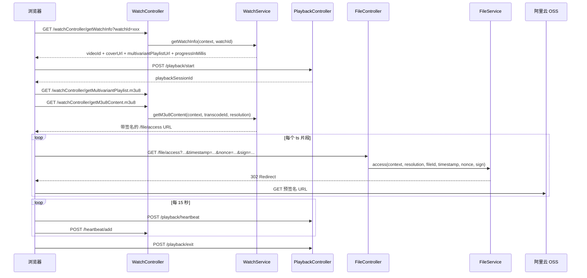

# 视频播放

> 文档地图：[README](../../README.md) > [关键设计](../1-关键设计.md) > 本文档

本文档描述当前 React Web 播放器与后端的真实播放链路，覆盖 HLS 分片访问、播放会话、旧版心跳和续播进度。

---

## 1. 播放链路概览



### 当前前端实现

- 页面播放器组件是 `web/src/components/VideoPlayer.tsx`
- 播放器内核是 `video.js`
- `clientId` 持久化在 `localStorage`
- `sessionId` 持久化在 `sessionStorage`
- 页面挂载时创建播放会话，页面隐藏或卸载时发送退出事件

---

## 2. HLS 与分片访问

### 2.1 主播放列表

`WatchService.getMultivariantPlaylist()` 读取视频的 `transcodeIds`，根据每个转码记录的：

- `resolution`
- `maxBitrate`
- `averageBitrate`

生成标准 HLS multivariant playlist，每个分辨率条目都指向：

```text
/watchController/getM3u8Content.m3u8?resolution=720p&videoId=...&clientId=...&sessionId=...&transcodeId=...
```

### 2.2 单分辨率 m3u8

`WatchService.getM3u8Content()` 会把原始 m3u8 中的 ts 文件名替换成：

```text
/file/access?resolution=720p&tsIndex=0&fileType=ts&videoId=...&clientId=...&sessionId=...&fileId=...&timestamp=...&nonce=...&sign=...
```

保留下来的核心参数：

- `videoId`
- `clientId`
- `sessionId`
- `resolution`
- `fileId`
- `timestamp`
- `nonce`
- `sign`

### 2.3 文件访问签名

`sign` 不再是随机 UUID，而是 `FileAccessSignatureService` 基于以下字段计算的 HMAC-SHA256：

```text
videoId
clientId
sessionId
resolution
fileId
timestamp
nonce
```

签名特性：

- 默认有效窗口：5 分钟
- 密钥来源：`file.access.signature-secret`
- 开发环境可从 `application.properties` 默认值读取
- 生产环境应通过 `FILE_ACCESS_SIGNATURE_SECRET` 注入

### 2.4 `/file/access` 服务端处理

`FileService.access()` 当前顺序是：

1. 校验时间戳是否仍在有效窗口内
2. 校验 HMAC 签名是否匹配
3. 异步记录 `FileAccessLog` 并创建 OSS 访问计费记录
4. 通过 `fileId` 查到 ts 文件 OSS key
5. 生成 3 小时有效的 OSS 预签名 URL
6. 返回 302 重定向

如果签名不合法，抛出 `FILE_ACCESS_SIGNATURE_INVALID`。

---

## 3. 播放会话协议

### 3.1 开始播放

前端挂载播放器后调用：

```json
POST /playback/start
{
  "watchId": "17GO2A",
  "videoId": "v_xxx",
  "clientId": "client_xxx",
  "sessionId": "session_xxx"
}
```

服务端创建 `PlaybackSession`，返回：

```json
{
  "playbackSessionId": "6806904f7506111b59855d8c"
}
```

### 3.2 播放中心跳

前端每 15 秒调用一次：

```json
POST /playback/heartbeat
{
  "playbackSessionId": "6806904f7506111b59855d8c",
  "currentTimeMs": 12345,
  "isPlaying": true,
  "resolution": "720p",
  "totalPlayDurationMs": 12000
}
```

服务端更新：

- `currentProgressMs`
- `maxProgressMs`
- `totalPlayDurationMs`
- `resolution`
- `heartbeatCount`
- `updateTime`

### 3.3 退出播放

页面隐藏时优先使用 `navigator.sendBeacon('/playback/exit', ...)`，卸载时回退为普通 POST：

```json
POST /playback/exit
{
  "playbackSessionId": "6806904f7506111b59855d8c",
  "currentTimeMs": 12345,
  "totalPlayDurationMs": 18000,
  "exitType": "NAVIGATE_AWAY",
  "resolution": "720p"
}
```

当前支持的退出类型：

- `CLOSE_TAB`
- `NAVIGATE_AWAY`
- `PLAYING`

### 3.4 PlaybackSession 记录的关键字段

Mongo 集合：`playbackSession`

关键字段：

- `watchId`
- `videoId`
- `userId`
- `clientId`
- `sessionId`
- `startTime`
- `endTime`
- `totalPlayDurationMs`
- `maxProgressMs`
- `currentProgressMs`
- `resolution`
- `exitType`
- `heartbeatCount`

---

## 4. 旧版心跳与续播进度

播放会话是新的统计链路，但 `POST /heartbeat/add` 仍保留，用于兼容已有进度和心跳数据。

### 4.1 `/heartbeat/add`

当前 React 播放器每 15 秒发送一次：

```json
{
  "videoId": "v_xxx",
  "clientId": "client_xxx",
  "sessionId": "session_xxx",
  "playerTime": 12,
  "playerStatus": "PLAYING"
}
```

这条链路会继续驱动：

- `Heartbeat` 集合写入
- `ProgressService.updateProgress()`

### 4.2 续播进度

`WatchService.getWatchInfo()` 会返回 `progressInMillis`。

前端恢复播放位置时的优先级：

1. URL 指定的 seek 参数
2. 服务端返回的 `progressInMillis`
3. 本地 `localStorage` 中按 `video_progress_{videoId}` 缓存的秒级进度

---

## 5. 当前已知约束

- `/playback/heartbeat` 里的 `isPlaying` 当前只作为前端状态上报，服务端主要使用 `currentTimeMs` 和 `totalPlayDurationMs`
- `/playback/exit` 为兼容 `sendBeacon`，允许 `text/plain` 请求体
- 播放会话和旧版 `Heartbeat` 目前并行存在：前者偏“完整观看过程”，后者偏“兼容进度/历史统计”
```

`ProgressController.getProgress()` 直接返回 `Progress` 对象。

---

## 6. 观看记录

### 6.1 接口

```
GET /watchController/addWatchLog?videoId=xxx&clientId=xxx&sessionId=xxx&videoStatus=xxx
```

### 6.2 去重逻辑

`WatchRepository.isWatchLogExist()` 按 `videoId` + `sessionId` + `videoStatus` 三个字段判断是否已存在记录，若已存在则跳过。

### 6.3 处理流程（`WatchService.addWatchLog()`）

1. **去重检查**：若该 session 已记录过相同 videoStatus 的观看日志，直接返回
2. **观看计数**：仅当 `videoStatus == "READY"` 时：
   - `VideoRepository.addWatchCount()` — MongoDB `$inc` 操作自增 `watch.watchCount`
   - 内存中同步更新 `Video.watch.watchCount` 并 save
3. **保存 WatchLog**：
   - IP：`RequestUtil.getIp()`
   - IP 归属地：`IpService.getIpWithRedis(ip)` — 带 Redis 缓存的 IP 地理信息查询，结果存为 JSONObject
   - UserAgent：`RequestUtil.getUserAgent()`
   - videoStatus、videoId、clientId、sessionId、createTime
4. **日志输出**：记录 videoId、title、IP、省/市/区

### 6.4 WatchLog 实体

MongoDB 集合：`watchLog`

| 字段 | 类型 | 说明 |
|------|------|------|
| `id` | String | MongoDB 主键 |
| `ip` | String | 客户端 IP |
| `videoId` | String | 视频 ID |
| `clientId` | String | 客户端 ID |
| `sessionId` | String | 会话 ID |
| `userAgent` | String | 浏览器 User-Agent |
| `videoStatus` | String | 视频状态（CREATED / READY 等） |
| `createTime` | Date | 记录创建时间 |
| `ipInfo` | JSONObject | IP 归属地信息（province、city、district 等） |

---

## 7. 数据模型

### 7.1 WatchLog 集合

```
Collection: watchLog
┌──────────────┬────────────┬──────────────────────────────┐
│ 字段          │ 类型       │ 说明                          │
├──────────────┼────────────┼──────────────────────────────┤
│ _id          │ String     │ MongoDB 自动生成               │
│ ip           │ String     │ 客户端 IP                      │
│ videoId      │ String     │ 视频 ID                        │
│ clientId     │ String     │ 客户端标识                      │
│ sessionId    │ String     │ 会话标识                        │
│ userAgent    │ String     │ User-Agent                     │
│ videoStatus  │ String     │ 视频状态                        │
│ createTime   │ Date       │ 创建时间                        │
│ ipInfo       │ JSONObject │ IP 地理信息                     │
└──────────────┴────────────┴──────────────────────────────┘
去重查询条件: { videoId, sessionId, videoStatus }
```

### 7.2 Heartbeat 集合

```
Collection: heartbeat
┌────────────────┬────────────┬───────────────────────────────────────┐
│ 字段            │ 类型       │ 说明                                   │
├────────────────┼────────────┼───────────────────────────────────────┤
│ _id            │ String     │ MongoDB 自动生成                        │
│ videoId        │ String     │ 视频 ID                                 │
│ clientId       │ String     │ 客户端 ID                               │
│ sessionId      │ String     │ 会话 ID                                 │
│ viewerId       │ String     │ 观看者 ID（可为 null）                    │
│ videoStatus    │ String     │ 视频状态                                 │
│ playerProvider │ String     │ 播放器提供商（如 ALIYUN_WEB）              │
│ clientTime     │ Date       │ 客户端时间                               │
│ createTime     │ Date       │ 服务端创建时间                            │
│ type           │ String     │ 触发类型 (TIMER / EVENT)                 │
│ event          │ String     │ 播放器事件名                              │
│ playerTime     │ Long       │ 播放进度（毫秒）                          │
│ playerStatus   │ String     │ 播放器状态                               │
│ playerVolume   │ BigDecimal │ 音量                                    │
└────────────────┴────────────┴───────────────────────────────────────┘
复合索引: { videoId: 1, viewerId: 1, clientId: 1, createTime: 1 }
```

### 7.3 Progress 集合

```
Collection: progress
┌──────────────────┬────────┬────────────────────────────────────┐
│ 字段              │ 类型   │ 说明                                │
├──────────────────┼────────┼────────────────────────────────────┤
│ _id              │ String │ MongoDB 自动生成                     │
│ videoId          │ String │ 视频 ID（索引）                       │
│ viewerId         │ String │ 观看者 ID（索引，可为空）               │
│ clientId         │ String │ 客户端 ID（索引）                     │
│ sessionId        │ String │ 会话 ID（索引）                       │
│ progressInMillis │ Long   │ 播放进度（毫秒）                      │
│ createTime       │ Date   │ 创建时间                             │
│ updateTime       │ Date   │ 更新时间                             │
└──────────────────┴────────┴────────────────────────────────────┘
复合索引: { videoId: 1, viewerId: 1, clientId: 1 }
```

### 7.4 FileAccessLog 集合

```
Collection: fileAccessLog
┌──────────────┬────────┬──────────────────────────────────────────────┐
│ 字段          │ 类型   │ 说明                                          │
├──────────────┼────────┼──────────────────────────────────────────────┤
│ _id          │ String │ MongoDB 自动生成                               │
│ fileId       │ String │ 文件 ID（索引）                                 │
│ userId       │ String │ 视频所有者 ID（索引）                            │
│ videoId      │ String │ 视频 ID（索引）                                 │
│ transcodeId  │ String │ 转码 ID（索引）                                 │
│ resolution   │ String │ 分辨率（索引）                                  │
│ tsSequence   │ Integer│ ts 片段在 m3u8 中的位置（索引）                   │
│ filename     │ String │ 文件名                                         │
│ key          │ String │ OSS 对象 key                                   │
│ size         │ Long   │ 文件大小（字节）                                 │
│ etag         │ String │ ETag（索引）                                    │
│ fileType     │ String │ 文件类型（索引）                                 │
│ provider     │ String │ 存储提供商（索引）                               │
│ videoType    │ String │ 视频类型（索引）                                 │
│ storageClass │ String │ 存储类型（索引）                                 │
│ createTime   │ Date   │ 访问时间（索引）                                 │
│ ip           │ String │ 访问者 IP                                       │
│ clientId     │ String │ 客户端 ID                                       │
│ sessionId    │ String │ 会话 ID                                         │
└──────────────┴────────┴──────────────────────────────────────────────┘
```

---

## 8. 边界情况

### 8.1 无效 watchId

- `WatchController.getWatchInfo()` 调用前执行 `checkService.checkWatchIdExist(watchId)`
- `CheckService` 通过 `VideoRepository.isWatchIdExist()` 查询 MongoDB
- 若不存在，抛出 `VideoException(ErrorCode.VIDEO_NOT_EXIST, "视频watchId不存在")`
- 前端未对此错误做特殊处理，请求会返回错误 Result

### 8.2 视频未就绪

- `getWatchInfo` 返回的 `videoStatus` 不为 `"READY"` 时，前端显示提示信息：`"视频正在上传或转码，请稍后再来"`
- 播放器不会创建，心跳不会发送
- 观看记录仍然会被记录（videoStatus 字段记录当前状态），但仅 `READY` 状态触发观看计数自增

### 8.3 签名参数

当前实现中（`WatchService.getM3u8Content()` 第 195-196 行），`sign` 使用 `IdUtil.simpleUUID()` 生成，`nonce` 使用 `IdUtil.nanoId()` 生成。`FileController.access()` 接收这些参数但**当前代码中未做服务端签名验证**，参数传递但未校验。`FileService.access()` 源码中直接进行文件访问和重定向，未对 sign / timestamp / nonce 做校验。

> **注意**：`FileController` 源码中标记了 `TODO`：访问文件应区分类型（ts / cover），后续可能重构。

### 8.4 预签名 URL 过期

- 预签名 URL 有效期为 **3 小时**（`Duration.ofHours(3)`）
- 若用户长时间暂停后继续播放，已获取的 ts URL 可能过期
- 播放器会触发 `onM3u8Retry` 和 `error` 事件（已监听并发送心跳）
- 但当前未实现自动刷新 m3u8 列表的机制

### 8.5 并发心跳

- 心跳每 2 秒一次 + 事件触发，可能存在短时间内大量心跳请求
- 服务端对每个心跳都做 `mongoTemplate.save()`，无去重、无节流
- `Progress` 更新也是每次心跳都触发（仅 `playerStatus == "playing"` 时），使用 `mongoTemplate.save()` 实现 upsert

### 8.6 观看记录去重

- 去重维度：`videoId` + `sessionId` + `videoStatus`
- 同一浏览器标签页（同一 sessionId）对同一视频只记录一次
- 不同标签页有不同 `sessionId`，会产生多条记录

### 8.7 未登录用户

- `viewerId` 为 null（`UserHolder.get()` 返回 null）
- 心跳和进度仍然保存，但进度查询退化为按 `clientId` 查询
- `clientId` 持久化在 `localStorage`，跨会话有效但不跨设备

---

## 源码位置

| 类 | 路径 |
|----|------|
| WatchService | `video/src/main/java/com/github/makewheels/video2022/watch/play/WatchService.java` |
| WatchController | `video/src/main/java/com/github/makewheels/video2022/watch/play/WatchController.java` |
| HeartbeatService | `video/src/main/java/com/github/makewheels/video2022/watch/heartbeat/HeartbeatService.java` |
| ProgressService | `video/src/main/java/com/github/makewheels/video2022/watch/progress/ProgressService.java` |
| VideoReadyService | `video/src/main/java/com/github/makewheels/video2022/video/service/VideoReadyService.java` |
| FileAccessLogService | `video/src/main/java/com/github/makewheels/video2022/file/access/FileAccessLogService.java` |
| FileService | `video/src/main/java/com/github/makewheels/video2022/file/FileService.java` |
