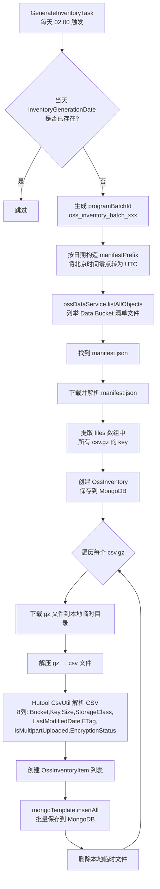
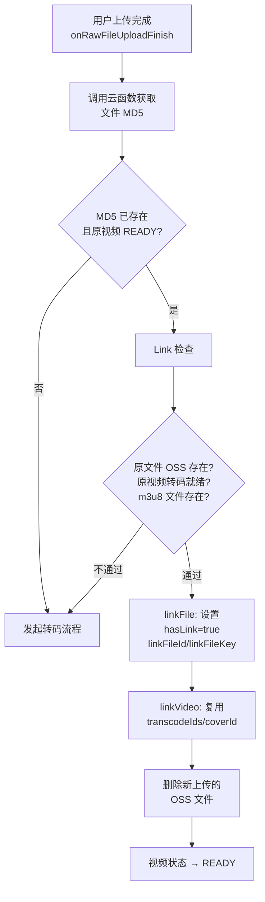

# 视频存储

> 文档地图：[README](../../README.md) > [关键设计](../1-关键设计.md) > 本文档

---

## 1. 双 Bucket 架构图

```
┌─────────────────────────────────────────────────────────────────────┐
│                       阿里云 OSS (cn-beijing)                       │
│                                                                     │
│  ┌──────────────────────────────┐  ┌──────────────────────────────┐ │
│  │   Video Bucket               │  │   Data Bucket                │ │
│  │   dev:  video-2022-dev       │  │   oss-data-bucket            │ │
│  │   prod: video-2022-prod      │  │                              │ │
│  │                              │  │                              │ │
│  │  存储内容：                    │  │  存储内容：                    │ │
│  │  · 用户上传的原始视频 (raw)    │  │  · OSS 访问日志文件           │ │
│  │  · 转码产物 (m3u8 + ts)      │  │  · OSS 库存清单 (inventory)  │ │
│  │  · 封面图片 (cover)          │  │    manifest.json + csv.gz    │ │
│  │  · 二维码图片 (qr_code)      │  │                              │ │
│  │                              │  │                              │ │
│  │  服务类：OssVideoService      │  │  服务类：OssDataService       │ │
│  └──────────────────────────────┘  └──────────────────────────────┘ │
│                                                                     │
│  endpoint (外网): oss-cn-beijing.aliyuncs.com                       │
│  endpoint (内网): oss-cn-beijing-internal.aliyuncs.com              │
└─────────────────────────────────────────────────────────────────────┘
```

**两个 Service 均继承 `BaseOssService`**，各自通过 `@Value` 注入独立的 bucket / endpoint / accessKeyId / secretKey。

- **`OssVideoService`** — 负责所有视频文件的读写、预签名、删除、ACL 变更、存储类型转换。
- **`OssDataService`** — 负责读取 OSS 自动投递的访问日志和库存清单文件。

---

## 2. OSS 路径规则

> 源码：`com.github.makewheels.video2022.utils.OssPathUtil`

所有路径以 `videos/` 为根，按 `uploaderId` → `yyyyMM`（视频创建月份）→ `videoId` 三级目录组织。

### 通用前缀

```
videos/{uploaderId}/{yyyyMM}/{videoId}/
```

生成逻辑（`getVideoPrefix`）：
```java
"videos/" + video.getUploaderId() + "/"
    + DateUtil.format(video.getCreateTime(), "yyyyMM") + "/"
    + video.getId()
```

### 各文件类型路径

| 类型 | 路径模式 | 示例 |
|------|---------|------|
| **原始视频 (raw)** | `videos/{uploaderId}/{yyyyMM}/{videoId}/raw/{fileId}/{fileId}.{ext}` | `videos/u001/202306/v001/raw/f001/f001.mp4` |
| **转码 m3u8** | `videos/{uploaderId}/{yyyyMM}/{videoId}/transcode/{transcodeId}/{transcodeId}.m3u8` | `videos/u001/202306/v001/transcode/t001/t001.m3u8` |
| **转码 ts 碎片** | `videos/{uploaderId}/{yyyyMM}/{videoId}/transcode/{transcodeId}/{tsFilename}` | `videos/u001/202306/v001/transcode/t001/t001-00001.ts` |
| **封面 (cover)** | `videos/{uploaderId}/{yyyyMM}/{videoId}/cover/{coverId}/{fileId}.{ext}` | `videos/u001/202306/v001/cover/c001/f002.jpg` |

### Data Bucket 路径

| 类型 | 路径前缀 |
|------|---------|
| **访问日志** | `{videoBucket}/accesslog/{videoBucket}{yyyy-MM-dd-HH-mm-ss}-{seq}` |
| **库存清单** | `{videoBucket}/inventory/{videoBucket}/inventory-rule/data/{date}/manifest.json` |

dev 示例：`video-2022-dev/accesslog/video-2022-dev2023-06-18-14-00-00-0001`
prod 示例：`video-2022-prod/inventory/video-2022-prod/inventory-rule/data/2023-06-18T16-00-00Z/manifest.json`

---

## 3. STS 临时凭证

> 源码：`BaseOssService.generateUploadCredentials()`

客户端上传文件前，通过 STS（Security Token Service）获取临时凭证，避免暴露主 AccessKey。

### AssumeRole 请求参数

| 参数 | 值 |
|------|---|
| STS endpoint | `sts.cn-beijing.aliyuncs.com` |
| region | `cn-beijing` |
| roleArn | `acs:ram::1618784280874658:role/role-oss-video-2022` |
| roleSessionName | `roleSessionName-{simpleUUID}` |
| durationSeconds | `10800`（3 小时） |

### 返回字段

```json
{
  "bucket": "video-2022-prod",
  "key": "videos/.../raw/{fileId}/{fileId}.mp4",
  "endpoint": "oss-cn-beijing.aliyuncs.com",
  "accessKeyId": "<临时 AK>",
  "secretKey": "<临时 SK>",
  "sessionToken": "<STS Token>",
  "expiration": "2023-06-18T12:00:00Z"
}
```

客户端拿到凭证后，直接使用 OSS SDK 上传文件到指定 `key`。

---

## 4. Presigned URL 策略

> 源码：`BaseOssService.generatePresignedUrl()` + 各调用处

系统通过预签名 URL（GET + 过期时间）提供临时下载链接，不同文件类型使用不同的有效期：

| 场景 | 有效期 | 调用位置 |
|------|--------|---------|
| **m3u8 内容获取** | 10 分钟 | `TranscodeCallbackService` — 转码完成时下载 m3u8 内容 |
| **原始视频下载** | 2 小时 | `VideoService.getRawFileDownloadUrl()` |
| **ts 碎片播放** | 3 小时 | `FileService.access()` — 通过 302 重定向 |
| **封面访问** | 2 小时 | `CoverService` — 单张和批量 |
| **内部临时下载** | 1 小时 | `BaseOssService.getTempDownloadUrl()` — 内部文件下载 |

### ts 碎片访问流程

```
播放器 → GET /file/access?fileId=xxx
       → FileService.access()
         1. 异步记录 FileAccessLog
         2. 通过 fileId 查找 TsFile 的 key
         3. generatePresignedUrl(key, 3h)
         4. HTTP 302 重定向到预签名 URL
```

---

## 5. 存储类型转换

> 源码：`BaseOssService.changeObjectStorageClass()` + `FileService.changeStorageClass()` + `ChangeStorageClassTask`

### 转换机制

阿里云 OSS 通过 **Copy-in-place**（原地拷贝覆盖）实现存储类型转换：

```java
CopyObjectRequest copyObjectRequest = new CopyObjectRequest(bucket, key, bucket, key);
ObjectMetadata meta = new ObjectMetadata();
meta.setHeader(OSSHeaders.OSS_STORAGE_CLASS, storageClass);
copyObjectRequest.setNewObjectMetadata(meta);
getClient().copyObject(copyObjectRequest);
```

即：源和目标是同一个 `bucket + key`，仅修改 metadata 中的 `x-oss-storage-class`。

### 存储类型层级

```
Standard（标准） → IA（低频访问） → Archive（归档）
```

### 当前状态

`ChangeStorageClassTask` 中定时任务的 `@Scheduled(cron = "")` **尚未配置 cron 表达式**，即该功能代码已写但未启用。该任务的逻辑框架为：

1. 调用 `videoService.getExpiredVideos(0, 5000)` 获取过期视频列表
2. 列举文件
3. 执行删除（注释占位，未实现）
4. 更新视频状态

`FileService.changeStorageClass()` 方法已完整实现，可通过 API 手动调用。

---

## 6. OSS 访问日志处理

> 源码：`OssLogService` + `GenerateOssAccessLogTask`

### 定时任务

- **cron**: `0 0 0 * * ?`（每天 00:00 执行）
- **处理日期**: `LocalDate.now().plusDays(-2)`（两天前的日志，因为 OSS 日志有延迟投递）

### 流程图

```mermaid
flowchart TD
    A[GenerateOssAccessLogTask<br/>每天 00:00 触发] --> B[生成 programBatchId<br/>oss_access_log_batch_xxx]
    B --> C[按日期构造 prefix<br/>accesslog/{bucket}{date}]
    C --> D[ossDataService.listAllObjects<br/>列举 Data Bucket 日志文件]
    D --> E{遍历每个日志文件 key}
    E --> F{生产环境:<br/>logFileKey 已存在?}
    F -->|是| E
    F -->|否| G[创建 OssAccessLogFile<br/>解析文件名中的时间和序号]
    G --> H[保存 OssAccessLogFile<br/>到 MongoDB]
    H --> I[下载日志文件内容]
    I --> J[按行解析日志]
    J --> K{每行 md5<br/>是否已存在?}
    K -->|是| J
    K -->|否| L[创建 OssAccessLog 对象<br/>解析28个字段]
    L --> M[保存 OssAccessLog<br/>到 MongoDB]
    M --> J
```

### 日志行格式

OSS 日志每行包含 28 个字段，以空格分隔（引号和中括号内的空格需特殊处理）：

```
{remoteIp} - - [{time}] "{requestUrl}" {httpStatus} {sentBytes} {requestTime}
"{referer}" "{userAgent}" "{hostName}" "{requestId}" "{loggingFlag}"
"{requesterAliyunId}" "{operation}" "{bucketName}" "{objectName}"
{objectSize} {serverCostTime} "{errorCode}" {requestLength} "{userId}"
{deltaDataSize} "{syncRequest}" "{storageClass}" "{targetStorageClass}"
"{transmissionAccelerationAccessPoint}" "{accessKeyId}"
```

### 去重机制

- **文件级别**: 通过 `OssLogRepository.isOssLogFileKeyExists()` 检查 `logFileKey` 是否已处理（生产环境跳过已存在的文件）
- **行级别**: 对每行日志计算 MD5，通过 `OssLogRepository.isOssLogLineMd5Exists()` 跳过重复行

### 手动触发

```
GET /oss-log/generateOssAccessLog?startDate=2023-06-01&endDate=2023-06-30
```

按天迭代调用 `ossLogService.generateOssAccessLog()`。

---

## 7. OSS 库存报告

> 源码：`OssInventoryService` + `GenerateInventoryTask`

### 定时任务

- **cron**: `0 0 2 * * ?`（每天凌晨 02:00 执行）
- **处理日期**: `LocalDate.now()`（当天——对应接近零点时刻的 OSS 快照）

### 流程图



### manifest.json 结构

```json
{
  "creationTimestamp": "1694448644",
  "destinationBucket": "oss-data-bucket",
  "fileFormat": "CSV",
  "fileSchema": "Bucket, Key, Size, StorageClass, LastModifiedDate, ETag, IsMultipartUploaded, EncryptionStatus",
  "files": [
    {
      "MD5checksum": "5FC695B803A384A2FAA01D747C405FD1",
      "key": "video-2022-dev/inventory/video-2022-dev/inventory-rule/data/fc581f25.csv.gz",
      "size": 12586
    }
  ],
  "sourceBucket": "video-2022-dev",
  "version": "2019-09-01"
}
```

### CSV 字段映射

| 列索引 | 字段名 | 映射到 OssInventoryItem 字段 |
|--------|--------|--------------------------|
| 0 | Bucket | bucketName |
| 1 | Key | objectName（URL 解码） |
| 2 | Size | size |
| 3 | StorageClass | storageClass |
| 4 | LastModifiedDate | lastModifiedDate（格式 `yyyy-MM-dd'T'HH-mm-ss'Z'`） |
| 5 | ETag | eTag |
| 6 | IsMultipartUploaded | isMultipartUploaded |
| 7 | EncryptionStatus | encryptionStatus |

### 去重机制

通过 `OssInventoryRepository.isInventoryGenerationDateExists()` 检查该日期是否已生成过清单，已存在则跳过。

---

## 8. 文件删除与清理

### 文件删除

> 源码：`FileService.deleteFile()`

```java
ossVideoService.deleteObject(file.getKey());   // 1. 从 OSS 删除文件
file.setDeleted(true);                         // 2. 软删除标记
file.setDeleteTime(new Date());                // 3. 记录删除时间
file.setUpdateTime(new Date());
mongoTemplate.save(file);                      // 4. 更新 MongoDB
```

**先硬删 OSS 文件，再软删 MongoDB 记录。** `BasicFile.deleted` 字段为软删除标志。

### MD5 去重 / Link 机制

> 源码：`LinkService` + `RawFileService.onRawFileUploadFinish()`

当用户上传的原始文件 MD5 与已有文件相同时，系统执行 Link（链接）而非重复存储：



**Link 后的 File 字段：**
- `hasLink = true`
- `linkFileId` = 已存在文件的 ID
- `linkFileKey` = 已存在文件的 OSS key

---

## 9. 数据模型

### File（MongoDB collection: `file`）

继承自 `BasicFile`，对应用户上传的原始文件、封面、m3u8 等。

| 字段 | 类型 | 索引 | 说明 |
|------|------|------|------|
| id | String | @Id | MongoDB 主键 |
| uploaderId | String | @Indexed | 上传者 ID |
| videoId | String | @Indexed | 所属视频 ID |
| rawFilename | String | — | 用户上传的原始文件名，仅 RAW_VIDEO 类型有值 |
| videoType | String | — | USER_UPLOAD / YOUTUBE |
| fileStatus | String | — | CREATED → READY |
| hasLink | Boolean | — | 是否 MD5 去重链接到另一个文件 |
| linkFileId | String | — | 链接目标文件 ID |
| linkFileKey | String | — | 链接目标文件 OSS key |

### BasicFile（父类，非独立 collection）

| 字段 | 类型 | 索引 | 说明 |
|------|------|------|------|
| filename | String | @Indexed | OSS 对象文件名 |
| fileType | String | — | RAW_VIDEO / COVER / TRANSCODE_M3U8 / TRANSCODE_TS / QR_CODE |
| key | String | @Indexed | OSS 对象完整 key |
| extension | String | — | 文件扩展名 |
| size | Long | @Indexed | 文件大小（bytes） |
| etag | String | @Indexed | OSS ETag |
| md5 | String | @Indexed | 文件 MD5 |
| acl | String | — | 对象 ACL |
| provider | String | — | ALIYUN_OSS |
| storageClass | String | — | Standard / IA / Archive |
| uploadTime | Date | @Indexed | OSS 上传时间 |
| deleteTime | Date | @Indexed | 删除时间 |
| createTime | Date | @Indexed | 创建时间 |
| updateTime | Date | @Indexed | 更新时间 |
| deleted | Boolean | — | 软删除标志 |

### TsFile（MongoDB collection: `tsFile`）

继承自 `BasicFile`，对应 HLS 转码产生的 ts 碎片文件。

| 字段 | 类型 | 索引 | 说明 |
|------|------|------|------|
| id | String | @Id | MongoDB 主键 |
| uploaderId | String | @Indexed | 上传者 ID |
| videoId | String | @Indexed | 所属视频 ID |
| transcodeId | String | @Indexed | 所属转码 ID |
| resolution | String | — | 转码分辨率 |
| tsIndex | Integer | — | 在 m3u8 中的序号 |
| bitrate | Integer | — | 视频码率 |
| fileStatus | String | — | 文件状态 |
| videoType | String | — | 视频类型 |
| timeLength | BigDecimal | — | 单个 ts 时长 |

### OssAccessLog（MongoDB collection: `ossAccessLog`）

| 字段 | 类型 | 索引 | 说明 |
|------|------|------|------|
| id | String | @Id | — |
| programBatchId | String | @Indexed | 处理批次 ID |
| logFileId | String | @Indexed | 所属日志文件 ID |
| line | String | — | 原始日志行 |
| md5 | String | @Indexed | 日志行 MD5（去重用） |
| remoteIp | String | — | 客户端 IP |
| time | Date | @Indexed | 请求时间 |
| requestUrl | String | — | 请求 URL |
| httpStatus | Integer | — | HTTP 状态码 |
| sentBytes | Long | — | 发送字节数 |
| requestTime | Long | — | 请求耗时(ms) |
| referer | String | — | Referer |
| userAgent | String | — | User-Agent |
| hostName | String | — | 请求主机名 |
| requestId | String | — | OSS 请求 ID |
| loggingFlag | Boolean | — | 日志标记 |
| requesterAliyunId | String | — | 请求者阿里云 ID |
| operation | String | — | 操作类型（GetObject 等） |
| bucketName | String | — | Bucket 名称 |
| objectName | String | — | 对象 key |
| objectSize | Long | — | 对象大小 |
| serverCostTime | Long | — | 服务端耗时 |
| errorCode | String | — | 错误码 |
| requestLength | Integer | — | 请求长度 |
| userId | String | — | 用户 ID |
| deltaDataSize | Long | — | 数据变化量 |
| syncRequest | String | — | 同步请求标识 |
| storageClass | String | — | 存储类型 |
| targetStorageClass | String | — | 目标存储类型 |
| transmissionAccelerationAccessPoint | String | — | 传输加速接入点 |
| accessKeyId | String | — | AccessKeyId |

### OssAccessLogFile（MongoDB collection: `ossAccessLogFile`）

| 字段 | 类型 | 索引 | 说明 |
|------|------|------|------|
| id | String | @Id | — |
| programBatchId | String | @Indexed | 处理批次 ID |
| logDate | LocalDate | @Indexed | 日志日期 |
| logFileKey | String | @Indexed | OSS 上日志文件的 key |
| logFileName | String | @Indexed | 日志文件名 |
| logFileTime | Date | @Indexed | 文件名上的时间 |
| logFileUniqueString | String | — | 文件名末尾四位序号（如 0001） |

### OssInventory（MongoDB collection: `ossInventory`）

| 字段 | 类型 | 索引 | 说明 |
|------|------|------|------|
| id | String | @Id | — |
| programBatchId | String | @Indexed | 处理批次 ID |
| snapshotSourceBucket | String | — | 快照源 Bucket |
| inventoryStorageBucket | String | — | 清单存储 Bucket |
| gzOssKeys | List\<String\> | — | gz 文件 key 列表 |
| manifestKey | String | — | manifest.json 的 key |
| manifest | JSONObject | — | manifest.json 完整内容 |
| ossGenerationTime | Date | — | 阿里云生成快照时间 |
| inventoryGenerationDate | LocalDate | @Indexed | 清单生成日期（北京时间） |

### OssInventoryItem（MongoDB collection: `ossInventoryItem`）

| 字段 | 类型 | 索引 | 说明 |
|------|------|------|------|
| id | String | @Id | — |
| programBatchId | String | @Indexed | 处理批次 ID |
| inventoryId | String | @Indexed | 所属 OssInventory ID |
| bucketName | String | — | Bucket 名称 |
| objectName | String | @Indexed | 对象 key |
| size | Long | — | 文件大小 |
| storageClass | String | — | 存储类型 |
| lastModifiedDate | Date | — | 最后修改时间 |
| eTag | String | @Indexed | ETag |
| isMultipartUploaded | Boolean | — | 是否分片上传 |
| encryptionStatus | Boolean | — | 加密状态 |
| ossGenerationTime | Date | @Indexed | 快照生成时间 |
| inventoryGenerationDate | LocalDate | @Indexed | 清单生成日期 |

---

## 10. 配置项

### Video Bucket 配置

| 配置 key | dev 值 | prod 值 |
|----------|--------|---------|
| `aliyun.oss.video.bucket` | `video-2022-dev` | `video-2022-prod` |
| `aliyun.oss.video.endpoint` | `oss-cn-beijing.aliyuncs.com` | `oss-cn-beijing.aliyuncs.com` |
| `aliyun.oss.video.internal-endpoint` | `oss-cn-beijing-internal.aliyuncs.com` | `oss-cn-beijing-internal.aliyuncs.com` |
| `aliyun.oss.video.accessKeyId` | `${ALIYUN_OSS_VIDEO_ACCESS_KEY_ID:}` | `${ALIYUN_OSS_VIDEO_ACCESS_KEY_ID:}` |
| `aliyun.oss.video.secretKey` | `${ALIYUN_OSS_VIDEO_SECRET_KEY:}` | `${ALIYUN_OSS_VIDEO_SECRET_KEY:}` |
| `aliyun.oss.video.accessBaseUrl` | `https://video-2022-dev.oss-cn-beijing.aliyuncs.com/` | `https://video-2022-prod.oss-cn-beijing.aliyuncs.com/` |

### Data Bucket 配置

| 配置 key | dev 值 | prod 值 |
|----------|--------|---------|
| `aliyun.oss.data.bucket` | `oss-data-bucket` | `oss-data-bucket` |
| `aliyun.oss.data.endpoint` | `oss-cn-beijing.aliyuncs.com` | `oss-cn-beijing.aliyuncs.com` |
| `aliyun.oss.data.internal-endpoint` | `oss-cn-beijing-internal.aliyuncs.com` | `oss-cn-beijing-internal.aliyuncs.com` |
| `aliyun.oss.data.accessKeyId` | `${ALIYUN_OSS_DATA_ACCESS_KEY_ID:}` | `${ALIYUN_OSS_DATA_ACCESS_KEY_ID:}` |
| `aliyun.oss.data.secretKey` | `${ALIYUN_OSS_DATA_SECRET_KEY:}` | `${ALIYUN_OSS_DATA_SECRET_KEY:}` |
| `aliyun.oss.data.inventory-prefix` | `video-2022-dev/inventory/video-2022-dev/inventory-rule` | `video-2022-prod/inventory/video-2022-prod/inventory-rule` |
| `aliyun.oss.data.accesslog-prefix` | `video-2022-dev/accesslog` | `video-2022-prod/accesslog` |

### 其他相关配置

| 配置 key | 说明 |
|----------|------|
| `aliyun.cf.video-2022.get-oss-object-md5.url` | 阿里云云函数：计算 OSS 对象 MD5 |

> **注意：** 所有 AccessKey / SecretKey 均通过环境变量注入，不在配置文件中硬编码。
