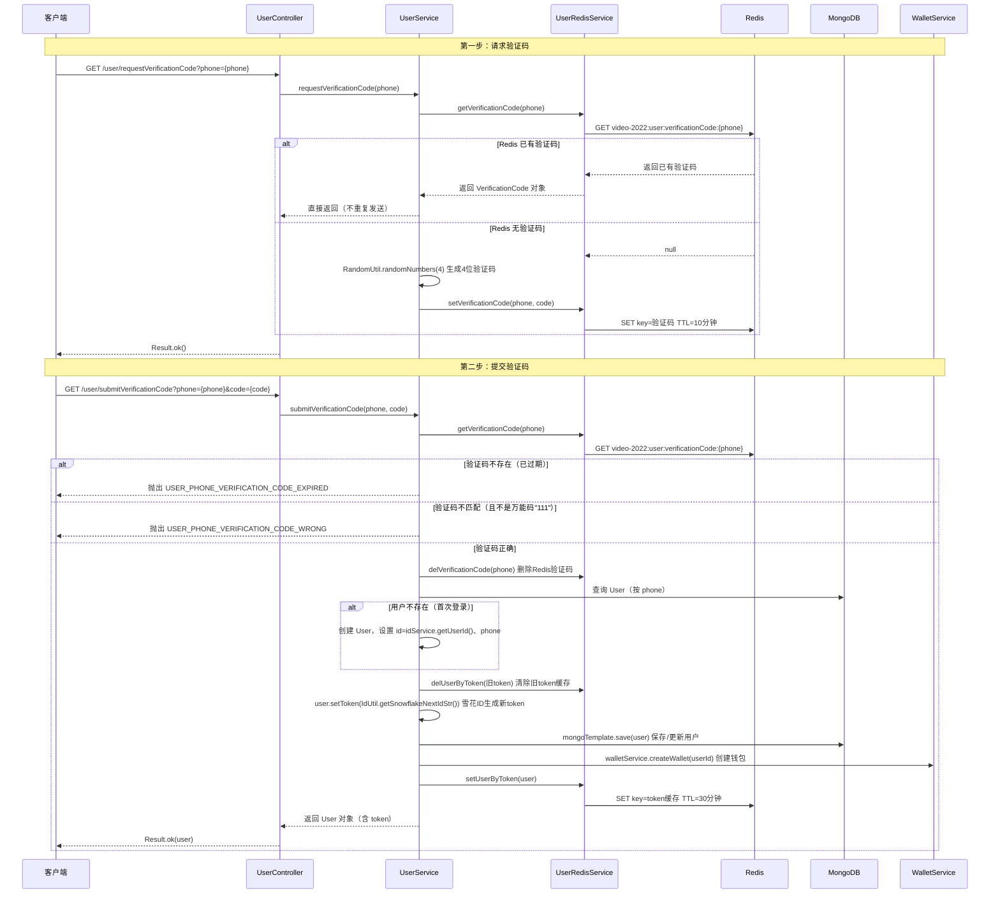

# 用户与设备

> 文档地图：[README](../../README.md) > [关键设计](../1-关键设计.md) > 本文档

本文档描述用户认证、设备识别、会话管理的完整业务流程。所有内容均来源于实际代码。

---

## 1. 登录流程

### 1.1 时序图



### 1.2 关键逻辑说明

| 步骤 | 说明 | 源码位置 |
|------|------|----------|
| 验证码生成 | `RandomUtil.randomNumbers(4)` 生成4位纯数字 | `UserService.requestVerificationCode()` |
| 验证码存储 | Redis key=`video-2022:user:verificationCode:{phone}`，TTL=10分钟 | `UserRedisService.setVerificationCode()` |
| 万能验证码 | code 等于 `"111"` 时跳过校验（开发用途） | `UserService.submitVerificationCode()` L107 |
| Token 生成 | `IdUtil.getSnowflakeNextIdStr()` 雪花算法 | `UserService.submitVerificationCode()` L125 |
| 自动创建用户 | 首次登录按 phone 查不到用户时自动创建 | `UserService.submitVerificationCode()` L116 |
| 自动创建钱包 | 每次登录都调用 `walletService.createWallet(userId)` | `UserService.submitVerificationCode()` L129 |

---

## 2. Token 认证机制

### 2.1 Token 获取方式

客户端传递 token 有两种方式（见 `UserService.getUserByRequest()`）：

1. **HTTP Header**：`token: {value}`（优先）
2. **URL 参数**：`?token={value}`（兼容海外服务器场景）

```java
// UserService.getUserByRequest() 源码逻辑
String token = request.getHeader("token");
if (StringUtils.isEmpty(token)) {
    String[] tokens = request.getParameterMap().get("token");
    if (tokens != null) {
        token = tokens[0];
    }
}
```

### 2.2 Token → User 查询流程

```
Token → Redis 查询 → 命中则返回 User
                   → 未命中 → MongoDB 查询 → 命中则回填 Redis 并返回
                                           → 未命中 → 返回 null（需重新登录）
```

- **Redis key**：`video-2022:user:token:{token}`
- **TTL**：30 分钟（`RedisTime.THIRTY_MINUTES = 1800秒`）
- **序列化**：JSON 格式（`JSON.toJSONString(user)` / `JSON.parseObject(json, User.class)`）

### 2.3 Token 生命周期

| 事件 | 操作 |
|------|------|
| 登录成功 | 生成新 token，写入 User 文档，缓存到 Redis 30分钟 |
| 旧 token | 登录时删除旧 token 的 Redis 缓存（`delUserByToken`） |
| Token 过期 | Redis 30分钟后自动过期，下次请求回查 MongoDB |
| MongoDB 也查不到 | 返回 null，前端需引导用户重新登录 |

---

## 3. 设备识别（Client）

### 3.1 API

| 接口 | 方法 | 说明 |
|------|------|------|
| `/client/requestClientId` | GET | 生成并返回客户端设备ID |

- **CORS**：接口标注 `@CrossOrigin`，允许跨域调用
- **无需认证**：不在 `CheckTokenInterceptor` 的拦截路径中

### 3.2 处理流程

```java
// ClientService.requestClientId() 完整逻辑
Client client = new Client();
client.setCreateTime(new Date());
client.setIp(request.getRemoteAddr());
client.setUserAgent(request.getHeader("User-Agent"));
mongoTemplate.save(client);              // MongoDB 自动生成 ObjectId
JSONObject jsonObject = new JSONObject();
jsonObject.set("clientId", client.getId()); // 返回生成的 clientId
return Result.ok(jsonObject);
```

每次调用都会创建新的 `Client` 文档。`clientId` 即 MongoDB 自动生成的 `_id`（ObjectId）。

### 3.3 clientId 的下游使用

`clientId` 被嵌入到多个业务实体中，通过 `Context` 对象在请求链路中传递：

| 使用场景 | 实体字段 | 说明 |
|----------|----------|------|
| 文件访问日志 | `FileAccessLog.clientId` | 追踪哪个设备访问了文件 |
| 观看记录 | `WatchLog.clientId` | 记录设备级观看行为 |
| 播放进度 | `Progress.clientId` | 按设备维度存储播放进度 |
| 心跳上报 | `Heartbeat.clientId` | 心跳绑定设备 |
| 费用计算 | `OssAccessFeeService` | 按设备追踪访问费用 |

---

## 4. Session 管理

### 4.1 API

| 接口 | 方法 | 说明 |
|------|------|------|
| `/session/requestSessionId` | GET | 生成并返回会话ID |

### 4.2 处理流程

与 Client 类似，每次调用创建新 `Session` 文档：

```java
// SessionService.requestSessionId()
Session session = new Session();
session.setCreateTime(new Date());
session.setIp(request.getRemoteAddr());
session.setUserAgent(request.getHeader("User-Agent"));
mongoTemplate.save(session);
// 返回 { "sessionId": session.getId() }
```

### 4.3 sessionId 的下游使用

`sessionId` 通过 `Context` 对象传递，用于以下场景：

| 使用场景 | 实体字段 | 说明 |
|----------|----------|------|
| 文件访问日志 | `FileAccessLog.sessionId` | 追踪单次会话的文件访问 |
| 观看记录 | `WatchLog.sessionId` | 按会话去重观看记录 |
| 播放进度 | `Progress.sessionId` | 会话级播放进度 |
| 心跳上报 | `Heartbeat.sessionId` | 心跳绑定会话 |

### 4.4 Session vs Client

- **Client**：代表一个设备/浏览器实例，生命周期长，跨多次访问持续存在
- **Session**：代表一次访问会话，生命周期短，每次打开页面可能生成新的
- 观看记录通过 `videoId + sessionId` 判断是否已存在来去重（`WatchRepository.isWatchLogExist()`）

---

## 5. 拦截器

### 5.1 拦截器执行顺序

系统定义了三个拦截器，按 `InterceptorOrder` 顺序执行：

| 顺序 | 拦截器 | Order 值 | 拦截路径 | 职责 |
|------|--------|----------|----------|------|
| 1 | `PutTokenInterceptor` | 1001 | `/**`（所有请求） | 解析 token，将 User 放入 ThreadLocal |
| 2 | `CheckTokenInterceptor` | 1002 | 指定路径（见下方） | 强制校验登录态，未登录则 403 重定向 |
| 3 | `RequestLogInterceptor` | 1003 | `/**`（所有请求） | 记录请求日志到 MongoDB |

### 5.2 PutTokenInterceptor — Token 注入

- 拦截 **所有请求** (`/**`)
- `preHandle`：调用 `userService.getUserByRequest(request)` 解析 token
- 如果找到用户，调用 `UserHolder.set(user)` 存入 ThreadLocal
- **始终返回 true**，不阻断请求

```
UserHolder 是基于 ThreadLocal 的用户上下文持有器：
- UserHolder.set(user)     — 拦截器中设置
- UserHolder.get()         — 业务代码中获取当前用户
- UserHolder.getUserId()   — 获取当前用户ID
- UserHolder.remove()      — afterCompletion 中清理
```

### 5.3 CheckTokenInterceptor — 登录校验

**拦截路径（需要登录的接口）：**

```
/save-token.html
/playlist/getMyPlaylistByPage
/video/create
/file/getUploadCredentials
/video/rawFileUploadFinish
/file/uploadFinish
/video/updateInfo
/playlist/addPlaylistItem
/video/getMyVideoList
```

**处理逻辑：**
- `preHandle`：通过 token 获取 User
  - 用户存在 → 返回 `true`，放行
  - 用户不存在 → 设置 HTTP 403，重定向到 `/login.html?target={原始URL}`
- `afterCompletion`：调用 `UserHolder.remove()` 清理 ThreadLocal

### 5.4 RequestLogInterceptor — 请求日志

- 拦截 **所有请求** (`/**`)
- `preHandle`：创建 `RequestLog` 对象，记录请求信息（URL、path、method、queryString、headerMap、IP、userAgent），存入 `RequestLogContext`（ThreadLocal）
- `afterCompletion`：计算耗时，设置响应状态码，保存到 MongoDB
- **排除路径**：`/file/access` 和 `/heartbeat/add` 不存储日志（高频接口，避免数据库压力）

---

## 6. 数据模型

### 6.1 User（用户）

**MongoDB Collection**：`user`

| 字段 | 类型 | 索引 | 说明 |
|------|------|------|------|
| `id` | String | `@Id` 主键 | 由 `idService.getUserId()` 生成 |
| `phone` | String | `@Indexed` | 手机号，登录凭证 |
| `registerChannel` | String | — | 注册渠道 |
| `token` | String | `@Indexed` | 当前登录 token（雪花ID） |
| `createTime` | Date | `@Indexed` | 创建时间（构造函数中初始化） |
| `updateTime` | Date | — | 更新时间（构造函数中初始化） |

### 6.2 Client（客户端设备）

**MongoDB Collection**：`client`

| 字段 | 类型 | 索引 | 说明 |
|------|------|------|------|
| `id` | String | `@Id` 主键 | MongoDB ObjectId |
| `createTime` | Date | `@Indexed` | 创建时间 |
| `userAgent` | String | — | 浏览器 User-Agent |
| `ip` | String | — | 客户端 IP |

### 6.3 Session（会话）

**MongoDB Collection**：`session`

| 字段 | 类型 | 索引 | 说明 |
|------|------|------|------|
| `id` | String | `@Id` 主键 | MongoDB ObjectId |
| `createTime` | Date | `@Indexed` | 创建时间 |
| `userAgent` | String | — | 浏览器 User-Agent |
| `ip` | String | — | 客户端 IP |

### 6.4 RequestLog（请求日志）

**MongoDB Collection**：`requestLog`

| 字段 | 类型 | 说明 |
|------|------|------|
| `id` | String | 主键 |
| `requestPath` | String | 请求路径 |
| `request` | Request（嵌套） | 包含 url、path、method、queryString、headerMap、ip、userAgent、body |
| `response` | Response（嵌套） | 包含 httpStatus、headerMap、body |
| `startTime` | Date | 请求开始时间 |
| `endTime` | Date | 请求结束时间 |
| `timeCost` | Long | 耗时（毫秒） |

### 6.5 Context（请求上下文）

非持久化对象，用于在一次请求中传递 videoId、clientId、sessionId：

```java
public class Context {
    private String videoId;
    private String clientId;
    private String sessionId;
}
```

---

## 7. Redis Key 设计

### 7.1 Key 格式总览

所有 key 以 `video-2022` 为根前缀，定义在 `RedisKey.java` 中：

```
根前缀：video-2022
用户前缀：video-2022:user
```

### 7.2 认证相关 Key

| Key 模式 | 生成方法 | TTL | 用途 |
|----------|----------|-----|------|
| `video-2022:user:verificationCode:{phone}` | `RedisKey.verificationCode(phone)` | **10 分钟**（600秒） | 存储手机验证码 JSON |
| `video-2022:user:token:{token}` | `RedisKey.token(token)` | **30 分钟**（1800秒） | 缓存 User JSON（token→用户映射） |

### 7.3 其他 Key

| Key 模式 | 生成方法 | 用途 |
|----------|----------|------|
| `video-2022:ip:{ip}` | `RedisKey.ip(ip)` | IP 相关缓存 |
| `video-2022:increaseShortId:{yyyy-MM-dd}` | `RedisKey.increaseShortId()` | 按日自增短ID |
| `video-2022:increaseLongId:{timeUnit}` | `RedisKey.increaseLongId(timeUnit)` | 长ID自增计数器 |

### 7.4 Redis 存储格式

- **验证码**：JSON 格式 `{"phone":"13800138000","code":"1234"}`，对应 `VerificationCode` 类
- **用户 token 缓存**：完整 User 对象的 JSON 序列化（包含 id、phone、token、createTime 等全部字段）
- **序列化库**：fastjson（`com.alibaba.fastjson.JSON`）

### 7.5 TTL 常量

定义在 `RedisTime` 接口中，单位为**秒**：

```java
long ONE_MINUTE = 60;
long TEN_MINUTES = 600;       // 验证码使用
long THIRTY_MINUTES = 1800;   // Token 缓存使用
long ONE_HOUR = 3600;
long TWO_HOURS = 7200;
long THREE_HOURS = 10800;
long SIX_HOURS = 21600;
long ONE_DAY = 86400;
long TWO_DAYS = 172800;
```
