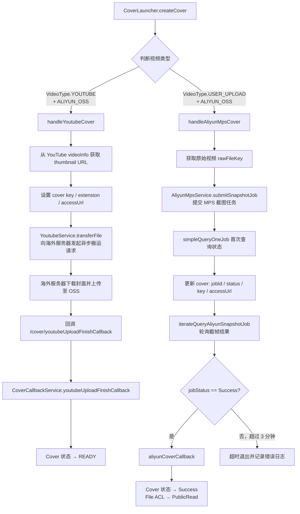
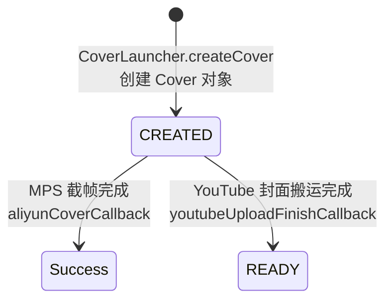

# 封面提取

> 文档地图：[README](../../README.md) > [关键设计](../1-关键设计.md) > 本文档

本文档面向 AI 助手（Copilot / Claude），描述视频封面提取的完整业务流程与技术实现。所有内容均基于源码。

---

## 1. 封面生成流程

系统根据视频类型（`VideoType`）和存储提供商（`ObjectStorageProvider`）自动选择封面生成策略。



---

## 2. MPS 截图任务

### 2.1 任务提交

`AliyunMpsService.submitSnapshotJob(sourceKey, targetKey)` 构建截图请求：

| 参数 | 值 | 说明 |
|---|---|---|
| `Input` | sourceKey（原始视频 OSS 路径） | 输入视频文件 |
| `OutputFile.Bucket` | 配置中的 bucket | 截图输出存储桶 |
| `OutputFile.Location` | `oss-cn-beijing` | OSS 区域 |
| `OutputFile.Object` | URL 编码后的 targetKey | 输出文件路径 |
| `Time` | `"0"` | 截取第 0 秒的帧 |
| `Num` | `"1"` | 截取 1 张 |
| `PipelineId` | `158c291025294f05b7d012a070ac8c28` | MPS 管道 ID |

输出格式固定为 `jpg`（`cover.setExtension("jpg")`）。

### 2.2 轮询查询

`CoverCallbackService.iterateQueryAliyunSnapshotJob` 以每秒 1 次的频率轮询 MPS 任务状态：

- 调用 `AliyunMpsService.simpleQueryOneJob(jobId)` 查询
- 当 `jobStatus == "Success"` 时触发 `aliyunCoverCallback`
- 超时阈值：**3 分钟**（`3 * 60 * 1000 ms`）
- 最大轮询次数：`1000000`（受超时限制，实际最多约 180 次）

### 2.3 完成回调

`aliyunCoverCallback(jobId)` 执行以下操作：

1. 根据 `jobId` 从数据库查找 Cover
2. 再次向阿里云查询截帧任务获取最终结果
3. 更新 Cover：`status`、`finishTime`、`result`（完整的 job JSON）
4. 更新 File：设置 ACL 为 `PublicRead`、填充 `objectInfo`、`fileStatus → READY`

---

## 3. YouTube 封面迁移

### 3.1 获取缩略图 URL

从 `Video.youTube.videoInfo.snippet.thumbnails.standard.url` 提取下载地址。

### 3.2 搬运流程

`YoutubeService.transferFile` 向海外服务器（阿里云函数计算）发起异步 POST 请求：

| 请求字段 | 来源 | 说明 |
|---|---|---|
| `missionId` | `IdUtil.nanoId()` | 任务唯一标识 |
| `key` | `file.getKey()` | OSS 目标路径 |
| `provider` | `file.getProvider()` | 存储提供商 |
| `fileId` | `file.getId()` | 文件 ID |
| `downloadUrl` | YouTube thumbnail URL | 封面下载地址 |
| `getUploadCredentialsUrl` | 回调地址 | 用于获取 STS 上传凭证 |
| `fileUploadFinishCallbackUrl` | 回调地址 | 文件上传完成通知 |
| `businessUploadFinishCallbackUrl` | `/cover/youtubeUploadFinishCallback?coverId=...&token=...` | 业务回调 |

请求头 `X-Fc-Invocation-Type: Async` 表示异步调用函数计算。

### 3.3 完成回调

`CoverCallbackService.youtubeUploadFinishCallback(coverId)`：

1. 根据 `coverId` 查找 Cover
2. 若 provider 为 `ALIYUN_CLOUD_FUNCTION` 或 `ALIYUN_MPS`，验证 OSS 文件存在
3. 更新 Cover 状态为 `READY`，记录 `finishTime`

> **注意**：YouTube 封面回调中的 OSS 存在性检查仅针对非 YouTube provider 执行。YouTube provider 跳过此检查。

---

## 4. 封面访问

### 4.1 单个封面 URL

`CoverService.getSignedCoverUrl(coverId)`：

1. 通过 `CoverRepository.getOssKey(coverId)` 查询 Cover 的 `key` 字段（仅投影 `key`）
2. 调用 `FileService.generatePresignedUrl(key, Duration.ofHours(2))` 生成签名 URL
3. 签名有效期：**2 小时**

### 4.2 批量封面 URL

`CoverService.getSignedCoverUrl(List<String> coverIdList)`：

1. `CoverRepository.getByIdList(coverIdList)` 批量查询 Cover 列表
2. 提取所有 `key`，调用 `FileService.generatePresignedUrl(keyList, Duration.ofHours(2))` 批量生成
3. 返回 `Map<coverId, signedUrl>`

---

## 5. 封面状态



| 状态 | 常量 | 触发场景 |
|---|---|---|
| `CREATED` | `CoverStatus.CREATED` | Cover 对象刚创建，封面尚未就绪 |
| `READY` | `CoverStatus.READY` | YouTube 封面搬运完成后设置 |
| `Success` | MPS 任务状态（非 CoverStatus 常量） | MPS 截帧完成后，直接写入 MPS 返回的 `job.getState()` |

> **实现细节**：MPS 场景下 cover.status 取值来自阿里云 API 返回的 `job.getState()`（如 `"Submitted"`、`"Success"`），而非 `CoverStatus` 常量。YouTube 场景下使用 `CoverStatus.READY`。

---

## 6. 数据模型

### Cover 实体（MongoDB `cover` 集合）

| 字段 | 类型 | 索引 | 说明 |
|---|---|---|---|
| `id` | String | @Id | Cover 主键，由 `IdService.getCoverId()` 生成 |
| `userId` | String | @Indexed | 所属用户 ID |
| `videoId` | String | @Indexed | 关联视频 ID |
| `provider` | String | @Indexed | 封面提供方：`YOUTUBE_COVER` / `ALIYUN_MPS_SNAPSHOT` / `ALIYUN_CLOUD_FUNCTION_COVER` |
| `fileId` | String | @Indexed | 关联的 File ID |
| `jobId` | String | @Indexed | MPS 截图任务 ID（仅 MPS 场景） |
| `createTime` | Date | @Indexed | 创建时间（构造函数中自动设置） |
| `finishTime` | Date | - | 完成时间 |
| `status` | String | @Indexed | 状态：`CREATED` / `READY` / MPS 状态值 |
| `accessUrl` | String | - | OSS 访问 URL（`aliyunOssAccessBaseUrl + key`） |
| `extension` | String | - | 文件扩展名（MPS 为 `jpg`，YouTube 从 URL 提取） |
| `key` | String | - | OSS 对象路径，格式：`{videoPrefix}/cover/{coverId}/{fileId}.{ext}` |
| `result` | JSONObject | - | MPS 截图任务完整结果 JSON（仅 MPS 场景） |

### CoverProvider 常量

| 常量 | 值 | 场景 |
|---|---|---|
| `YOUTUBE` | `YOUTUBE_COVER` | YouTube 视频封面搬运 |
| `ALIYUN_MPS` | `ALIYUN_MPS_SNAPSHOT` | 阿里云 MPS 视频截帧 |
| `ALIYUN_CLOUD_FUNCTION` | `ALIYUN_CLOUD_FUNCTION_COVER` | 云函数封面生成（已定义，未实现） |

---

## 7. 代码调用链

### 场景一：用户上传视频 → MPS 截帧生成封面

```
CoverLauncher.createCover(user, video)
├── mongoTemplate.save(file)                          // 创建 File（FileType.COVER）
├── mongoTemplate.save(cover)                         // 创建 Cover（status=CREATED）
├── handleAliyunMpsCover(user, video, cover, file)
│   ├── fileService.getKeyByFileId(rawFileId)         // 获取原始视频 OSS key
│   ├── AliyunMpsService.submitSnapshotJob(sourceKey, targetKey)
│   │   └── getClient().submitSnapshotJob(request)    // 阿里云 MPS API
│   ├── AliyunMpsService.simpleQueryOneJob(jobId)     // 首次查询状态
│   ├── mongoTemplate.save(cover)                     // 更新 jobId/status/key/accessUrl
│   ├── mongoTemplate.save(file)                      // 更新 file.key
│   └── CoverCallbackService.iterateQueryAliyunSnapshotJob(video, cover)
│       └── [轮询循环，每秒查询一次]
│           ├── AliyunMpsService.simpleQueryOneJob(jobId)
│           └── aliyunCoverCallback(jobId)            // Success 时触发
│               ├── CoverRepository.getByJobId(jobId)
│               ├── AliyunMpsService.simpleQueryOneJob(jobId)   // 再次确认
│               ├── mongoTemplate.save(cover)         // 更新 status/finishTime/result
│               ├── fileService.changeObjectAcl → PublicRead
│               └── mongoTemplate.save(file)          // 更新 ACL/objectInfo/fileStatus
└── mongoTemplate.save(video)                         // 设置 video.coverId
```

### 场景二：YouTube 搬运 → 下载缩略图

```
CoverLauncher.createCover(user, video)
├── mongoTemplate.save(file)                          // 创建 File（FileType.COVER）
├── mongoTemplate.save(cover)                         // 创建 Cover（status=CREATED）
├── handleYoutubeCover(user, video, cover, file)
│   ├── video.getYouTube().getVideoInfo()
│   │   .snippet.thumbnails.standard.url              // 提取缩略图 URL
│   ├── OssPathUtil.getCoverKey(video, cover, file)   // 生成 OSS 路径
│   ├── mongoTemplate.save(cover)                     // 更新 provider/extension/key/accessUrl
│   ├── mongoTemplate.save(file)                      // 更新 key/extension/rawFilename/provider
│   └── YoutubeService.transferFile(user, file, downloadUrl, callbackUrl)
│       └── HTTP POST → 海外函数计算服务（异步）
│           ├── 下载 YouTube 封面图片
│           ├── 获取 STS 凭证 → 上传至 OSS
│           ├── 回调 /file/uploadFinish
│           └── 回调 /cover/youtubeUploadFinishCallback
│               └── CoverCallbackService.youtubeUploadFinishCallback(coverId)
│                   ├── mongoTemplate.findById(coverId)
│                   ├── cover.setStatus(READY)
│                   └── mongoTemplate.save(cover)
└── mongoTemplate.save(video)                         // 设置 video.coverId
```
