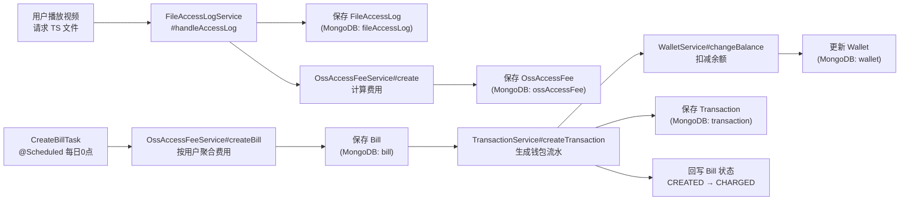

# 计费系统

> 文档地图：[README](../../README.md) > [关键设计](../1-关键设计.md) > 本文档

---

## 1. 计费架构图



**核心链路**：`FileAccess → FileAccessLog → OssAccessFee → Bill → Transaction → Wallet`

---

## 2. 流量计费

### 2.1 计费触发时机

当用户播放视频时，每个 TS 分片文件的访问都会触发计费。入口方法：

```
FileAccessLogService#handleAccessLog(request, videoId, clientId, sessionId, resolution, fileId)
  ├── saveAccessLog()   → 写入 FileAccessLog 文档
  └── saveFee()         → 调用 OssAccessFeeService#create() → 写入 OssAccessFee 文档
```

### 2.2 单价配置（UnitPriceService）

单价参照阿里云 OSS 定价，按访问时间分时段计费：

| 时段 | 时间范围 | 单价（元/GB） |
|------|---------|--------------|
| 闲时 | 00:00 — 08:00 | 0.25 |
| 忙时 | 08:00 — 24:00 | 0.50 |

**实际存储的 unitPrice** 是按字节换算后的值：`pricePerGb / (1024^3)`，精度 `SCALE = 20` 位小数，舍入模式 `HALF_DOWN`。

### 2.3 费用计算公式

```
feePrice = unitPrice × fileSize(bytes)
```

- `unitPrice`：每字节单价（由 `UnitPriceService#getOssAccessUnitPrice` 根据访问时间返回）
- `amount`：文件大小，即 `fileAccessLog.getSize()`，单位字节
- `unitName`：固定为 `UnitName.GB`（"GB"）
- 结果取绝对值，精度 20 位小数

### 2.4 费用类型枚举（FeeTypeEnum）

| code | name | 说明 |
|------|------|------|
| `TRANSCODE` | 视频转码 | TranscodeFee，含 resolution、duration（毫秒）、provider |
| `OSS_ACCESS` | OSS访问文件 | OssAccessFee，按文件访问量计费 |
| `OSS_STORAGE` | OSS存储空间 | OssStorageFee，按时间范围计费（billTimeStart / billTimeEnd） |

### 2.5 计费单位（UnitName）

| 常量 | 值 | 用途 |
|------|-----|------|
| `GB` | "GB" | OSS 访问流量 |
| `SECOND` | "SECOND" | 视频转码时长 |
| `TIME` | "TIME" | 按次计费 |

---

## 3. 自动账单生成

### 3.1 定时任务 CreateBillTask

```java
@Scheduled(cron = "0 0 0 * * ?")  // 每天凌晨 0 点
public void createAccessFeeBill()
```

**时间窗口逻辑**：
- **生产环境**：统计昨天 00:00:00 → 今天 00:00:00 的费用（`DateUtil.yesterday()` → `new Date()`）
- **开发环境**：统计今天 00:00:00 → 明天 00:00:00 的费用（方便调试）

### 3.2 账单生成流程

```
CreateBillTask#createAccessFeeBill()
  │
  ├── 1. OssAccessFeeService#createBill(billTimeStart, billTimeEnd)
  │      ├── 遍历所有用户 (userRepository.listAll())
  │      ├── 查询该用户在时间窗口内、状态为 CREATED 的 OssAccessFee
  │      ├── 汇总 feePrice → originChargePrice
  │      ├── 抹零计算: roundDownPrice = originChargePrice(保留2位) - originChargePrice
  │      ├── 应付金额: realChargePrice = originChargePrice - roundDownPrice（保留2位小数）
  │      ├── 保存 Bill 文档
  │      └── 回写每条 OssAccessFee 的 billId，状态改为 CHARGED
  │
  └── 2. TransactionService#createTransaction(billIds)
         ├── 查询 Bill 列表
         ├── 获取用户 Wallet（不存在则自动创建）
         ├── 扣减余额: walletService.changeBalance(walletId, -realChargePrice)
         ├── 创建 Transaction 记录（类型 CONSUMPTION、流向 EXPENSE、状态 PAID）
         └── 回写 Bill: transactionId + billStatus = CHARGED
```

### 3.3 账单状态（BillStatus）

| 状态 | 含义 |
|------|------|
| `CREATED` | 账单已创建，尚未扣费 |
| `CHARGED` | 已扣费完成，关联了 transactionId |

### 3.4 费用状态（FeeStatus）

| 状态 | 含义 |
|------|------|
| `CREATED` | 费用已记录，待打包进账单 |
| `CHARGED` | 已关联到某个 Bill |

### 3.5 抹零规则

原始金额 `originChargePrice` 精度为 20 位小数，生成账单时保留 2 位小数（`HALF_DOWN`），抹去的尾数记录在 `roundDownPrice` 字段。

---

## 4. 钱包系统

### 4.1 自动创建

钱包通过 `WalletService#getByUserId` 懒加载创建——首次查询时如果不存在，自动调用 `createWallet(userId)`。`createWallet` 内部有幂等检查（再次查询防并发重复创建）。初始余额为 `BigDecimal.ZERO`。

### 4.2 余额变更

```java
WalletService#changeBalance(walletId, changeAmount)
```

- 充值时 `changeAmount > 0`（增加余额）
- 扣费时传入 `bill.getRealChargePrice().negate()`（负数，减少余额）
- 直接 `balance = balance + changeAmount`，然后 `mongoTemplate.save(wallet)`

### 4.3 充值（Recharge）

| 字段 | 说明 |
|------|------|
| `walletId` | 关联的钱包 |
| `chargeAmount` | 充值金额 |
| `rechargeStatus` | `CREATED` → `PAID` |
| `payMethod` | 支付方式（微信、支付宝） |
| `outTradeNo` | 第三方支付订单号 |
| `transactionId` | 充值成功后关联的钱包流水 |

### 4.4 交易类型（TransactionType）

| 类型 | 值 | 说明 |
|------|-----|------|
| `RECHARGE` | "RECHARGE" | 充值 |
| `CONSUMPTION` | "CONSUMPTION" | 账单扣费 |

### 4.5 收支流向（TransactionFlow）

| 流向 | 值 |
|------|-----|
| `INCOME` | 收入（充值） |
| `EXPENSE` | 支出（扣费） |

### 4.6 交易状态（TransactionStatus）

| 状态 | 值 |
|------|-----|
| `PAID` | 已完成 |

---

## 5. 统计接口

### 5.1 GET /statistics/getTrafficConsume

**参数**：`videoId`（String）

**功能**：聚合 `fileAccessLog` 集合中指定 videoId 的所有 `size` 字段之和。

**MongoDB 聚合**：
```javascript
db.fileAccessLog.aggregate([
    { $match: { videoId: "<videoId>" } },
    { $group: { _id: null, sum: { $sum: "$size" } } }
])
```

**响应示例**：
```json
{
  "code": 200,
  "data": {
    "videoId": "6381ca21be2b3c61f70361d2",
    "trafficConsumeInBytes": 316371476,
    "trafficConsumeString": "301.74 MB"
  }
}
```

`trafficConsumeString` 使用 `hutool` 的 `FileUtil.readableFileSize()` 格式化。

### 5.2 GET /statistics/aggregateTrafficData

**参数**：`startTime`（long, 毫秒时间戳）、`endTime`（long, 毫秒时间戳）

**功能**：按天分组统计流量，返回 Echarts 柱状图所需数据格式。

**MongoDB 聚合**：
```javascript
db.fileAccessLog.aggregate([
    { $match: { createTime: { $gte: startDate, $lte: endDate } } },
    { $project: { date: { $dateToString: { format: "%Y-%m-%d", date: "$createTime" } }, size: 1 } },
    { $group: { _id: "$date", totalSize: { $sum: "$size" } } },
    { $sort: { _id: 1 } }
])
```

**响应格式（Echarts 柱状图）**：
```json
{
  "code": 200,
  "data": {
    "xAxis": {
      "type": "category",
      "data": ["2023-01-06", "2023-01-14", "2023-01-15"]
    },
    "yAxis": {
      "type": "value",
      "data": ["171.24 MB", "301.74 MB", "118.07 MB"]
    },
    "series": {
      "type": "bar",
      "data": [179589256, 316371476, 123835600],
      "label": { "show": true, "position": "top" }
    }
  }
}
```

- `xAxis.data`：日期字符串数组（已排序）
- `yAxis.data`：人类可读的流量大小
- `series.data`：原始字节数（用于图表绘制）

---

## 6. 数据模型

所有实体存储在 MongoDB 中，以下为各集合的字段定义。

### 6.1 fileAccessLog（文件访问日志）

| 字段 | 类型 | 索引 | 说明 |
|------|------|------|------|
| `id` | String | PK | |
| `fileId` | String | ✓ | 文件 ID |
| `userId` | String | ✓ | 视频拥有者 ID |
| `videoId` | String | ✓ | 视频 ID |
| `transcodeId` | String | ✓ | 转码记录 ID |
| `resolution` | String | ✓ | 分辨率 |
| `tsSequence` | Integer | ✓ | TS 分片序号 |
| `filename` | String | | 文件名 |
| `key` | String | | OSS key |
| `size` | Long | | 文件大小（字节） |
| `etag` | String | ✓ | ETag |
| `fileType` | String | ✓ | 文件类型 |
| `provider` | String | ✓ | 存储供应商 |
| `videoType` | String | ✓ | 视频类型 |
| `storageClass` | String | ✓ | 存储类型 |
| `createTime` | Date | ✓ | 访问时间 |
| `ip` | String | | 客户端 IP |
| `clientId` | String | | 客户端 ID |
| `sessionId` | String | | 会话 ID |

### 6.2 ossAccessFee（OSS 访问费用）

继承 `BaseFee`（含 `BaseVideoFields` → `BaseCommonFields`）。

| 字段 | 类型 | 索引 | 说明 |
|------|------|------|------|
| `id` | String | PK | |
| `createTime` | Date | ✓ | 创建时间 |
| `updateTime` | Date | ✓ | 更新时间 |
| `userId` | String | ✓ | 用户 ID |
| `videoId` | String | ✓ | 视频 ID |
| `billId` | String | ✓ | 关联账单 ID（生成账单后回写） |
| `feeStatus` | String | | CREATED / CHARGED |
| `feeType` | String | | "OSS_ACCESS" |
| `feeTypeName` | String | | "OSS访问文件" |
| `unitName` | String | | "GB" |
| `unitPrice` | BigDecimal | | 每字节单价 |
| `amount` | BigDecimal | | 文件大小（字节） |
| `feePrice` | BigDecimal | | 本次费用金额 |
| `fileId` | String | ✓ | 文件 ID |
| `accessId` | String | ✓ | FileAccessLog ID |
| `key` | String | ✓ | OSS key |
| `storageClass` | String | | 存储类型 |
| `fileSize` | Long | | 文件大小（字节） |
| `billTime` | Date | ✓ | 计费时间（= accessLog.createTime） |

### 6.3 bill（账单）

继承 `BaseCommonFields`。

| 字段 | 类型 | 索引 | 说明 |
|------|------|------|------|
| `id` | String | PK | |
| `createTime` | Date | ✓ | |
| `updateTime` | Date | ✓ | |
| `userId` | String | ✓ | |
| `originChargePrice` | BigDecimal | | 原始应扣金额（20位精度） |
| `roundDownPrice` | BigDecimal | | 抹零金额 |
| `realChargePrice` | BigDecimal | | 应付金额（2位小数） |
| `chargeTime` | Date | ✓ | 扣费时间 |
| `walletId` | String | ✓ | 钱包 ID |
| `transactionId` | String | ✓ | 流水 ID（扣费后回写） |
| `feeCount` | Integer | | 包含的费用记录数 |
| `feeType` | String | | 计费类型 code |
| `feeTypeName` | String | | 计费类型名称 |
| `billStatus` | String | | CREATED / CHARGED |

### 6.4 transaction（交易流水）

继承 `BaseCommonFields`。

| 字段 | 类型 | 索引 | 说明 |
|------|------|------|------|
| `id` | String | PK | |
| `createTime` | Date | ✓ | |
| `updateTime` | Date | ✓ | |
| `userId` | String | ✓ | |
| `walletId` | String | ✓ | 钱包 ID |
| `amount` | BigDecimal | | 交易金额 |
| `balance` | BigDecimal | | 交易后余额 |
| `transactionType` | String | | RECHARGE / CONSUMPTION |
| `transactionFlow` | String | | INCOME / EXPENSE |
| `transactionStatus` | String | | PAID |
| `sourceId` | String | ✓ | 来源 ID（billId 或 rechargeId） |
| `transactionTime` | Date | ✓ | 交易时间 |
| `remark` | String | | 备注 |

### 6.5 wallet（钱包）

| 字段 | 类型 | 索引 | 说明 |
|------|------|------|------|
| `id` | String | PK | |
| `createTime` | Date | ✓ | |
| `updateTime` | Date | ✓ | |
| `userId` | String | ✓ | |
| `balance` | BigDecimal | | 当前余额 |

### 6.6 recharge（充值记录）

| 字段 | 类型 | 索引 | 说明 |
|------|------|------|------|
| `id` | String | PK | |
| `createTime` | Date | ✓ | |
| `updateTime` | Date | ✓ | |
| `userId` | String | ✓ | |
| `walletId` | String | ✓ | 钱包 ID |
| `chargeAmount` | BigDecimal | | 充值金额 |
| `rechargeStatus` | String | | CREATED / PAID |
| `transactionId` | String | ✓ | 流水 ID |
| `payMethod` | String | | 微信 / 支付宝 |
| `outTradeNo` | String | ✓ | 第三方支付订单号 |

---

## 7. 代码调用链

### 7.1 实时计费（每次文件访问）

```
用户请求 TS 文件
  │
  └─→ FileAccessLogService#handleAccessLog(request, videoId, clientId, sessionId, resolution, fileId)
        │
        ├── saveAccessLog()
        │     ├── tsFileRepository.getById(fileId)          // 获取 TS 文件信息
        │     ├── transcodeRepository.getById(transcodeId)  // 获取转码信息
        │     ├── videoRepository.getById(videoId)          // 获取视频（拿 ownerId 作为 userId）
        │     ├── BeanUtils.copyProperties(tsFile, accessLog)
        │     ├── 设置 resolution, clientId, sessionId, ip, createTime
        │     └── mongoTemplate.save(accessLog)             // 持久化 FileAccessLog
        │
        └── saveFee()
              ├── OssAccessFeeService#create(fileAccessLog, ...)
              │     ├── UnitPriceService#getOssAccessUnitPrice(accessTime)
              │     │     └── 根据小时判断闲时/忙时 → 返回按字节换算的 unitPrice
              │     ├── feePrice = unitPrice × fileSize
              │     └── 返回 OssAccessFee 对象（feeStatus = CREATED）
              └── mongoTemplate.save(accessFee)             // 持久化 OssAccessFee
```

### 7.2 每日账单结算（凌晨定时任务）

```
CreateBillTask#createAccessFeeBill()    @Scheduled("0 0 0 * * ?")
  │
  ├── 确定时间窗口 [billTimeStart, billTimeEnd)
  │
  ├── OssAccessFeeService#createBill(billTimeStart, billTimeEnd)
  │     │
  │     └── for each user in userRepository.listAll():
  │           ├── feeRepository.listDirectDeductionFee(OssAccessFee.class, start, end, userId, "CREATED")
  │           ├── if empty → skip
  │           ├── convertToBill(user, accessFees)
  │           │     ├── originChargePrice = sum(feePrice)
  │           │     ├── roundDownPrice = 抹零差额
  │           │     └── realChargePrice = 应付金额（2位小数）
  │           ├── mongoTemplate.save(bill)
  │           └── for each fee:
  │                 ├── feeRepository.updateBillId(fee.id, bill.id)
  │                 └── feeRepository.updateStatus(fee.id, "CHARGED")
  │
  └── TransactionService#createTransaction(billIds)
        │
        └── for each bill in billRepository.listByIds(billIds):
              ├── walletService.getByUserId(userId)         // 无钱包则自动创建
              ├── walletService.changeBalance(walletId, -realChargePrice)  // 扣款
              │     └── wallet.balance += changeAmount → mongoTemplate.save(wallet)
              ├── 设置 Transaction 字段:
              │     ├── transactionType = "CONSUMPTION"
              │     ├── transactionFlow = "EXPENSE"
              │     ├── transactionStatus = "PAID"
              │     ├── amount = realChargePrice
              │     ├── balance = 扣款后余额
              │     └── sourceId = bill.id
              ├── mongoTemplate.save(transaction)
              ├── billRepository.updateTransactionId(billIds, transaction.id)
              └── billRepository.updateBillStatus(billIds, "CHARGED")
```

---

## 关键源码文件索引

| 文件 | 包路径 |
|------|--------|
| `FileAccessLogService.java` | `file.access` |
| `OssAccessFee.java` | `finance.fee.ossaccess` |
| `OssAccessFeeService.java` | `finance.fee.ossaccess` |
| `UnitPriceService.java` | `finance.unitprice` |
| `Bill.java` | `finance.bill` |
| `CreateBillTask.java` | `finance.bill` |
| `TransactionService.java` | `finance.transaction` |
| `WalletService.java` | `finance.wallet` |
| `StatisticsController.java` | `etc.statistics` |
| `StatisticsRepository.java` | `etc.statistics` |

---

## 源码位置

| 类 | 路径 |
|----|------|
| CreateBillTask | `video/src/main/java/com/github/makewheels/video2022/finance/bill/CreateBillTask.java` |
| BillService | `video/src/main/java/com/github/makewheels/video2022/finance/bill/BillService.java` |
| WalletService | `video/src/main/java/com/github/makewheels/video2022/finance/wallet/WalletService.java` |
| TransactionService | `video/src/main/java/com/github/makewheels/video2022/finance/transaction/TransactionService.java` |
| OssAccessFeeService | `video/src/main/java/com/github/makewheels/video2022/finance/fee/ossaccess/OssAccessFeeService.java` |
| UnitPriceService | `video/src/main/java/com/github/makewheels/video2022/finance/unitprice/UnitPriceService.java` |
| FileAccessLogService | `video/src/main/java/com/github/makewheels/video2022/file/access/FileAccessLogService.java` |
| StatisticsService | `video/src/main/java/com/github/makewheels/video2022/etc/statistics/StatisticsService.java` |
